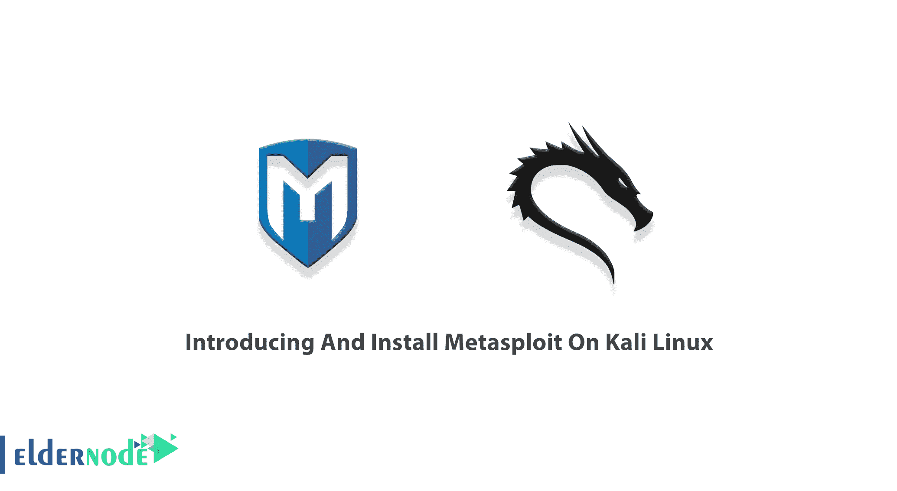

# Kali Linux - Eldernode 博客上的 Metasploit 介绍和安装

> 原文：<https://blog.eldernode.com/introducing-and-install-metasploit-on-kali/>



Metasploit 是一个在 BSD 风格的许可下发布的渗透测试框架。攻击者、防御者和安全研究人员发现它是一个必不可少的工具，因为它使黑客攻击变得简单。HD Moore 已经在 2003 年用 Perl 写好了。Metasploit 框架被认为是当今安全专业人员可以免费获得的最有用的安全审计工具。你可以准备一个真正令人印象深刻的工作环境。因为对许多人来说，最好的起点可能是下载并安装 Kali Linux，所以本文是**介绍并在 Kali Linux 上安装 Metasploit**。它还需要一个易受攻击的虚拟机(VM)来进行目标练习。所以，看看 [Eldernode](https://eldernode.com/) 上可用的包，然后购买你自己的 [Linux VPS](https://eldernode.com/linux-vps/) 来继续这个指南。

## **介绍 Metasploit 工具**

由于 Metasploit 作为一种广泛使用的渗透测试工具，黑客攻击现在变得更加容易。该框架只提供了一个命令行界面。但是如果您更喜欢基于 GUI 的点击-拖动黑客技术——加上一些其他很酷的特性，您可以将每个席位的许可证捆绑到 Metasploit Pro。Metasploit 由数据存储和模块组成。您可以使用数据存储在框架内配置方面，而模块是自包含的代码片段，Metasploit 从这些代码片段中派生其特性。

接下来，你将会读到关于模块的内容。您能想到的每种侦察工具都与 Metasploit 集成，例如 Nmap、SNMP 扫描和 Windows 修补程序枚举等。这样就有可能找到你要找的盔甲上的漏洞。当您在计算机上安装和设置 Metasploit 时，它包含一整套利用后工具，包括权限提升、传递散列、数据包嗅探、屏幕捕获、键盘记录程序和旋转工具。但是，您也可以设置一个持久后门，以防有问题的机器重新启动。

要使用 Metasploit，您需要精通或具备工作知识:

_ [Windows](https://blog.eldernode.com/tag/windows/) 和 [Linux](https://blog.eldernode.com/tag/linux/) OS

_ 网络协议

_ 漏洞管理系统

_ 基本笔测试概念

### **Metasploit 的模块(Kali Linux 上的 Metasploit)**

Metasploit 模块是 Metasploit 的主要组件，是数据库中的代码片段。他们在受害者计算机上运行时使用它。攻击者将试图利用本地或远程系统上的漏洞来危害有效负载模块，如 Meterpreter 外壳。有三个模块嵌入在不同的类别中。让我们回顾一下:

**1-漏洞利用**

攻击者使用调用的代码来获得对漏洞系统的访问权限。攻击者将试图利用本地或远程系统上的漏洞来危害有效负载模块，如 Meterpreter 外壳。

**2-有效载荷**

黑客使用有效负载作为简单的脚本来与被黑客攻击的系统进行交互。这有助于他们将数据传输到受害者系统。有效载荷可以有三种类型——单个——单个非常小，旨在创建某种通信，然后进入下一阶段

**3-辅助设备**

这些模块用于 Metasploit 中的扫描等任务。由于这些类型的模块不需要使用有效载荷来运行，所以它们包括有用的程序，如扫描仪、模糊器和 SQL 注入工具。

***注*** :本地防火墙，包括 Windows 防火墙，干扰漏洞和有效载荷的运行。如果您从防火墙后安装 Metasploit 框架，防火墙可能会将 Metasploit 框架检测为恶意软件并中断下载。

## **如何在 Kali Linux 上安装 Metasploit**

Metasploit 是最常用的渗透测试工具之一，内置于 [Kali Linux](https://blog.eldernode.com/install-and-configure-kali-linux-on-vps/) 中。如果您是 Kali Linux 2.0 用户，Metasploit 框架已经预安装并每月更新。如果您想更频繁地接收更新，可以使用此安装程序。

***安装注意事项*** :在安装或运行 Metasploit 框架之前，您应该禁用本地防火墙。如果必须在防火墙后操作，应该从网络外部下载 Metasploit 框架。

### **使用 Rapid 7** 在 Kali Linux 上安装 Metasploit】

Rapid7 为 Linux、Windows 和 OS X 操作系统上的 Metasploit 框架提供了开源安装程序。这些安装程序包括依赖项(如 [Ruby](https://blog.eldernode.com/install-ruby-centos8/) 和 [PostgreSQL](https://blog.eldernode.com/install-postgresq-ubuntu-18-04/) )并与你的包管理器集成，所以它们很容易更新。

如果 PostgreSQL 没有运行，首先，通过运行以下命令启动 PostgreSQL:

```
service postgresql start
```

```
service postgresql status
```

它包括 ***msfconsole*** 并安装相关工具如开膛手约翰和 [Nmap](https://blog.eldernode.com/install-nmap-on-linux/) 。此外，要安装 Metasploit 框架，您必须在要用来运行该框架的系统上拥有管理员权限。

***注意*** : Rapid7 不再支持 Kali Linux 1.0 上预装的 Metasploit 社区版。

以下脚本调用将导入 Rapid7 签名密钥，并为支持的 Linux 和 macOS 系统设置软件包:

```
curl https://raw.githubusercontent.com/rapid7/metasploit-omnibus/master/config/templates/metasploit-framework-wrappers/msfupdate.erb > msfinstall
```

```
chmod 755 msfinstall
```

```
./msfinstall
```

安装完成后，从终端窗口以**/opt/metasploit-framework/bin/MSF console**的身份启动 ***msfconsole。根据您的环境，它可能已经在您的路径中，您可以直接运行它。如果是第一次运行，一系列提示将帮助您设置一个数据库，并将 Metasploit 添加到您的本地路径(如果还没有的话)。***

这些软件包集成到您的软件包管理器中，可以使用 **msfupdate** 命令或您的软件包管理器进行更新。同样，如果这是第一次启动，这些包将自动设置数据库或使用您现有的数据库。

## 结论

在本文中，向您介绍了 Metasploit，您了解了如何在 Kali Linux 上安装 Metasploit。Pentesters、安全研究人员和系统管理员可能会发现本指南很有用。如果你愿意，可以参考文章[如何在 windows 10 RDP](https://blog.eldernode.com/install-metasploit-on-windows-10/) 上安装 Metasploit。如果您正在使用这个工具，[发送您的反馈](https://community.eldernode.com/)，让您的朋友更多地了解它。