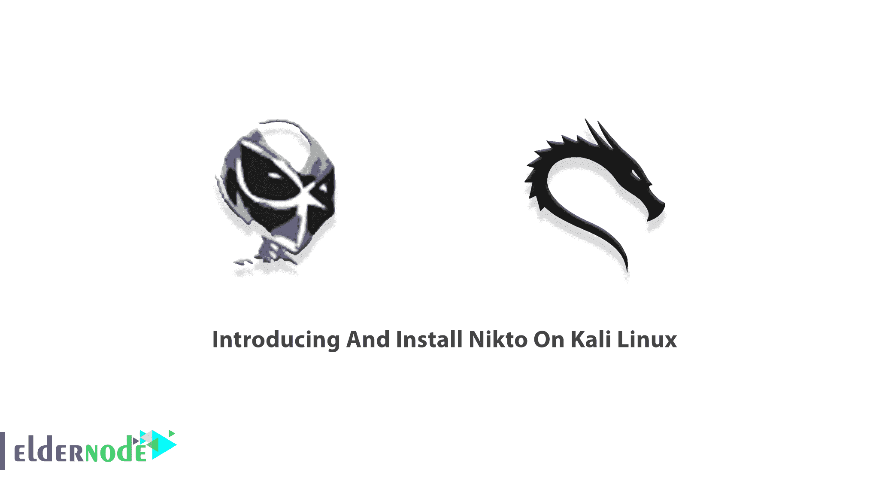

# 在 Kali Linux - Eldernode 博客上介绍和安装 Nikto

> 原文：<https://blog.eldernode.com/introducing-and-install-nikto-on-kali-linux/>



Nikto 是最流行的 web 服务器扫描器之一。它是一个开源的、免费的、易于使用的工具，可以帮助您非常快速地发现潜在的问题和漏洞。Nikto 检查是否存在多个索引文件、HTTP 服务器选项，并识别已安装的 web 服务器和软件。使用 Nikto 可以非常快速地测试 web 服务器。它不是一个隐蔽的工具，您可以在日志文件或 IPS/IDS 中查看结果。这篇文章是关于**在 Kali Linux** 上介绍和安装 Nikto。要购买您自己的 **[Linux VPS](https://eldernode.com/linux-vps/)** ，请在 [Eldernode](https://eldernode.com/) 上找到您喜欢的带有精确定制计划的软件包。

## **介绍 Nikto 工具**

要非常快速地发现潜在的问题和漏洞，除了 Nikto，您别无选择。因为网络服务器接受访问者的请求，回答并理解他们，所以它是你的网站最关键的部分。通过这种方式，攻击者将您的 web 服务器作为目标，以找到任何漏洞、与配置相关的错误以及与 SSL 证书相关的安全问题。所以，你必须保护它免受攻击。Nikto 允许您检查服务器配置错误和它们可能引入的任何可能的漏洞。之前， [Nmap](https://blog.eldernode.com/tag/nmap/) 和 [Wpscan](https://blog.eldernode.com/install-wpscan-on-kali-linux/) 作为网络扫描工具介绍给大家。接下来，你将看到如何在 [Kali Linux](https://blog.eldernode.com/tag/kali-linux/) 中使用 Nikto 扫描 web 服务器的漏洞。

### **Nikto 特征**

在本节中，我们将向您介绍 Nikto 的 14 项功能。这些功能包括:

1-开源并经常更新

2-能够扫描 6700 多个已知漏洞，并扫描任何 web 服务器，如 Apache、Nginx、Lighttpd、Litespeed 等

3-检查 1，250 多台 web 服务器

4-扫描与配置相关的问题，如打开索引目录

5- SSL 证书扫描

6-扫描运行多个 web 服务器的服务器上的多个端口

7-通过代理扫描并使用 HTTP 验证

8-完全 HTTP 代理支持

9-记录到 Metasploit

10-重放保存的肯定请求

11-交互状态、暂停和详细设置的更改

12- LibWhisker 的 IDS 编码技术

13- Nikto 指定最大扫描时间，同时排除某些类型的扫描和异常报告标题

14-快速准确的结果

## **如何在 Kali Linux 上安装 Nikto**

Nikto 默认包含在笔测试发行版中，如 [Kali Linux](https://blog.eldernode.com/install-and-configure-kali-linux-on-vps/) 。在其他操作系统/平台上，需要手动安装。Nikto 完全免费且易于安装。许多优秀的开源安全工具只在 Linux 版本中可用。加入我们这一节，看看如何将 Nikto 漏洞扫描器添加到 Kali Linux 上的安全分析工具集中，只需几个命令就可以实现。如果您运行的是 Kali Linux，Nikto 是预装的。

要刷新 APT 软件包列表并安装待定更新，请运行:

```
sudo apt-get update && sudo apt-get upgrade
```

现在，您可以使用以下命令安装 Nikto:

```
sudo apt-get install nikto -y
```

此外，您还可以验证 Nikto 网站漏洞扫描程序是否已安装并可以使用。因此，键入:

```
nikto
```

然后，如果您看到如下所示的输出(列出了安装的 Nikto 的版本)，您可以确保 Nikto 安装成功。

```
[[email protected]](/cdn-cgi/l/email-protection):~# nikto  - Nikto v2.1.5
```

要开始使用 Nikto，请将“http://www.example.com”替换为您希望扫描的任何域或 IP 地址，然后扫描任何网站或 IP 地址:

```
./nikto.pl -h http://www.example.com
```

如果不起作用，请运行:

```
perl nikto.pl -h http://www.example.coma
```

### **如何在 Kali Linux 上使用 Nikto**

Nikto 需要主机扫描。该主机可以用 **-h** 或**-主机**选项指定。使用以下命令启动 Nikto，使用选项 **1** 扫描您考虑的文件:

```
nikto -host [hostname or IP]-Tuning 1
```

要使用 Kali Linux 中的 Nikto Scanner 查找 Web 服务器漏洞，请遵循以下路径:

1-登录 Kali Linux

2-转到应用程序

3-漏洞分析并点击 **Nikto**

这样，终端就打开了。然后，您可以对您的 web 服务器运行扫描。最好也是最快的方法如下:

```
# nikto –h $webserverurl
```

***注意* :** 记得把 **$webserverurl** 换成你的 web 服务器的实际 IP 或者 FQDN。

使用下面的命令查看在 Nikto 中可以做的一切:

```
nikto -Help
```

## 结论

在本文中，向您介绍了 Nikto，您学习了如何在 Kali Linux 上安装它。开始使用 Nikto 测试网站、虚拟主机和 Web 服务器的已知安全漏洞和错误配置。此外，您可以通过标题、图标和文件来识别 web 服务器上安装的软件。建议您在远程计算机上安装 Nikto，并在注意到您的网站遭受网络攻击之前开始评估。