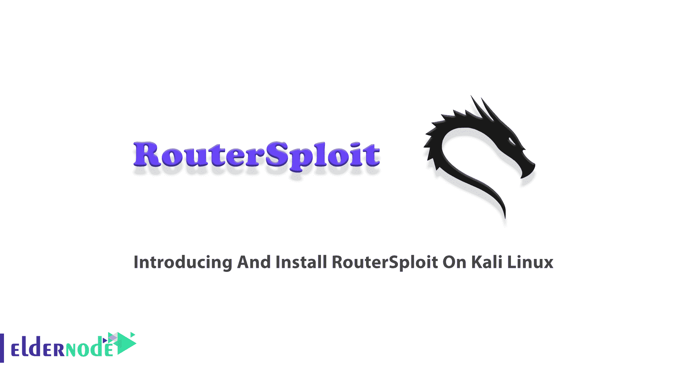

# Kali Linux - Eldernode 博客上介绍和安装 RouterSploit

> 原文：<https://blog.eldernode.com/introducing-and-install-routersploit-on-kali/>



与 Metasploit 类似，RouterSploit 框架是一个利用嵌入式设备的开源开发框架。作为管理员，您可以使用 RouterSploit 来发现这些设备，并在必要时修补、升级或替换它们。RouterSploit 有一个很好的漏洞集合，并且有一个相对于单个路由器来说相当方便的工作组织。正如你所猜测的，这个软件也可以被恶意使用。本文介绍了在 Kali Linux 上介绍和安装 RouterSploit。访问 [Eldernode](https://eldernode.com/) 的可用软件包，以最优惠的价格和支持购买您自己的 **[Linux VPS](https://eldernode.com/linux-vps/)** 。

## **介绍 RouterSploit**

强大的 RouterSploit 拥有 BSD 许可证，可以在大多数 Android 设备上运行，并帮助您识别和利用路由器中的常见漏洞。你可以使用 RouterSploit，评估一些设备(路由器、摄像头等)的[安全性](https://blog.eldernode.com/tag/security/)。)并执行笔测试。RouterSploit 支持 [Linux](https://blog.eldernode.com/tag/linux/) (Kali、Debian、Ubuntu、CentOS)、macOS/Mac OS X、Raspberry Pi、 [Windows](https://blog.eldernode.com/tag/windows/) ，也支持非 root Android 手机。因为 RouterSploit 是一个基于 Python 的应用程序，所以，你可以很容易地开发你自己的模块。正如我们提到的，RouterSploit 类似于 Metasploit，RouterSploit 也是由各种模块组成的。漏洞、有效载荷、扫描器和凭证都是它的模块，它们也在调用“**通用**模块。通用模块执行通用操作，如各种代码改进。

### **RouterSploit 模块**

RouterSploit 带有各种渗透测试模块:

**1-漏洞利用**

漏洞利用是指利用路由器中的漏洞来获取访问权限。他们利用已识别的漏洞。

**2-有效载荷**

为各种架构和注入点生成有效负载。实际有效载荷/数据。所以用来感染/重写被利用的路由器的代码。

**3 台扫描仪**

该模块扫描网络和/或设备，以查看其是否容易受到攻击。他们还检查目标是否容易受到任何利用。

**4- Creds**

“凭证”或“**凭证**模块用于测试不同设备上的凭证。这些旨在根据网络服务测试凭据。使用 creds 模块，您可以对 FTP、SSH、Telnet、HTTP Basic 和 HTTP Form 等各种网络协议进行字典攻击。

## **如何在 Kali Linux 上安装 routersploit**

作为安装 RouterSploit 的一项要求，系统中应存在以下模块。这些模块是 future、requests、Paramiko、Pysnmp 和 Pycrypto。此外，Bluepy–蓝牙低能耗是一项可选要求。

准备好之后，可以使用以下命令在 Kali Linux 上安装 Routersploit:

```
apt-get install python3-pip
```

```
git clone https://www.github.com/threat9/routersploit
```

```
cd routersploit
```

```
python3 -m pip install -r requirements.txt
```

```
python3 rsf.py
```

***注意*** :您也可以运行下面的命令来安装 RouteSploit 和它所依赖的任何其他包:

```
sudo apt-get install routersploit
```

### **如何卸载 Kali Linux 上的 Routersploit**

如果您希望卸载 Routersploit，请使用以下命令仅删除 RouterSploit 软件包本身:

```
sudo apt-get remove routersploit
```

此外，您还可以删除 Routersploit 包和任何其他不再需要的相关包。因此，键入:

```
sudo apt-get remove --auto-remove routersploit
```

但是，如果您还想**删除 Routersploit 的本地/配置文件**,那么无论出于什么原因，这都可以实现，您只需运行:

```
sudo apt-get purge routersploit
```

或者类似地，像这样的 Routersploit:

```
sudo apt-get purge --auto-remove routersploit
```

***重要点*** :被清除的配置/数据*无法*通过重新安装包恢复。

## 结论

RouterSploit 是用 Python 编码的。它还提供了命令行界面、Docker 支持和模块化工具。在本文中，向您介绍了 RouterSploit，您了解了如何在 Kali Linux 上安装 ReouterSploit。尽量定期更新 RouterSploit，因为新模块几乎每天都在增加。你更喜欢哪种开发框架？让你的朋友知道你在 [Eldernode 社区](https://community.eldernode.com/)的经历。