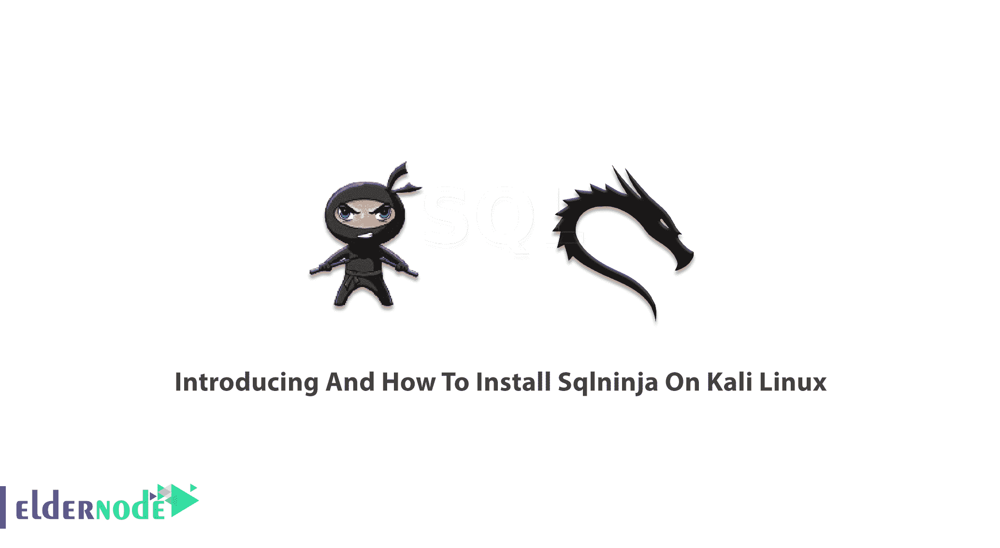
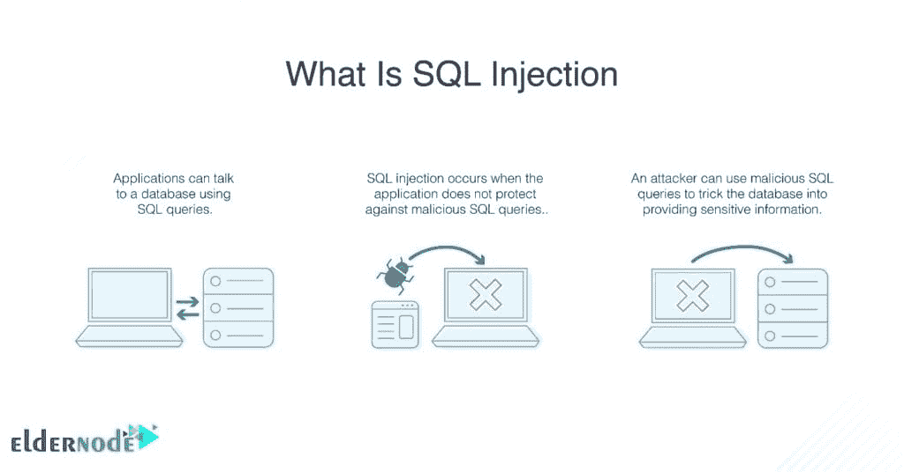
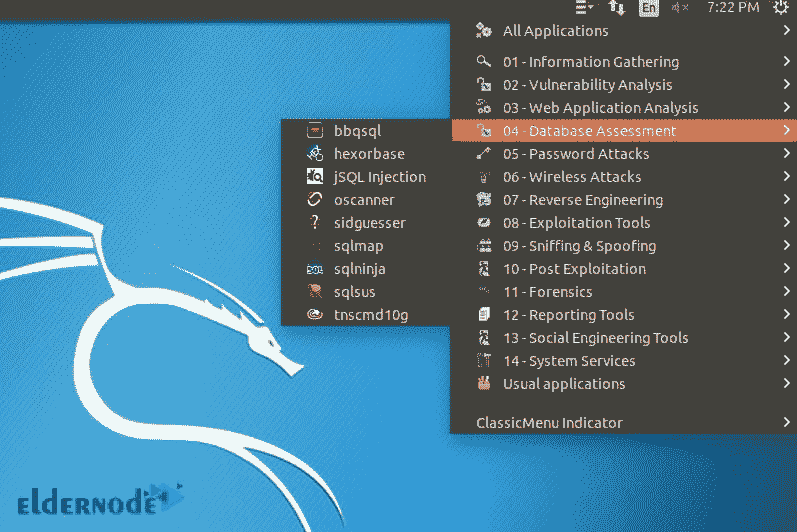

# Kali Linux - Eldernode 博客上的 Sqlninja 介绍及安装方法

> 原文：<https://blog.eldernode.com/introducing-and-install-sqlninja-on-kali-linux/>



永远不要停止关心安全。Sqlninja 是一个 SQL 注入工具。SQL 注入易受攻击，Sqlninja 利用 web 应用程序并在远程主机上获得正在运行的外壳。web 应用程序使用 Microsoft SQL Server 作为其后端。Sqlninja 提供了对易受攻击的数据库服务器的远程访问。当发现 SQL 注入漏洞时，渗透测试人员应该使用 Sqlninja 来帮助和自动化接管 DB 服务器的过程。换句话说，一旦它发现一个 SQL 注入，将自动利用过程。在本文中，我们将介绍如何在 Kali Linux 上安装 Sqlninja。在 [Eldernode](https://eldernode.com/) 上选择自己喜欢的软件包，购买自己的 [Linux VPS](https://eldernode.com/linux-vps/) 。

## **Kali Linux 上的 Sqlninja 介绍**

即使一般环境是敌对的，Sqlninja 也会让攻击者远程访问易受攻击的数据库。渗透测试人员用它来检查 SQL 注入漏洞并分析[安全性](https://blog.eldernode.com/tag/security/)。SQL 注入是对数据库最常见的攻击方式，对 web 应用危害极大。因此，您需要保护您的 web 应用程序来保护您的信息。

### SQL inja 要求

Sqlninja 完全是用 Perl 编写的，它是一个 Perl 脚本，需要许多 Perl 库才能正常工作。因此，您只需要安装 Perl 本身及其模块，例如:

1.  网络数据包
2.  Net-pcap
3.  网络域名系统
4.  网络机器人
5.  IO-套接字-SSL
6.  Net-Pcap
7.  DBI
8.  网络机器人

如果您希望使用 Metasploit 攻击模式，您需要在您的机器上提供 Metasploit Framework 3。此外，如果你想使用 VNC 有效载荷，你需要一个 VNC 客户端。

您应该使用 Perl 解释器在任何基于 Unix 的平台上运行 Sqlninja，以便安装所有需要的模块。Sqlninja 可用于 Unix 操作系统，并已在以下系统上成功测试:

1.  Linux 操作系统
2.  FreeBSD
3.  麦克·OS X
4.  IOS

请注意，Sqlninja 不能在 Windows 上运行。Sqlninja 受 GNU 通用公共许可证 3.0 版(GPLv3)的约束。发布了新版本 0.2.999-alpha1，并增加了通过 WAITFOR 和 DNS 隧道以及基于 vbscript 的数据提取。此外，0.2.6.r1 是 Sqlninja 的稳定版本，缺少 alpha1 上可用的数据提取模块。

### Sqlninja 特性

基于时间或通过 DNS 隧道，Sqlninja 提取数据。

2-SQL inja 提供远程 SQL server 的指纹。它包括版本、执行查询的用户。用户权限、xp_cmdshell 可用性和 DB 身份验证模式。

3-为了获得对远程数据库服务器的图形化访问，Sqlninja 提供了与 Metasploit3 的集成。它通过 VNC 服务器注入或者仅仅是上传 Meterpreter。

4-强制使用基于字典和增量的“sa”密码。

5-如果原始版本已经被删除，它会创建一个自定义的 xp_cmdshell

6-不需要任何 FTP/TFTP，通过 vbscript 或 debug.exe，Sqlninja 可以只使用普通的 HTTP 请求上传 netcat。(当版本 0.2.6 发布时，Sqlninja 使用一种新的方式来配置 HTTP 请求和相对注入字符串)

7-直接和反向绑定外壳，包括 TCP 和 UDP。(数据库服务器可以解析外部主机名)

8- TCP/UDP 端口从目标 SQL Server 扫描到攻击机器，以便找到目标网络的防火墙允许的端口，并将其用于反向外壳。

9-如果找到“sa”密码，Sqlninja 将提升 sysadmin 组的权限。

10- Sqlninja 考虑了规避技术来混淆一些 IDS/IPS/WAF。

11- Sqlninja 支持 CVE-2010-0232，将 sqlservr.exe 的特权升级到系统。

### SQL 注入攻击

SQL 注入是对 web 应用程序最危险的攻击之一。并被列为十大 Web 应用程序安全威胁之一。SQL 注入袭击何时发生？如果应用程序未经验证就处理用户提供的数据，就会发生 SQL 注入。所以，SQL 注入可以让黑客访问数据库内容或系统中的远程命令。公司和组织使用 SQL servers 作为存储机密信息的数据库。所以，黑客选择攻击它的原因就很清楚了。这可能导致黑客控制托管数据库的服务器。如果你想知道 SQL 注入攻击中哪些因素是有效的，请看下面的列表:

1-漏洞出现在代码中的位置。

2-漏洞如何让黑客行动。

3-受损应用程序对服务器数据库的访问级别。



## **教程在 Kali Linux 上安装 SQL inja**

数据库通过提供广泛的功能，如数据输入和存储、大量信息的检索等，来帮助用户和服务器。黑客和 Pentesters 总是试图抓住机会找到数据库安全性的漏洞。因此，您可以使用 Sqlninja 通过 SQL 注入漏洞来控制数据库服务器。现在您已经熟悉了 SQL inja 和 SQL 注入，让我们看看如何在 Kali Linux 服务器上安装 SQL inja。

### **在 Kali Linux 上安装 Sqlninja【完成】**

运行以下命令进行安装:

```
sudo apt-get install sqlninja
```

现在，您已经安装了 Sqlninja 和所有需要的包。

要安装所有依赖项，请使用以下命令:

```
sudo apt-get install
```

您可以在 Kali 中导航至应用程序>数据库评估找到它。

### 

### **如何在 Kali Linux 上卸载 SQL inja**

每当您需要删除 Sqlninja 时，都可以运行下面的命令来执行此操作:

```
sudo apt-get remove sqlninja
```

这样，您可以只删除 Sqlninja 包本身。

此外，您可以使用以下命令卸载 Sqlninja 及其依赖项。

```
sudo apt-get remove --auto-remove sqlninja
```

使用下面的命令也可以帮助您清除配置/数据:

```
sudo apt-get purge sqlninja
```

或者，

```
sudo apt-get purge --auto-remove sqlninja
```

这样，您将删除 Sqlninja 的本地/配置文件。

就是这样。至此，您已经成功完成了本指南。如果您打算购买一台专用服务器，并且安全性是您的目标，请关注我们的 T2 文章安全，快速免费成为专家。

## 结论

在本文中，您了解了如何在 [Kali Linux](https://blog.eldernode.com/install-and-configure-kali-linux-on-vps/) 上安装 Sqlninja。请注意，您并没有使用 Sqlninja 作为检测注入缺陷存在的工具，但是正如您在本指南中所阅读的，它被用来利用该缺陷对数据库服务器进行外壳访问。