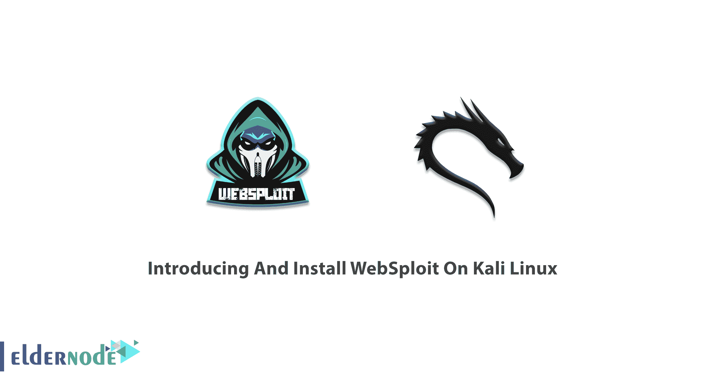
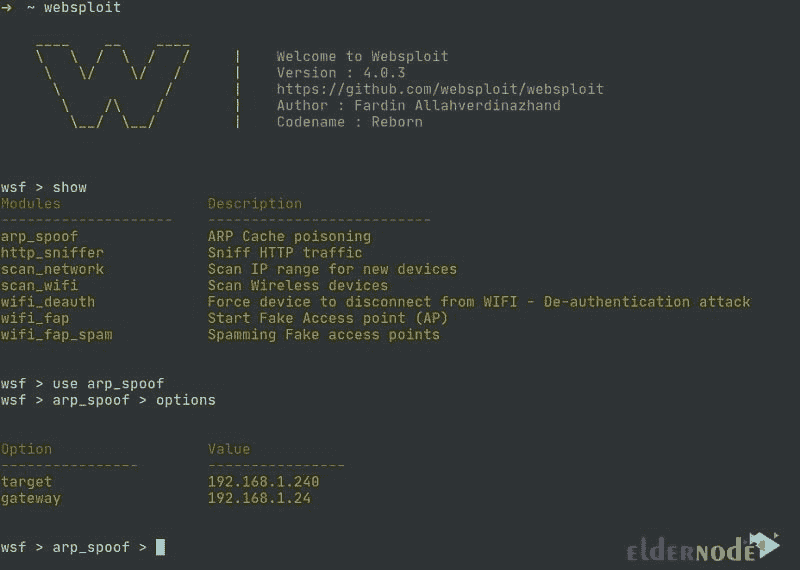

# 在 Kali Linux 上介绍和安装 WebSploit

> 原文：<https://blog.eldernode.com/introducing-and-install-websploit-on-kali/>



WebSploit 是一个针对有线和无线网络攻击的开源框架，用 Python 编写。它用于测试网络应用程序网络，并使用模块来扫描目录、中间人和无线攻击。默认情况下，这个框架在 [Kali Linux](https://blog.eldernode.com/tag/kali-linux/) 上可用，你也可以在其他发行版上使用它。本文介绍**在 Kali Linux** 上介绍和安装 WebSploit。由于网站配置错误，攻击者可以查看通常不应该看到的目录。加入我们来回顾 WebSploit 扫描和攻击的能力。购买一个可用的 [Eldernode](https://eldernode.com/) 包来准备你自己的 [Linux VPS](https://eldernode.com/linux-vps/) 。

## **逐步介绍 Kali Linux 上的 web sploit**

黑客或安全的相关工具和操作系统正在开发中。有许多强大的工具为专业人员进行入侵测试提供了便利，但也被许多黑客用来实现恶意目标。大多数黑客和[安全](https://blog.eldernode.com/tag/security/)工具都是双面的，因为它们既用于黑客攻击，也用于安全和入侵测试。最强大的双刃工具之一是 **WebSploit 工具**。由于目录包含私有凭据或配置文件，将使用来设计针对服务器的攻击。黑客使用 WebSploit 可以轻松扫描目标和查看任何隐藏的目录。



WebSploit Menu

### **介绍 WebSploit 特性:**

WebSploit 支持多个漏洞。下面的列表显示了 WebSploit 扫描和攻击的能力:

1.社会工程作品

2.扫描、爬虫和分析网络

3.自动剥削者

4.支持网络攻击

5.autopwn–在 Metasploit 中用于扫描和利用目标服务

6.Wmap–扫描，从 Metasploit Wmap 插件使用的 Crawler 目标

7.format infector——将反向和绑定有效载荷注入文件格式

8.PHPMyAdmin 扫描仪

9.云耀斑分解器

10.LFI 旁路

11.Apache 用户扫描仪

12.迪尔·布鲁特

13.管理查找器

14.MLITM 攻击–中间人、XSS 网络钓鱼攻击

15.MITM——中间人攻击

16.Java Applet 攻击

17.MFOD 攻击媒介

18.USB 感染攻击

19.ARP Dos 攻击

20.网络黑仔攻击

21.Wifi Dos

22.假冒接入点攻击

23.蓝牙 POD 攻击

24\. Wifi Jammer

25.假冒更新攻击

26.Wifi 蜜罐

### **如何在 Kali Linux 上使用 WebSploit 工具**

WebSploit 框架是 [Kali Linux](https://blog.eldernode.com/tag/kali-linux/) 发行版中工具集的一部分。它用于 web 应用程序的漏洞分析和渗透测试。WebSploit 被认为是 Metasploit 强大工具的激烈竞争对手。

运行 Kali 发行版时，请遵循以下路径启动 WebSploit。

应用程序> > Kali Linux >> Web 应用程序> > Web 应用程序模糊器> > Websploit

## **在 Kali Linux 服务器上安装 web sploit**

要安装 WebSploit 和任何其他软件包，请运行以下命令:

```
sudo apt-get install websploit
```

### **如何在 Kali Linux 上卸载 WebSploit**

您可以使用以下命令**卸载 WebSploit** :

```
sudo apt-get remove websploit
```

这样，您可以只删除 WebSploit 包本身。此外，您可以卸载 WebSploit 及其依赖项，请键入:

```
sudo apt-get remove --auto-remove websploit
```

使用下面的命令**删除 WebSploit 的本地/配置**:

```
sudo apt-get purge websploit
```

或者类似的，像这个 WebSploit

```
sudo apt-get purge --auto-remove websploit
```

*注意* :您必须小心使用上述命令，因为被清除的配置/数据不能通过重新安装软件包来恢复。

## 结论

在本文中，我们向您介绍了 WebSploit，您学习了如何在 Kali Linux 上安装 WebSploit。在 [Eldernode Community](https://community.eldernode.com/) 上与你的朋友讨论你是否使用了任何替代工具，或者你在使用这个工具的过程中是否发现了任何缺点。