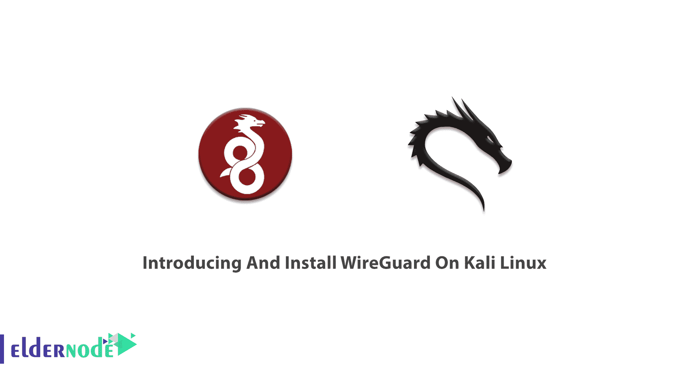
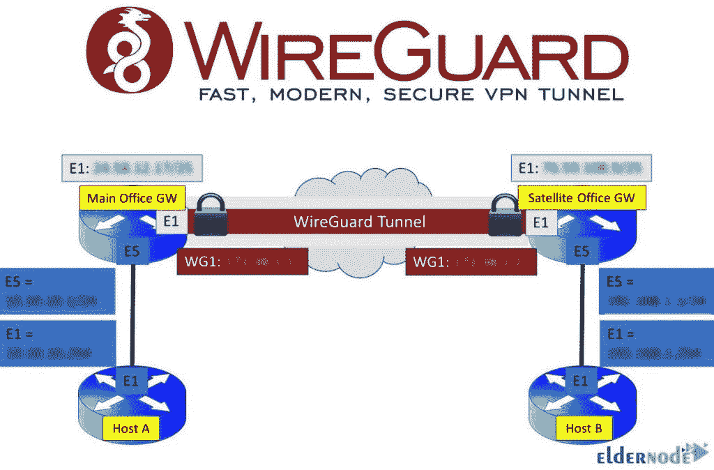

# 在 Kali Linux - Eldernode 博客上介绍和安装 WireGuard

> 原文：<https://blog.eldernode.com/introducing-and-install-wireguard-on-kali/>



WireGuard 是一个免费、开源、简单、快速的现代 VPN。它被认为是业内最安全、最容易使用、最简单的 VPN 解决方案。WireGurd 最初是为 Linux 内核发布的，但现在已经广泛开发并支持 Windows、macOS、BSD、iOS 和 Android。内核组件在 GPLv2 下发布。根据上下文，其他项目是在 MIT、BSD、Apache 2.0 或 GPL 下许可的。加入我们这篇文章来回顾一下**在 Kali Linux 上介绍和安装 wire guard**。要购买您自己的 **[Linux VPS](https://eldernode.com/linux-vps/)** ，请在 [Eldernode](https://eldernode.com/) 上找到您喜欢的带有精确定制计划的软件包。

## **Kali Linux 上的 WireGuard 介绍**

在下面几节中，我们将定义 WireGuard 并解释它的工作原理。然后我们看看它的特点、优点和缺点。最后，我们将教你如何在 Kali Linux 上安装 WireGuard。和我们在一起。

### **什么是 WireGuard，它是如何工作的？**

WireGuard 比旧的 VPN 更安全，因为它使用最新的加密协议，如 ChaCha20、Curve25519、BLAKE2s、SipHash24、HKDF 等。虽然其他 VPN 协议，如 [OpenVPN](https://blog.eldernode.com/set-up-openvpn-debian-10/) 有超过 400，000 行代码，但 WireGuard 只有大约 4，000 行。更少的代码行意味着更容易审计和发现漏洞。它还可以像 SSH 一样易于配置和部署，并提供一个基本而强大的界面。然而，一个安全的 VPN 可以帮助你提高你的[安全](https://blog.eldernode.com/tag/security/)，隐私和在线匿名。

WireGuard 最重要的特点是其轻便的设计和更快的连接时间。当用户等待 OpenVPN 提供 VPN 连接大约 10 秒或更长时间时，WireGuard 将会非常快地完成这项工作。此外，如果你在移动设备上使用 WireGuard VPN，你将获得更**可靠的连接**和更好的电池寿命。此外，当您更改移动设备上的网络接口(从 WiFi 到移动/蜂窝数据)时，只要 VPN 客户端继续向 VPN 服务器发送认证数据，就不会失去**连接**。

由于 Wireguard 是一种分散的对等 VPN 协议，因此直接在两台计算机之间打开隧道，而不需要服务器。这样，WireGuard 服务器就是一台包含多个对等点的连接配置的机器。WireGuard 命令行工具和其他在 Linux[上可用的资源](https://blog.eldernode.com/tag/linux/)用于在对等机器上进行配置。在下图中，您可以看到网络中的 WireGuard 架构。



### **铁丝网特性**教程中的**安装铁丝网**

让我们来看看这个简单的 VPN 有哪些特性可以为加密技术提供更好的性能和效率:

–简单易用

–加密声音

–最小的攻击面

–高性能

–定义明确，考虑周全

–非常快速、安全、私密

–降低复杂性

–支持许多操作系统变体

### **WireGuard 的优势在文章中介绍并安装 WireGuard**

WireGuard 是一个安全的虚拟专用网络，以其简单易用而闻名。以下是 WireGuard 的优势:

–更新的加密

–简单和最小的代码库

–性能提升

–测试最快的 VPN 协议

–跨平台易用性

–比 IPSec 使用更少的内存和 CPU

–使用更少的带宽

–支持许多操作系统变体

### **铁丝网弊端**

虽然 WireGuard 非常安全，但它在设计时并没有考虑隐私。所以，我们来看看它的一些问题。

1-在 VPN 服务器上无限期存储用户 IP 地址

2- WireGuard 不分配动态 IP 地址

3-不记录无法使用

但是，有一些解决方案可以解决这些隐私问题。例如，一些提供 WireGuard 的 VPN 提供商已经实现了他们自己的系统来绕过这个缺陷，并提供他们自己的 WireGuard 修改版本。

## **如何一步步在 Kali Linux 上安装 wire guard**

WireGuard 是一种简单快速的 VPN 隧道服务。WireGuard 易于设置和使用。它最近还增加了 Kali 知识库。要在 [Kali Linux](https://blog.eldernode.com/tag/kali-linux/) 上安装 WireGuard，您应该拥有 WireGuard apt 库，这取决于您正在运行的版本。

首先，通过运行以下命令更新您的系统:

```
sudo apt-get update
```

```
sudo apt-get upgrade
```

现在，输入一个简单的 apt 命令来安装 WireGuard:

```
sudo apt-get install –y wireguard
```

### 如何在 Kali Linux 上配置 WireGuard 客户端

一旦确保在系统上安装了 WireGuard，就可以开始配置 WireGuard 客户端了。

首先，您需要生成键值对。

```
wg genkey | tee privatekey | wg pubkey > publickey    umask u=rwx,go= && cat /etc/wireguard/wg0.conf << EOF    [Interface]    Address = CLIENT_IP    PrivateKey = CLIENT PRIVATE KEY
```

```
[Peer]
```

```
PublicKey = SERVER PUBLIC KEY
```

```
Endpoint = SERVER_IP:51820
```

```
AllowedIPs = 0.0.0.0/0
```

```
PersistentKeepalive = 21
```

```
EOF
```

现在，您可以保存文件并启用 VPN。

```
sudo wg
```

## 结论

在本文中，我们试图帮助您在 Kali Linux 上介绍和安装 WireGuard。时间会告诉我们关于 WireGuard 是否会取代 OpenVPN 的猜测。与你在 [Eldernode community](https://community.eldernode.com/) 的朋友讨论，如果你已经使用了他们两个或者你有别的想法。