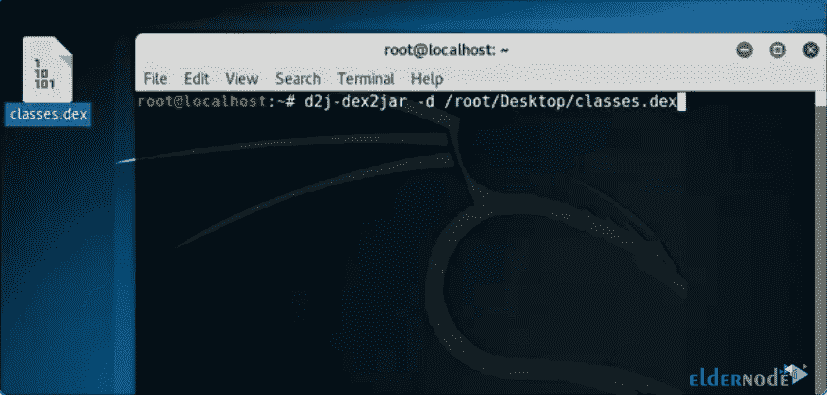
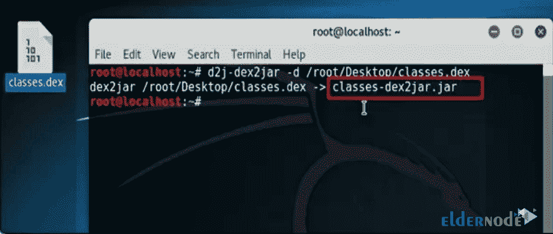
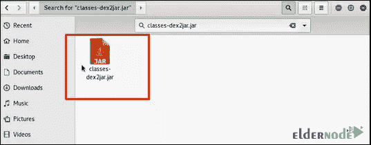

# Kali Linux - Eldernode 上 Dex2jar 的介绍和使用

> 原文：<https://blog.eldernode.com/introducing-and-use-dex2jar-on-kali-linux/>


**Dex2jar** 是一个免费的应用程序，允许你将 APK 文件转换成 jar 文件，并查看源代码。将 APK 的 classes.dex 文件转换为 classes.jar 文件或者反过来是 Dex2jar 的核心特性。你可以通过 Java 反编译器查看一个 Android 应用的源代码。还有，你可以得到”。smali”文件直接从 classes.dex 文件中导出，反之亦然，因此可以更改直接使用这种格式的应用程序的源代码。本文介绍**在 Kali Linux** 上介绍和使用 Dex2jar。要购买您自己的 [Linux VPS](https://eldernode.com/linux-vps/) ，请访问 [Eldernode](https://eldernode.com/) 上的可用软件包来购买您需要的东西。

## Kali Linux 上的 Dex2jar 简介

Dex2jar 是一个用于 android 的应用程序。dex 和 java。类文件。它将一种二进制格式转换成另一种格式，而不是转换成源代码。Dex2jar 受 Apache2.0 许可。在本文的后续部分，请加入我们，学习如何在 [Kali Linux](https://blog.eldernode.com/install-and-configure-kali-linux-on-vps/) 上使用 Dex2jar。

### **Dex2jar 组件**

Ex2jar 包含一些组件。请看下面的列表:

dex-reader 设计用于读取 Dalvik 可执行文件(。dex/。odex)格式。它有一个类似 ASM 的轻量级 API。

dex-translator 被设计来完成转换工作。它读取 dex 指令以

dex-ir 格式，经过一些优化，转换成 ASM 格式。

dex-translator 使用的 dex-ir 用于表示 dex 指令

dex-tools 要使用的工具。类文件。下面是一些例子:修改 apk，去除罐子的气泡

d2j-smali 【待发布】将 dex 反汇编成 smali 文件，并将 dex 从

smali 文件。与 smali/baksmali 的实现不同，语法相同，但我们支持 desc 类型中的转义

dex-writer 【待发布】用和 dex-reader 一样的方式写 dex。

## **如何在 Kali Linux 上一步步使用 dex 2 jar**

要查看桌面上的文件“ **classes.dex** ”，打开终端，写“**d2j-dex 2 jar–d/文件位置**”。



这样，将创建一个 JAR 文件，如下所示:



*



### **如何在 Kali Linux 上安装 dex 2 jar**

Dex2Jar 工具是 Kali Linux 的逆向工程之一。它预装在逆向工程工具下的 [Kali Linux](https://blog.eldernode.com/tag/kali-linux/) 上。要在 Kali Linux 上安装它，请使用以下命令:

```
sudo apt-get install dex2jar
```

### **如何使用 dex 2 jar**

下面是 Dex2jar 的利用率。

```
sh d2j-dex2jar.sh -f ~/path/to/apk_to_decompile.apk
```

您将看到类似于*apk _ to _ decompile-dex 2 jar . jar*的输出

### **如何使用 dex2jar** 读取 dex 文件

以下是解决方案。

```
DexFileReader r = new DexFileReader(...);
```

```
DexFileNode n = new DexFileNode();
```

```
DexFileWriter w = new DexFileWriter();
```

```
// reade dex to DexFileNode
```

```
r.accept(n);
```

```
... // modify DexFileNode here
```

```
// copy modified DexFileNode to DexWiter
```

```
n.accept(w);
```

```
byte[] data = w.toByteArray();
```

```
... // save data
```

### 如何将 jar 转换为 dex

android sdk 的 dx 工具可以完成这项工作

```
dx --dex --output=classes.dex abc.jar
```

来自 dex2jar 的[d2j-jar2dex]也可以完成这项工作

```
d2j-jar2dex.sh --output=classes.dex abc.jar
```

## 结论

在本文中，您回顾了在 Kali Linux 上介绍和使用 Dex2jar。注意，您应该在 d2j_invoke 脚本中增加 JVM 内存的大小，否则，在将 DEX 转换为 JAR 时，您可能会遇到大尺寸 DEX 文件的错误。询问您在 [Eldernode Community](https://community.eldernode.com/) 上的朋友是否使用过这个工具。