# 介绍以太坊并获得一个 VPS-elder node 博客

> 原文：<https://blog.eldernode.com/introducing-ethereum-and-get-a-vps-with-it/>

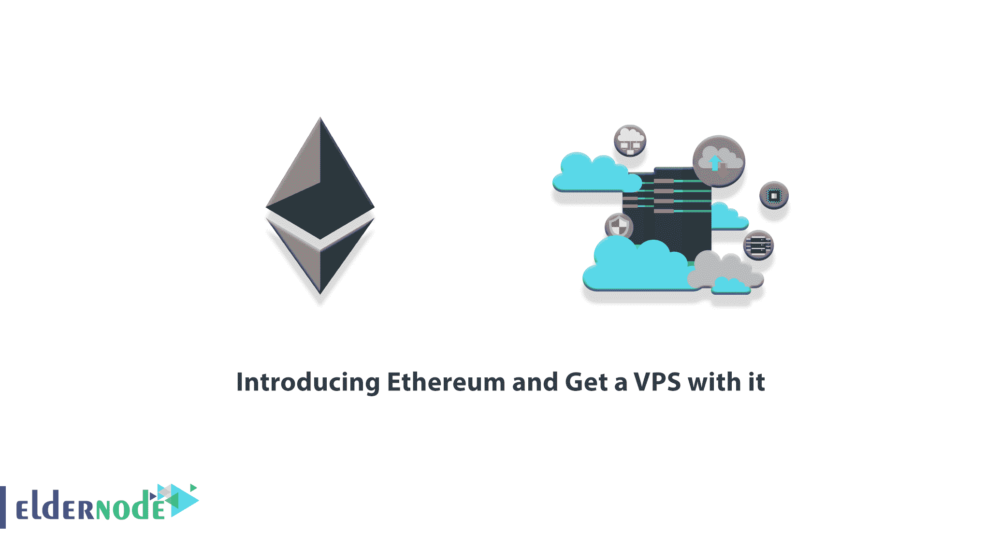

想象一个去中心化的世界。在这个世界里，人们无需信任中介，直接处理分散的项目，签署合同，并使用各种金融和非金融服务。由人民控制的系统永远不会停止，没有人能干涉他们的工作。以太坊是一种基于区块链技术的数字货币，旨在实现这一目标。在这篇文章中，我们将**介绍以太坊，并用它在 [Eldernode](https://eldernode.com/) 中获得一个 [VPS](https://eldernode.com/vps/) 。**

## **以太坊(ETH)简介**

**以太坊是一种非常受欢迎的加密货币，无论是受欢迎程度还是市场规模都仅次于比特币，可用于投资。以太坊可以通过购买或挖掘获得。更具体地说，以太坊是一个区块链平台，以其本国货币 ETH 命名。应该注意的是，以太坊是一个全球化、开源、分布式的区块链平台，包括智能合约、分布式应用软件(DApp)开发和业务支持去中心化金融(Defi)。**

**因为分散式应用程序运行在区块链上，所以它们也可以使用区块链的所有特性。例如:**

****1。不变性****

**中介和第三方不能更改数据。**

****2。不可侵犯和侵扰****

**程序在网络共识的基础上运行。因此，不存在审查、网络入侵或删除数据的可能性。**

****3。安全性****

**没有中央实体，由加密技术保证。**

****4。始终激活****

**程序永远不会停止，也没有人能阻止它们。**

**任何集中式的服务都可以通过以太坊去中心化。支付等大型服务。我们在 **Eldernode 团队**也决定允许用户支付基于数字货币的服务，包括以太坊。在这篇文章的续篇中，加入我们来教你如何使用以太坊购买 VPS 服务器。**

### ****什么是 VPS？**VPS 功能**

**[什么是 VPS](https://blog.eldernode.com/what-is-vps-complete-guide/) ，在上一篇文章中有详细描述。在这一部分，我们想简单解释一下 VPS。**

**VPS 服务器是与其他操作系统共享硬件和软件资源的服务器。VPS 服务器实际上是一种半专用服务器，与专用服务器的不同之处在于它如何与其他用户共享资源。**

**当您使用 VPS 服务器时，您将只能获得一部分[专用服务器](https://eldernode.com/dedicated-server/)资源。在某种程度上，可以说 VPS 服务器是专用服务器的子集和一部分。当然，不言而喻，你对 VPS 服务器的访问是完全特殊的，对你来说是唯一的，不会干扰其他用户的 VPS 服务器。**

*****注:*** 每个 VPS 服务器提供不同的 IP、文件目录、私有空间，以及特定的邮件访问。**

**VPS 服务器的使用和购买与日俱增。因为，例如，企业已经得出结论，即使他们的服务器因为任何原因停机一个小时，他们也会失去几个客户。事实上，任何需要一天 24 小时完成的事情都需要 VPS 服务器。拥有一个网站也是其中之一。**

## ****elder node**中的 VPS 服务器位置**

**在我们开始讨论如何购买 VPS 之前，在本节中，我们想向您介绍一下 Eldernode 的 **VPS 位置。在本文的后续部分，将解释如何选择这些位置。现有的 VPS 地点分为三类:**北美**、**欧洲、**和**亚洲**。在下文中，我们将提到其中的每一个位置。请注意，如果您要寻找的位置不在此列表中，您可以通过实时聊天或发送票证联系支持部门来获得建议。****

### ****北美可用的 VPS 服务器****

**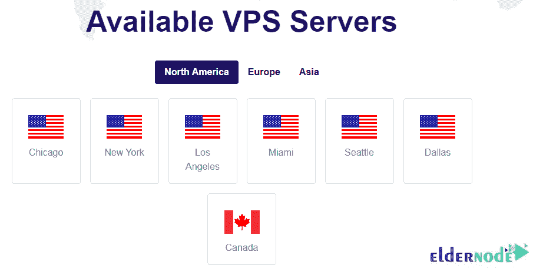**

**芝加哥**

**–纽约**

**洛杉矶**

**迈阿密**

**西雅图**

**达拉斯**

**–加拿大**

****欧洲可用的 VPS 服务器****

**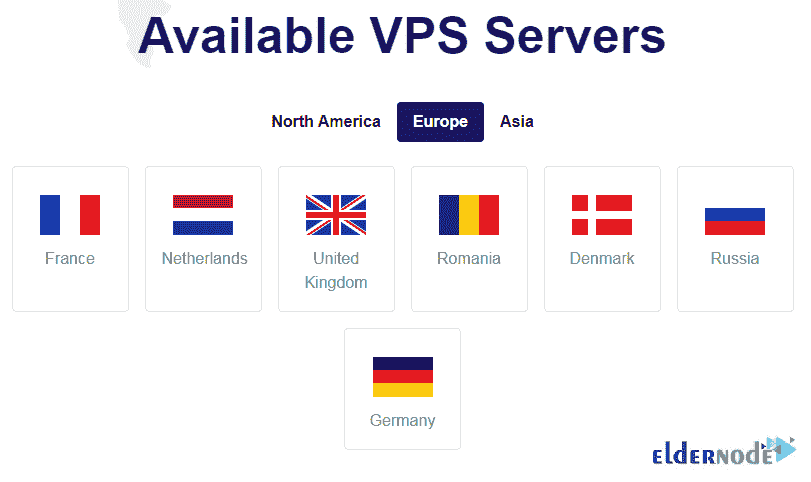**

**法国**

**–荷兰**

**–英国**

**-罗马尼亚**

**–丹麦**

**俄罗斯**

**–德国**

****亚洲可用的 VPS 服务器****

### **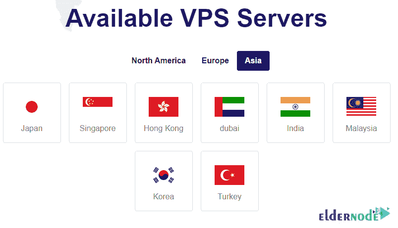**

**–日本**

**–新加坡**

**–香港**

**–迪拜**

**–印度**

**–马来西亚**

**–韩国**

**土耳其**

****如何在 Eldernode** 用以太坊购买 VPS**

**访问 [**Eldernode 网站**](https://eldernode.com/) 购买 VPS 服务器。开始的第一步是在网站上注册。你可以通过参考文章[如何在 Eldernode](https://blog.eldernode.com/register-on-eldernode-and-order-vps/) 上注册来轻松做到这一点。**

**然后在主菜单中点击**购买 VPS** 。**

**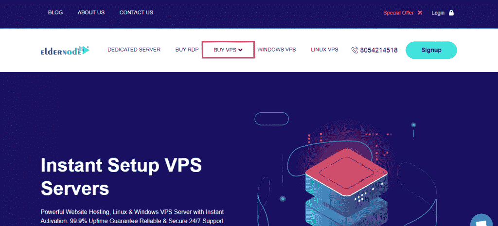**

**在打开的页面上，向下滚动一点，可以看到可用的 VPS 服务包括 [Windows VPS](https://eldernode.com/windows-vps/) 、 [Linux VPS](https://eldernode.com/linux-vps/) 、 [Mikrotik VPS](https://eldernode.com/mikrotik-vps-server/) 和 [RDP 管理](https://eldernode.com/buy-rdp/)服务器。点击**查看所有计划**中您想要查看的部分计划。**

**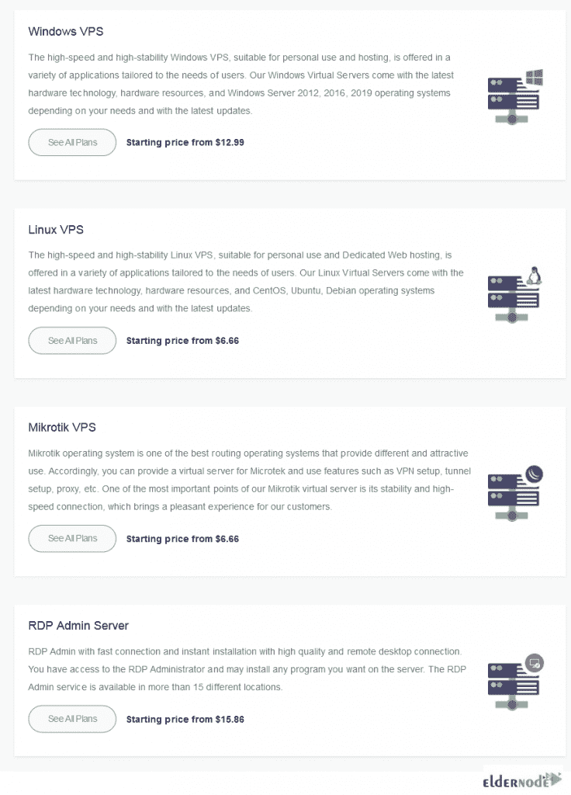**

**例如，我们在这里选择**管理 RDP 服务器**。下一步，你可以确定你想要的服务是基于**每月**还是**每年**的？然后，在研究完套餐后，您必须点击**立即订购**来选择您想要的套餐。**

**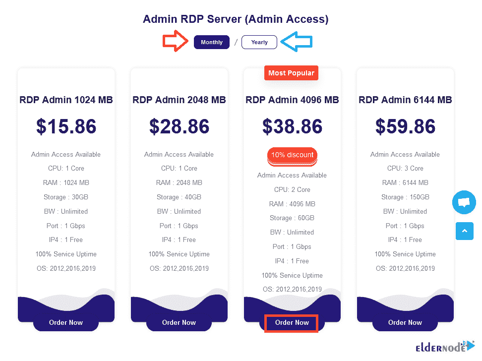**

**下一步叫做**配置**。在此阶段，您可以查看所选服务的详细信息。在**可配置选项**部分，您必须选择您想要的**位置**和**操作系统**。**

**请注意，在**可用插件**部分，您可以选择一个可用选项来支持您的服务。完成这些步骤后，点击右栏的**继续**。**

**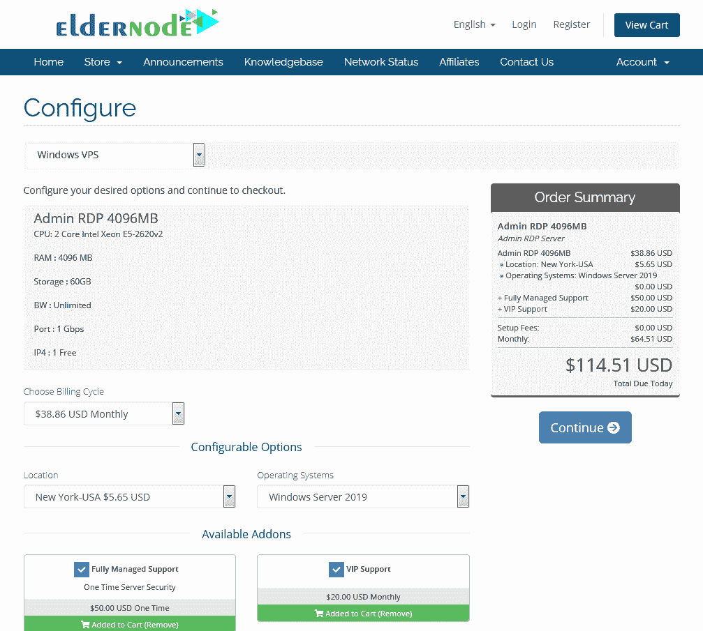**

**在**查看&结账**部分，你可以看到你的购物车。如果您有**折扣代码**，请在**应用促销代码**部分输入该代码，然后点击**验证代码**以应用您的折扣。**

**然后点击右栏的**结账**。**

**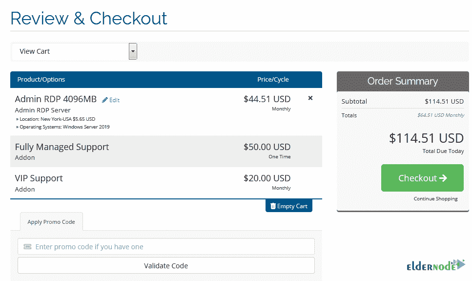**

**下一步，您必须指定**付款方式**。由于我们将使用以太坊进行购买，您必须在此部分选择**比特币、以太坊、USDT 和所有加密货币**，并点击**完成订单**。**

**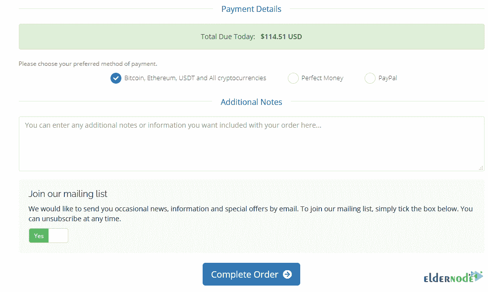**

*****注意:*** 这一步可能需要几秒或几分钟，请耐心等待。**

**在右栏的搜索字段中输入 **Eth** 。选择**乙醚**后，点击左侧**完成结账**。**

**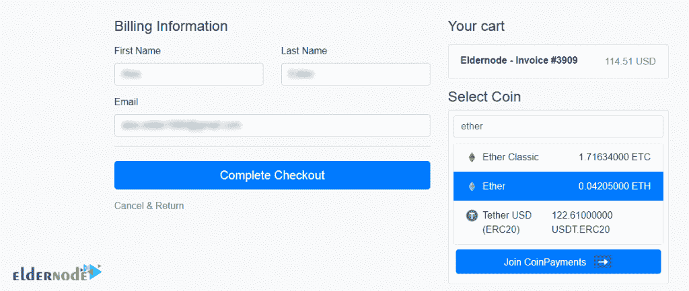**

**最后，在你的**以太坊钱包**中复制以下地址，即可完成存款。**

**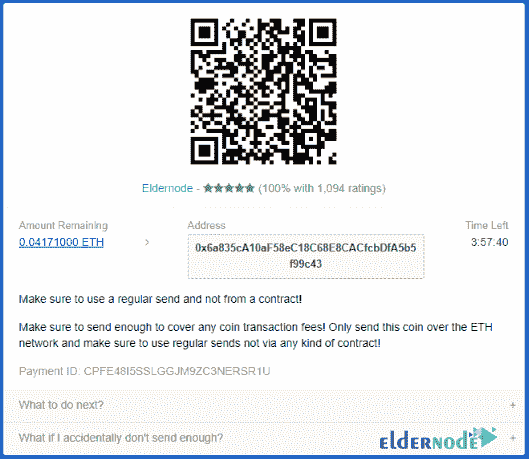**

**我们向您保证，我们将在最短的时间内提供您所购买的服务。**

**结论**

**以太坊为每个人提供免费的数字货币和数据友好服务，无论他们的背景或地理位置如何。这就是为什么在这篇文章中，我们试图向您介绍以太坊，并教您如何在 Eldernode 网站上使用它购买 VPS 服务器。你可以阅读更多关于 [Linux VPS vs Windows VPS](https://blog.eldernode.com/linux-vps-vs-windows-vps/) 的信息。**

## **[yasr _ visitor _ votes size = " medium "]**

**Ethereum provides free access to digital money and data-friendly services for everyone, regardless of their background or geographical location. That’s why in this article we tried to introduce you to Ethereum and teach you how to buy a VPS server using it on the Eldernode website. You can read more about [Linux VPS vs Windows VPS](https://blog.eldernode.com/linux-vps-vs-windows-vps/) for more information.**

**[yasr_visitor_votes size=”medium”]**