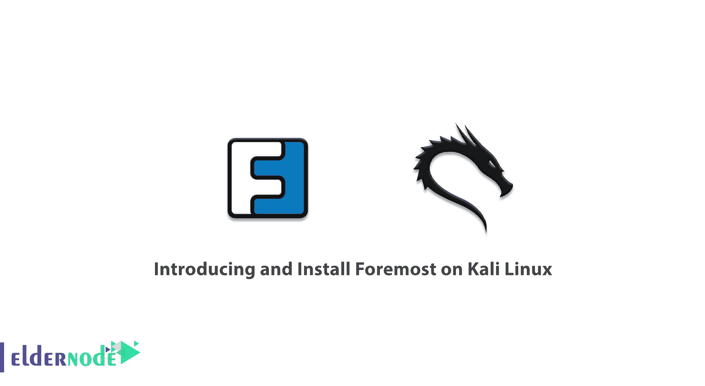

# Kali Linux - Eldernode 博客上的介绍和安装

> 原文：<https://blog.eldernode.com/introducing-install-foremost-on-kali-linux/>



计算机世界中最困难和复杂的主题之一是数据存储和检索，这是非常专业的主题。我们的信息被无意或有意删除的情况已经发生了很多次，我们正在考虑归还这些信息。在许多情况下，我们要么去找修理工，要么担心我们的数据。在下面的教程中，我们将介绍一个工具，通过它你可以自己恢复你的信息。这是最重要的工具，是一个专有工具。请注意，默认情况下，在 Kali Linux 中可以使用 foremost。我们正试图在 Kali Linux 上引入和安装。你可以访问 [Eldernode](https://eldernode.com/) 提供的包来购买 [Linux VPS](https://eldernode.com/linux-vps/) 服务器。

## **介绍卡利最前面的**

foremost 是取证领域的一个强大工具，用于数据恢复和丢失信息领域。该工具能够根据文件的页眉和页脚以及数据的内部结构检索各种格式。该工具还能够处理图像文件，并且可以轻松处理 dd、safe beach 和 encase 等工具的输出。在本文的后续部分，我们将学习如何在 [Kali Linux](https://blog.eldernode.com/install-and-configure-kali-linux-on-vps/) 上安装 Foremost。

### **最重要的是做什么？**

数据恢复成功的关键之一是你没有把新的内容复制到硬盘或者所谓的重写。假设您硬盘无意中被格式化了。在这种情况下，数据恢复的几率非常高。但是，如果您在上面复制内容，然后想要检索数据，您的机会就低得多。因为新的数据集放在先前数据的空白空间上，是所谓的重写。在这种情况下，恢复的数据较少。

最重要的工具被设计成忽略文件系统类型，直接读取和复制部分驱动器到计算机内存。它一次一段地获取这些部分，并使用称为文件雕刻的过程在内存中搜索与 Foremost 的配置文件中找到的文件头类型相匹配的文件头类型。当找到一个匹配项时，它将该文件头及其后面的数据写入一个文件，当找到一个页脚时停止，或者直到达到文件大小限制。

Foremost 使用命令行界面，没有可用的图形用户界面选项。它能够恢复特定的文件类型，包括 jpg，gif，png，bmp，avi，exe，mpg，wav，riff，wmv，mov，pdf，ole，doc，zip，rar，htm 和 cpp。

### **如何在 Kali Linux 上安装最重要的**

在前面几节中熟悉了 Foremost 及其特性之后，现在是安装它的时候了。要在 Kali Linux 上安装 Foremost，您可以轻松地运行以下命令:

```
sudo apt-get install foremost
```

注意，通过执行上面的命令，Foremost 和其他依赖包也将被安装。

## 结论

最重要的工具是法医领域最强大的工具之一。如前所述，这个程序在 Kali Linux 操作系统上默认可用。要运行它，只需转到应用程序部分的取证部分。然后找到工具，或者通过输入最前面的命令调用终端中的程序。在本文中，我们试图介绍并在 Kali Linux 上安装。