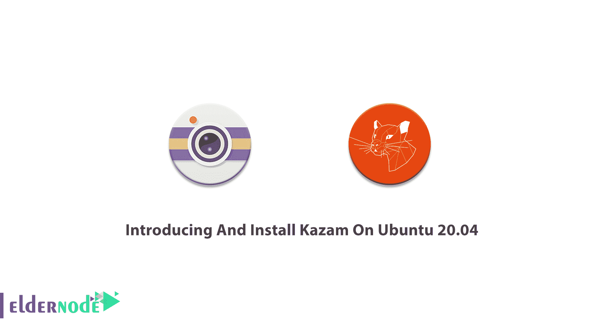
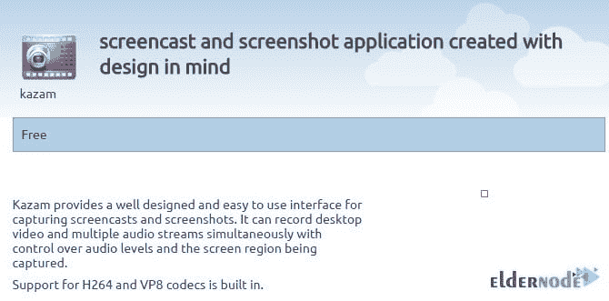
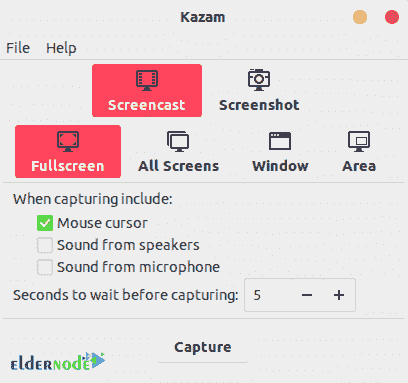
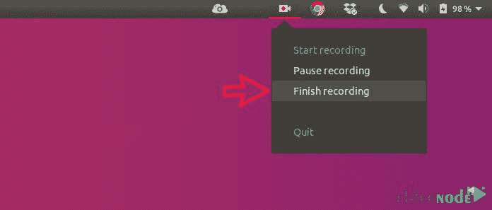
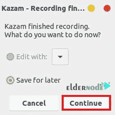
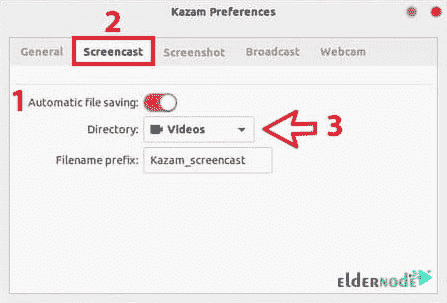
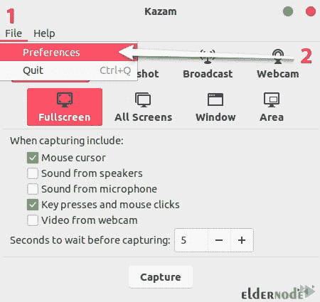
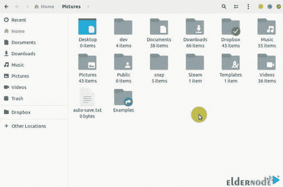

# 在 Ubuntu 20.04 - Eldernode 博客上介绍和安装 Kazam

> 原文：<https://blog.eldernode.com/introducing-install-kazam-on-ubuntu-20-04/>



Kazam 是一个简单的屏幕录制程序，可以捕捉屏幕截图，并录制视频文件。Kazam 可以同时录制桌面视频和多个音频流，并控制音频级别和正在捕捉的屏幕区域。新用户是 Kazam 的粉丝，因为它需要一个小的配置设置，他们可以捕捉和记录屏幕视频。您可以捕捉屏幕内容并录制视频文件。任何支持 VP8/WebM 视频格式的视频播放器都可以播放视频。清晰的声音由 Kazam 录制，视频可以保存为几种不同的文件格式。在本文中，你将学习**介绍并在 Ubuntu 20.04** 上安装 Kazam。如果你正准备购买一台新的 [Linux VPS](https://eldernode.com/linux-vps/) 或者你需要拥有自己的 [Ubuntu VPS](https://eldernode.com/ubuntu-vps/) 服务器，你可以以你能想象的最快速度购买你需要的东西。

为了让本教程更好地发挥作用，请考虑以下**先决条件**:

拥有 sudo 权限的非 root 用户。

要进行设置，请遵循我们在 Ubuntu 20.04 上的[初始服务器设置。](https://eldernode.com/ubuntu-vps/)

基本的 Linux 知识并熟悉 shell 的使用。

用你自己的 [VPS](https://eldernode.com/vps/) 托管你的网站。

## **在 Ubuntu 上引入并安装 Kazam 20**

通过这篇文章，我们可以了解到什么是 Kazam，如何在你的 Ubuntu 服务器上安装它，以及如何在投射屏幕之前定制录制你的屏幕。Kazam 提供了一个易于使用且设计良好的用户界面。它也是为 [Linux](https://blog.eldernode.com/tag/linux/) 操作系统设计的。本指南的以下说明将适用于其他基于 Ubuntu 的发行版，如 Linux Mint、elementary OS 等。



### **卡赞**简介

Kazam 允许你捕捉整个屏幕，一个特定的窗口，甚至是一个选定的屏幕区域。通过使用它的热键，您将能够开始、暂停、恢复和结束录制。它的最新版本还可以记录你的鼠标点击和键盘按键。此外，它还提供网络摄像头支持、直播支持和刷新倒计时定时器。

### Kazam 特性

1-以各种流行格式录制，如 AVI、MP4 等

2-录制屏幕时从麦克风或扬声器捕捉音频

3 键盘快捷键支持在录制屏幕时轻松暂停和恢复

4-截图能力

捕捉鼠标点击和按键。

6-记录整个屏幕、屏幕的一部分、指定的应用程序或窗口或所有监视器

7-录制网络摄像头视频

8-在侧面插入一个网络摄像头窗口

9-向 youtube 直播视频

*注意* : Kazam **不支持**录制视频编辑。因此，您无法进行裁剪、修剪或分割等操作。

## **如何在 Ubuntu 20.04 上安装 Kazam |**Ubuntu 18.04

Kazam 可以从 Ubuntu Universe 库获得。[稳定 PPA](https://launchpad.net/~kazam-team/+archive/ubuntu/stable-series) 仅为方便起见而提供。所以，不要等到 Ubuntu 库发布最新版本。让我们通过这篇文章的步骤，不要浪费时间，录制第一个视频。

*第一步:*

使用以下命令更新所有系统软件包。

```
sudo apt update
```

```
sudo apt upgrade
```

*第二步:*

由于默认的 Ubuntu 库提供的版本不是最新的，你可以使用这个非官方的适用于 Ubuntu 系统的 PPA:

```
sudo add-apt-repository ppa:kazam-team/unstable-series 
```

```
sudo apt update 
```

```
sudo apt install kazam python3-cairo python3-xlib
```

*第三步:*

当 Kazam 安装后，在应用程序菜单中搜索并启动它。根据您的需要检查选项，并点击捕获开始**用 Kazam** 记录屏幕。



### 如何使用 Kazam

使用时，您会看到在录制屏幕之前，它会向您显示一个**倒计时**。默认的等待时间是 5 秒，但是您可以从 Kazam 界面更改它，如上图所示。这样，你就可以很容易地准备记录你的愿望。


你会看到主 Kazam 界面在开始录制时消失了。该指示器会出现在面板中。因此，使用指示器来暂停或结束录制。



当您选择结束录制时，将显示“保存以备后用”选项。但是，如果您在 Linux 中安装了视频编辑器，您也可以从这一点开始编辑录像。


默认情况下，它会提示您将录像安装在视频文件夹中，但是您可以更改位置并将其保存在您认为合适的位置。

此外，您还可以从 Kazam 屏幕记录器中获得更多信息。由于 Kazam 是一个用于 Linux 的功能丰富的屏幕记录器，您可以从首选项中访问它的高级或附加功能。


您可以**将屏幕录像**自动保存在特定位置。它会自动完成。默认位置是视频，但您可以将其更改为任何其他位置。



屏幕记录可以保存为文件格式，如 WEBM。MP4，AVI，等等。你可以选择你最喜欢的格式，但建议你**避免在 RAW (AVI)模式下进行屏幕录制**。如果您使用 RAW 文件格式，即使是几分钟的录制，录像机文件也是以 GBs 为单位。最好选择 MP4 文件格式的 H264。



在一些视频中，特别是当你创建一个视频来教授一些东西的时候，如果你能在鼠标被点击的时候高亮显示，这是非常理想的。有了 Kazam，你可以轻松做到这一点。在新版本中，你可以**捕捉鼠标点击和鼠标按压，同时记录屏幕**。因此，检查 Kazam 界面上的“按键和鼠标点击”选项来利用这一优势。



当您出于任何原因需要暂停录制时，您可以通过转到 Kazam 指示器并选择暂停选项来暂停录制。这样，您将**使用键盘快捷键进行一些高效的屏幕录制**。

**注意**:选择暂停选项的活动也将被记录，您必须在以后编辑掉这部分。

但是，如果您使用 Ubuntu 中的**键盘快捷键**，屏幕录制会更好。这里有一些**热键**，你可以在运行 Kazam 的时候使用，解释说超级键是你键盘上的 Windows 键。：

超级+Ctrl+R:开始录制

Super+Ctrl+P:暂停录音，再按一次恢复录音(最重要的快捷键)

超级+Ctrl+F:完成录制

超级+Ctrl+Q:退出录制

## 结论

在本文中，我们向您介绍了在 Ubuntu 20.04 上安装 Kazam。Kazam 位于屏幕录制工具的前 10 名。从现在开始，你可以制作教程，创建演示文稿，分享视频游戏截图，或录制屏幕视频。通过 [Ubuntu 教程](https://blog.eldernode.com/tag/ubuntu/)完成你的 Ubuntu 知识，并找到你进一步需要的主题。