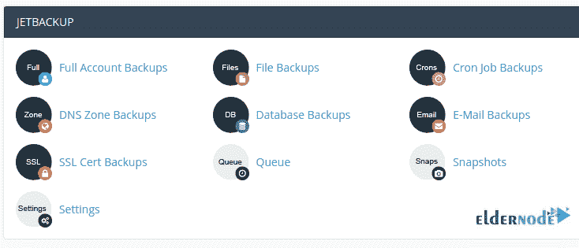
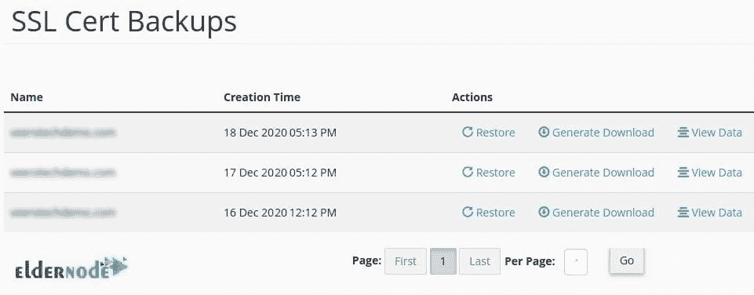
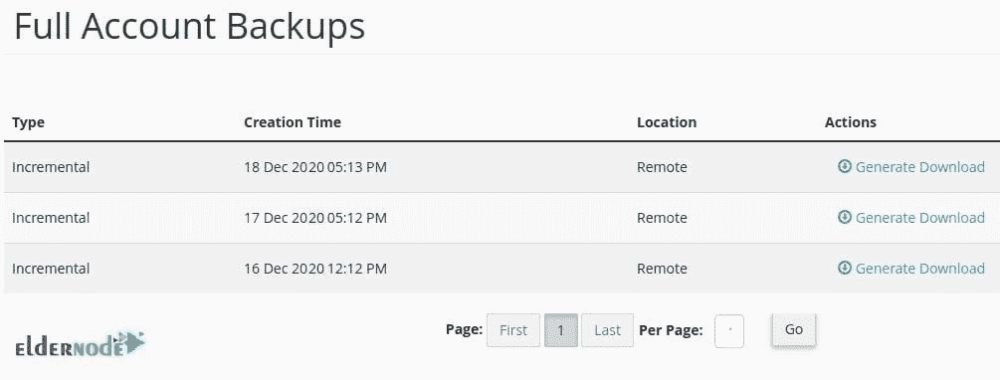

# 介绍 JetBackup For Linux Server-elder node 博客

> 原文：<https://blog.eldernode.com/introducing-jetbackup-for-linux-server/>

之前，[阿曼达](https://blog.eldernode.com/amanda-backup-tool-for-linux/)给大家介绍过。在本文中，我们将介绍用于 Linux 服务器的 JetBackup】的**。正如你所猜测的，JetBackup 应该是一个备份软件，这是真的。由于从服务器提供定期备份的原因很清楚，JetBackup 由 JetServer LTD .开发，可帮助您实现安全目标。在[虚拟主机](https://eldernode.com/)行业，JetBackup 是出色的备份解决方案之一。你可能已经准备了一个[专用服务器](https://eldernode.com/dedicated-server/)，需要通过使用一个完善的备份工具来考虑你的数据安全。如果是，请继续阅读以进一步熟悉 JetBackup。**

## JetBackup For Linux Hosting

Recommended Article: [Spain Virtual Server](https://blog.eldernode.com/spain-virtual-server/)

## **捷备份**简介

你可能听过这个名字 **JetApps** ，这是这个软件以前的名字。当 JetServer LTD 和 Control Panel solutions and Inc 建立战略伙伴关系时，产品名称改为 JetBackup。在成功地将“自助式”备份和恢复到他们独有的 web 托管客户端后，JetBckupManager 作为零售产品向公众发布。当你试图建立一个完美的网站时，你可能会面临一些失败，所以你建议保存数据的异地副本。

**JetBackup** 让你在 cPanel 中体验安全下载备份，因为 cPanel 中提供了 JetBackup 的插件。它使用它们来管理和恢复可用备份中的网站文件和数据库。它是 cPanel 行业中增长最快的备份软件，因为其许可证数量已经达到 2000%以上的增长率。此外，JetBackup 团队中的支持技术人员也通过了 cPanel 认证。没有什么不同，你需要**远程**或**本地增量**备份，JetBackup 在这两种情况下都很有用，它可以备份你网站的全部内容，并保留你的电子邮件、数据库、文件和其他数据的副本。您无法下载当前实时网站的副本，但可以访问 JetBackup 已经完成的备份。

## **Linux 服务器教程 JetBackup**

在登录 **cPanel** 并查看 JetBackup 部分后，您可以使用 **JetBackup** 轻松启动您的网站备份。在特定的日期和时间，您可以下载和恢复您的[托管](https://eldernode.com/vps-hosting/)计划的备份。这些备份包括完整帐户备份、文件、电子邮件、DNS 区域、cronjobs、数据库和 SSL 证书。在下文中，你可以读到上面列举的一些例子。

您可以决定下载您的备份，如您的 **SSL 证书**、电子邮件、数据库。例如，当您希望使用 JetBackup 来恢复或下载 SSL 证书的备份时，您将看到如下内容:

但如果你遵循推荐的选项，你会选择下载一个完整的网站备份，让它备份你所有的网站数据，如电子邮件和数据库。该选项正在调用**完整帐户备份**。

当您点击生成下载时，您也必须确认它。下载进度屏幕将显示如下:

当备份结束时，下载链接会出现在同一页面上。如果您单击该链接，备份将开始下载到您的计算机上。

当您使用**文件备份部分**时，您可以将任何文件和文件夹从灾难恢复服务器恢复到您的托管服务器。但是，如果您希望将您帐户中的任何数据库恢复到它们的状态，并且能够看到您的数据库列表和数据库[备份](https://blog.eldernode.com/move-backup-from-cpanel-to-the-directadmin/)的时间，您必须选择**数据库备份**部分。

### JetBackup 功能

产品**稳定性**是 JetBackup 开发者的主要目标。JetBackup 使用**安全编码实践**，代码库由外部安全提供商定期控制。总的来说，**安全性**是这个软件考虑的最重要的因素之一。JetBackup 设计的功能可以让主机提供商从他们的客户那里获得额外收入。还有一些其他重要的功能，例如:

**多调度**

**账户过滤器**

**GDPR 模式**

**混合备份**

**自定义挂钩**

**Custom Hooks**

### 

## 结论

## 在本文中，您已经学习了 JetBackup For Linux Server 的介绍。使用此软件作为备份解决方案来保护您的数据，并快速备份您的 cPanel 帐户。使用 JetBackup，您可以创建过滤器，根据磁盘空间、经销商和 cPlanel 软件包来包含或排除帐户。如果您有兴趣阅读更多内容，可以在[教程中找到我们的相关文章对主机 Cpanel](https://blog.eldernode.com/make-a-full-backup-of-host-cpanel/) 进行完整备份。

## Conclusion

In this article, you have learned Introducing JetBackup For Linux Server. Safe your data by using this software as a backup solution and backup your cPanel account quickly. With JetBackup you can create filters to include or exclude accounts by disk space, reseller, and cPlanel packages. In case you are interested in reading more, find our related article on [Tutorial make a full backup of Host Cpanel](https://blog.eldernode.com/make-a-full-backup-of-host-cpanel/).