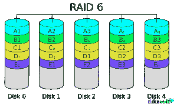

# Raid 磁盘简介(优缺点)- Eldernode 博客

> 原文：<https://blog.eldernode.com/introducing-raid-advantages-and-disadvantages/>

RAID 代表独立磁盘冗余阵列。乍一看，这个短语似乎很陌生，但是这项技术比您想象的更容易理解。RAID 于 1987 年由大卫·帕特森、兰迪·卡茨和加斯·吉布森首次推出。这些人设想了 6 种具有不同特性的 RAID 模式(从 0 到 5 命名)，但今天 RAID 模式的数量增加了。IBM 在 1977 年申请了一项专利，后来改名为 RAID 4。1983 年，Digital Equipment 推出了具有 RAID 1 功能的驱动器。1986 年，IBM 申请了另一项专利，现在称为 RAID 5。RAID 的主要目的是将相同的数据存储在不同的磁盘上，以防止磁盘损坏和崩溃时数据丢失。在本文中，我们试图让您了解 **Raid 及其优缺点**。注意，要有 Raid，你必须有一个**专用服务器**和 **Raid 控制器**才能使用 Raid。你可以访问 [Eldernode](https://eldernode.com/) 中可用的包来购买[专用服务器](https://eldernode.com/dedicated-server/)。

## **【Raid 磁盘(优缺点)**

RAID 的工作原理是将数据插入多个磁盘。通过允许数据进出所有这些磁盘，性能和速度都得到了提高。使用多个磁盘会增加错误率并减少数据丢失。

操作系统中的 RAID 阵列被视为一个逻辑磁盘，您不能单独查看每个磁盘。RAID 中数据共享单元的大小范围从 512 字节开始，达到几兆字节。在本文的后续部分，请加入我们，介绍 Raid 类型及其优缺点。

### Raid 磁盘 0 简介

在这种情况下，存储的信息被分割在磁盘或所谓的“条带”中。例如，如果您有两个磁盘，一半数据存储在一个磁盘上，另一半存储在另一个磁盘上。假设系统想在这种状态下存储“100111”数据；第一个、第二个零和第三个存储在磁盘 1 上，其余的存储在磁盘 2 上，最后将存储在磁盘 1“101”和磁盘 2“011”上。

#### Raid 0 的优势

**1。**提高读写速度

**2。**整个磁盘卷的可用性

**3。**所需磁盘数量少

**4。**易于运行

#### Raid 0 的缺点

**1。**如果任何一个磁盘损坏并且数据丢失，几乎所有数据都会丢失。

**2。**损坏一个磁盘会增加创建坏扇区和损坏另一个磁盘的风险。

#### Raid 0 的理想用途

RAID 0 根本不适合敏感的应用程序，相反，由于它的高速度，它将在编辑图像和视频等任务中有用。它还是存储需要高速读写的非关键数据的理想选择。如果用户希望使用两个驱动器来组合单个卷的存储容量，他必须将一个驱动器安装在另一个驱动器的文件夹路径中。需要注意的是，这个功能在 [Linux](https://blog.eldernode.com/tag/linux/) 、OS X 和 [Windows](https://blog.eldernode.com/tag/windows/) 上都是支持的。

### Raid 1 简介

在这种情况下，信息以相同的方式写入您的磁盘，并且您的磁盘包含完全相同的信息。例如，在这种情况下，“1001”数据将在所有磁盘上存储为“1001”。

#### Raid 1 的优势

**1。**更多信息保护

**2。**如果磁盘上的数据丢失，读取数据没有问题。

**3。**能够向 RAID 添加新磁盘并自动创建相同的磁盘

**4。**从磁盘组中移除磁盘并独立使用它们的能力

**5。** RAID 1 是一项非常简单的技术。

#### Raid 1 的缺点

**1。**速度比 RAID 0 慢

**2。**可用体积等于总体积的一半。

**3。**损坏一个磁盘会增加创建坏扇区和损坏另一个磁盘的风险。

#### Raid 1 的理想用途

RAID 1 可用于会计系统和小型服务器。此外，它适用于仅使用两个数据驱动器的小型服务器。

### Raid 5 简介

这种 RAID 模式试图为您提供最佳的 RAID 0 和 RAID 1 模式。Raid 5 的特性之一是在不增加丢失信息风险的情况下提高速度。要使用此模式，您必须至少有三个磁盘。两个磁盘像 RAID 0 一样写入，数据在两个磁盘之间分割。然后将奇偶校验位写入第三个磁盘。

平衡位是指示对或个体的数量的位，并且在该数据的帮助下，在丢失任何磁盘的情况下，系统可以用另外两个磁盘的数据创建新的磁盘，并且信息保持不被损坏。

#### Raid 5 的优势

**1。**不存在 RAID 0 和 RAID 1 问题。

**2。**读取速度快

**3。**增强数据保护

#### Raid 5 的缺点

**1。**所需磁盘的最小数量超过 RAID 0 和 RAID 1

**2。**驱动器故障影响吞吐量。

#### Raid 5 的理想用途

RAID 5 由于其良好的速度和稳定性，适用于磁盘数量有限的服务器。它还是一个综合系统，将高效存储与良好的安全性和良好的性能结合在一起。此外，它非常适合数据驱动器数量有限的文件和应用程序服务器。

### Raid 6 简介

这种 RAID 也叫双奇偶 RAID 位 RAID，其实就是从它的结构上衍生出来的。如何存储数据与 RAID 5 相同，只是这个 RAID 使用了两位插件。也就是说，它以两种不同的方式计算奇偶校验两次，并将其分布在两个不同的硬盘上。

这允许系统在两个硬盘都被破坏的情况下继续工作而不会中断。事实上，这种 RAID 的容错能力为 2，这意味着如果两个驱动器完全失效，仍然有能力恢复数据。如果 3 个硬盘出现问题，数据将无法访问。RAID 6 也可以用在固态硬盘上。

#### Raid 6 的优势

**1。**最高级别的容错和容错

**2。** RAID6 实际上是 RAID5 的高级版本，改进了纠错和控制。该 RAID 版本在数据存储方面提供了高可靠性和高容量。

**3。**关键和敏感应用的最佳选择

#### Raid 6 的缺点

**1。**高度先进和复杂的控制电路设计

**2。**非常慢的写入周期(双奇偶校验计算)

**3。**由于其二维奇偶校验模式，需要 N + 2 个硬盘。(N 个普通硬盘)

**4。**高可靠性与高功能性的集成

#### Raid 6 的理想用途

由于 RAID 6 型号中离线备份硬盘驱动器的数量增加到了两个，与 RAID 5 型号相比，这增加了该 RAID 型号的安全系数。

### Raid 磁盘 10 简介

这种模式其实就是 RAID 1+0。在这种情况下，数据首先在一对磁盘(如 RAID 0)之间拆分，然后这对磁盘(如 RAID 1)被写入另一对磁盘。当然，这可以以相反的顺序进行，这不会导致变化。在这种情况下，至少需要四个磁盘。RAID 10 比 RAID 1 更高效，但成本也更高。在 RAID 10 中，数据首先被镜像，然后被搅拌。

#### Raid 10 的优势

**1。**不存在 RAID 0 和 RAID 1 问题。

**2。**增强数据保护

**3。**恢复数据比 RAID 5 快得多

**4。**读写速度快于 RAID 5

#### Raid 10 的缺点

**1。**所需磁盘的最小数量超过 RAID 0、RAID 1 和 RAID 5

**2。**不可用磁盘的数量高于 RAID 5，可用卷的显著差异也很大

#### Raid 10 的理想用途

这种 RAID 是一种嵌套的 Raid 配置，提供 RAID 1 的冗余以及 RAID 0 读/写速度。

### 介绍 Raid 控制器

RAID 控制器充当操作系统和物理磁盘之间的接口，并将磁盘组作为逻辑单元呈现给操作系统。使用 RAID 控制器可以提高性能，并在崩溃时保护数据。RAID 控制器可以是硬件也可以是软件。在硬件控制器中，物理控制器管理阵列。该物理控制器可以是 PCI Express 卡的形式，并且被设计成支持 SATA 和 SCSI 格式。物理控制器也可以是主板的一部分。

软件控制器使用系统硬件资源来执行其功能，但其性能提升不如硬件控制器。如果软件控制器与系统不兼容，并且硬件控制器太贵，建议使用基于操作系统的 RAID 或驱动程序。在这种类型的控制器中，控制器芯片安装在主板上，所有操作都由 CPU 执行。到目前为止，这个控制器像软件控制器一样工作；但不同的是，这个控制器在启动系统后监控 RAID 的运行。这种控制器不像硬件控制器那样昂贵，并且比软件控制器具有更高的性能。

请记住，当安装在[专用服务器](https://eldernode.com/dedicated-server/)上时，您可以拥有两个或更多硬盘的 Raid 软件。如果您需要一个硬件 Raid 并使用它，您必须有一个带有 Raid 控制器和 2 个以上硬盘驱动器的专用服务器。在本文的后续部分，我们将解释这两种方法。

#### 硬件 Raid

在这种方法中，RAID 程序通过嵌入在独立于主机的设备中的处理器和 ram 来运行。硬件可以在主板上无缝使用，也可以在主板上安装插槽卡。

要确定哪种硬件或软件 RAID 最适合您的工作，最简单的方法是查看每种 RAID 的规格或手册。如果建议的方法涉及微处理器(通常是 I/O、处理器，或者在某些情况下是 ROC——意味着嵌入在芯片组中的 RAID ),则建议的方法是硬件，如果没有处理器，则是软件。重要的是要知道哪种方法对你的工作过程有什么影响，哪种方法最适合你。讨论的影响如下:

**–**运行其他程序时的处理器性能状态

**–**可以添加到系统中的磁盘的性能

**–**故障后恢复信息的容易程度

**–**高级数据管理和监控功能

**–**能够在不同的操作系统上同时管理磁盘

**–**能够安装备用电池来升级系统高速缓存

*实现硬件 RAID 有两种方式:*

**1)** 作为独立卡

**2)** 集成在特殊芯片组上。

#### 软件 Raid 磁盘

描述软件 RAID 的一个简单方法是知道它使用您的系统处理器来完成它的工作。这意味着，除了操作系统和其上运行的软件所需的常规处理之外，RAID 假定用于其操作的处理需求和能力也强加于系统处理器。

*软件 RAID 有两种使用方式:*

***1)作为纯软件解决方案***

在这种情况下，软件将在没有任何硬件辅助的情况下工作，只需将系统功能作为应用软件与运行在操作系统上的其他软件一起使用。此方法中使用的硬盘是操作系统所在的磁盘。这些软件 RAIDs 中的一些具有与服务器操作系统以及免费程序集成的能力，这使得这种方法更便宜。

***2)作为一种混合解决方案，包括旨在提高处理器性能的硬件***

在这种方法中，RAID 软件在添加到主板的硬件的帮助下工作，例如具有 RAID BIOS 的 HBA，其在引导系统时修复了先前解决方案的弱点。此外，大多数操作系统都支持该方法中使用的硬件驱动程序。

## 结论

如今，RAID 技术被用来提高效率、容量和安全性。任何 RAID 系统通常都会考虑增加容量。例如，两个硬盘驱动器可以被连接以形成高容量存储单元。提高效率是使用这项技术的另一个原因。在类似例子中，两个硬盘被连接以形成单个存储器。在这种情况下，控制器可以将数据分成两部分，并将每个部分放在硬盘上。这使得存储系统读写信息的效率加倍。第三为用户的信息提供安全保障。数据被写入两个或更多硬盘，如果其中一个硬盘有问题，信息仍可在另一个硬盘上获得。在本文中，我们试图让您熟悉 Raid 的类型以及每种类型的优缺点。