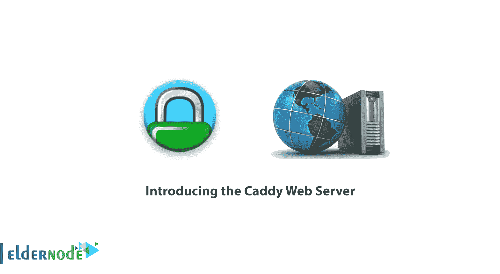

# 介绍 Caddy Web 服务器- Caddy Web 服务器| Eldernode

> 原文：<https://blog.eldernode.com/introducing-the-caddy-web-server/>

**介绍球童网络服务器** 

在百科文章的这一部分，我们将为您提供 Caddy Web 服务器的**介绍。Caddy，在互联网界称为 Caddy Webserver，是一个开源的 web 服务器，默认支持 HTTP / 2，在 Go 环境中编码，使用默认的 Go 库。Caddy 在节目开始时受到了世界各地许多人的欢迎，到现在已经五年了，它已经被下载和安装了超过 2 万次，并吸引了用户的注意，目前在 GitHub 上注册的明星多达 4500 人。**

**球童网络服务器许可**

该公司以三种不同的方式提供许可证。

1.  个人
2.  小规模商业
3.  大型商业

Caddy Web 服务器的优势和特性:

除了正常服务之外，在此 web 服务器上运行的所有网站都将接受反向代理服务以及负载平衡器模式。大多数 web 服务器都有中间件，这意味着它们只与 caddy 配置文件直接接触。

使用 [Caddy web 服务器](https://eldernode.com/tag/caddy-web-server/)的好处如下。

*   HTTP / 1.1 支持和默认 HTTP / 2 支持
*   为网站分配安全证书
*   支持 TLS 1.2 和更早版本
*   一个端口上的虚拟主机
*   静态文件服务
*   支持 IPv4 和 IPv6
*   快速重启和有效负载 web 服务器
*   反向代理支持
*   负载平衡和持续运行状况测试
*   FastCGI 代理支持
*   Gzip 支持
*   用不同的方法完成重定向
*   文件搜索
*   和许多其他好处

此外，在介绍 Caddy [Web 服务器](https://eldernode.com/category/web-server/)的最后，你应该知道任何在 Caddy 上启动的网站都默认使用 HTTPS，并获得免费的安全证书，如 [Cloudflare](https://www.cloudflare.com/) 服务。

您可以通过以下链接订购:

[**购买 VPS 服务器**](https://eldernode.com/vps/)