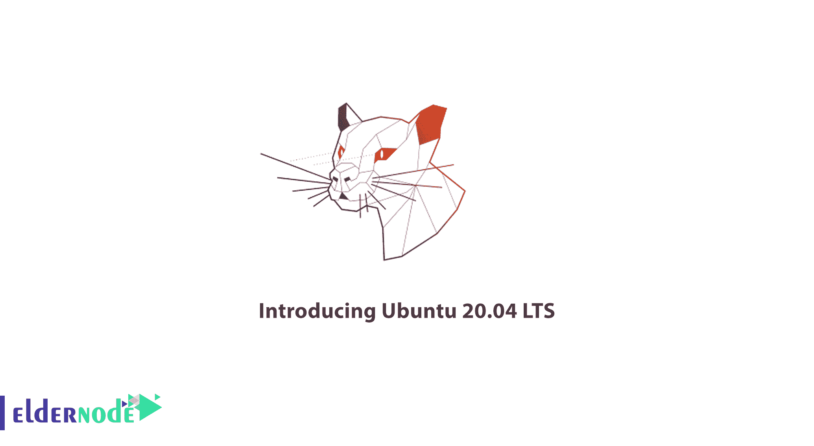
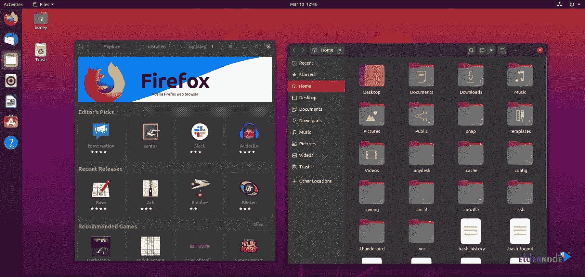

# 介绍 Ubuntu 20.04 LTS Ubuntu 20.04 发布日期和新功能

> 原文：<https://blog.eldernode.com/introducing-ubuntu-20/>

在本帖中，我们**介绍 Ubuntu 20** 并看看它的新特性。所以和我们在一起吧。

Ubuntu 20.04 LTS 版于 2020 年 4 月 23 日发布，接替 Ubuntu 19.10，成为这个广受欢迎的基于 Linux 的操作系统的最新稳定版本。

#### 新 Ubuntu 代号

让我们从顶部的 [**Ubuntu 20.04**](https://ubuntu.com/blog/ubuntu-20-04-lts-arrives) 开始，这个版本的代号是“Focal Fossa”。

单词' **Focal** 的意思是“中心点”或“最重要的部分”，而 **Fossa** 是一种类似猫的食肉动物。

## 介绍 Ubuntu 20.04 LTS

因为这是一个 LTS 版本，所以稳定性是最重要的。canonical 团队不会在这里尝试任何激进的改变。

#### 1。更多默认主题变体

Canonical 再次尝试主题。在 Ubuntu 19.10 中，默认的 Yaru 主题引入了黑暗版本。Ubuntu 20.04 在默认的 Yaru 主题上又进了三步:黑暗、光明和标准。

你甚至不需要安装 GNOME 来切换默认的主题变体。该选项嵌入在设置应用程序中。

#### 2。GNOME 3.36 以及随之而来的所有视觉和性能改进

Ubuntu 20.04 有最新的 GNOME 3.36 版本。这意味着 3.36 中的所有新功能也适用于 [Ubuntu 20.04 LTS](https://eldernode.com/tag/update-ubuntu-virtual-server/) 。

#### 3。禁用所有桌面通知

被桌面通知分散了注意力？您可以利用“请勿打扰”选项来切换桌面通知。

#### 4。apts 前的快照

Canonical 继续推进其通用包装格式 snap。在 Ubuntu 20.04 版本中更加明显。如果你试图运行一个没有安装的程序，以前它会建议使用 APT 命令来安装它。

#### 5。强化 ZFS 支援

随着 Ubuntu 19.10 发布，Ubuntu 成为第一个引入 ZFS 作为 root 用户的主流 Linux 发行版。

#### 6。WireGuard VPN 专门背端口

虽然 Ubuntu 20.04 至少不会马上使用内核 5.6，但它会将 WireGuard 移植到内核 5.4 中。

WireGuard 是 VPN 行业的新热点，因此在其内核中包含 WireGuard 应该会在云场景中给 Ubuntu 20.04 带来一些推动。

#### 7。刚刚 64 位系统为 Ubuntu 20.04

Ubuntu 已经有几年没有为 32 位计算机提供 ISO 了。但至少现有的 32 位 Ubuntu 用户仍然可以升级到 Ubuntu 18.04。

现在不是这样的了。如果您使用的是 32 位 Ubuntu 18.04，则无法升级到 Ubuntu 20.04。如果您尝试运行升级，您将会看到此类错误。

#### 8。Linux 内核 5.4

Ubuntu 20.04 采用了最新的 LTS 内核 5.4。这意味着您可以获得原生的 ExFAT 支持，以及随之而来的所有其他性能改进和新的硬件支持。

#### 9。更快的启动，更快的安装，更快的性能

现在安装 Ubuntu 20.04 花费的时间更少了。不仅如此，与 18.04 相比，Ubuntu 20.04 的性能和启动速度也更快。多亏了新的压缩算法。这对于最好的[VP](https://eldernode.com/vps/)OS 来说非常非常重要。

##### 结论

Ubuntu 20.04 LTS 版为客户端和服务器版本提供了许多其他功能，我们只是在介绍 Ubuntu 20.04 LTS 版时谈论了 9 个新的和最好的功能。

我们稍后会在 [Eldernode](https://eldernode.com/) 博客上为 Ubuntu 20.04 LTS 准备一个新的[教程，以便更好地了解。](https://eldernode.com/category/tutorial/)