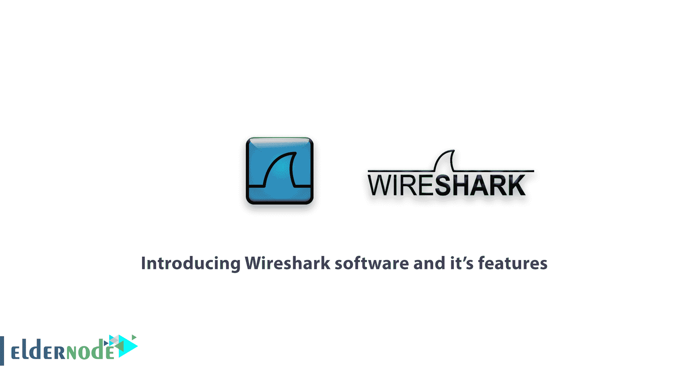

# Wireshark 软件及其功能简介- Wireshark 功能

> 原文：<https://blog.eldernode.com/introducing-wireshark-software/>

分析器软件非常受欢迎，对网络管理员来说非常重要。加入我们，介绍 Wireshark 软件及其功能。如今，网络管理员使用 Wireshark 软件来分析和排除网络结构故障，检查重要数据包的进出。近年来，Wireshark 软件帮了大忙，所有的网络分析软件都是高成本或专门设计和使用的。Wireshark 具有丰富的功能，您将在下面的内容中了解到。

## 介绍 Wireshark 软件及其特性

### Wireshark 软件简介及历史

Wireshark 是一款可以分析网络数据包的免费开源软件。Ans 向您展示了您的网络在微观层面上发生了什么。起初，该软件在 1998 年以“Ethereal”的名字发布和开发，但在 2006 年，该软件的创始人 Gerald Combs 宣布它是开源的，并将其重命名为 Wireshark。它是一个多平台软件，使用 **pcap** 拾取并分析数据包。Wireshark 软件可以安装在 **[Linux](https://eldernode.com/linux-vps/) 、 [macOS](https://www.apple.com/macos/catalina/) 、 [Solaris](https://www.oracle.com/solaris/solaris11/) 、**和 Windows 系列操作系统上。**无线开发团队**也发布了一个没有图形界面的软件版本，用于 Unix 操作系统和 Linux 终端，名为 [**TShark**](https://www.wireshark.org/docs/man-pages/tshark.html) 。

### Wireshark 软件的功能和特点

**1**–实时记录所有网络数据包

**2**–显示数据包协议信息的详细信息

**3**–打开并保存记录的数据包

**4**–向其他软件导入和导出数据包

**5**–智能包过滤记录

**6**–提供您需求的统计数据

**7**–解码不同的协议

**8**–支持大多数协议

**9**–根据数据包的特定标准进行搜索

**10**–显示 VoIP 网络数据包内的详细信息

#### 下一篇文章

我们将很快发表一篇关于 Wireshark 软件的**最佳使用的文章，来解释这个重要的故障诊断工具的作用以及如何使用它。**

亲爱的用户，我们希望你喜欢这个介绍 Wireshark 软件及其功能的教程，你可以在评论区提出关于这次培训的问题，或者解决 [Eldernode 培训](https://eldernode.com/blog/)领域的其他问题，请参考[提问页面](https://eldernode.com/ask)部分并在其中提出你的问题。