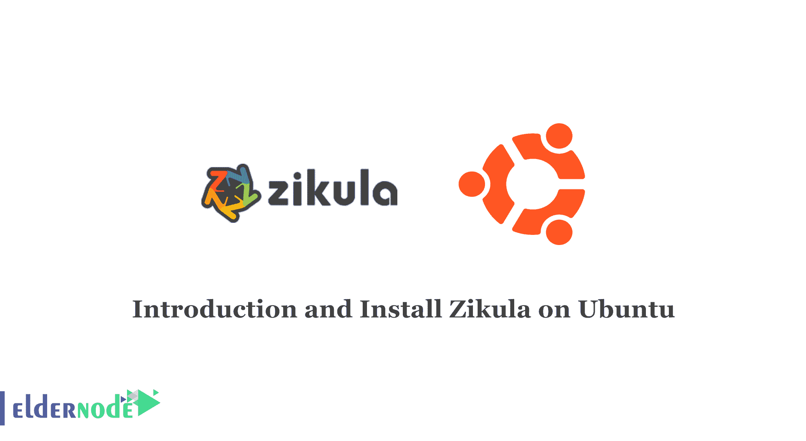

# Ubuntu - Eldernode 博客上的 Zikula 介绍和安装

> 原文：<https://blog.eldernode.com/introduction-and-install-zikula-on-ubuntu/>



Zikula 是一个多平台应用程序，支持所有流行的操作系统。你可以使用 Zikula 设计交互式可编辑网站。在本文中，我们将一步步教你如何在 Ubuntu 20.04，18.04 上安装 Zikula。如果你想购买一台 [**Linux VPS**](https://eldernode.com/linux-vps/) 服务器，你可以访问 [Eldernode](https://eldernode.com/) 中的软件包。

## 教程在 Ubuntu Linux 上安装 Zikula

### 兹库拉是什么？

Zikula 是一个内容管理系统(CMS)和开源 web 应用程序框架，允许您创建基于云的网站和应用程序。Zikula 是用 PHP 写的，用的是 Symfony 3 框架。此外，它在前端使用 jQuery、Bootstrap 和 Font Awesome。

Zikula 在后端使用 MySQL、PostgreSQL、Oracle 数据库、微软 SQL Server 进行数据库操作。事实上，Zikula 应用框架是借助模块和主题实现 web 应用和网站的强大解决方案。

### 【Zikula 使用哪些库？

Doctrine:用于存储数据库和对象映射的一组库。

jQuery、Bootstrap、Font Awesome:用于快速实现响应性和交互式前端的知名组件。

Symfony:一组非常流行的可重用 PHP 组件，提供了许多有用的摘要，例如非常强大的验证解决方案和 web 表单。

Twig:一个灵活、快速、可靠的模板引擎。

### 在 Ubuntu 服务器上安装 Zikula 的先决条件

_ 使用 Ubuntu 的云 VPS 和具有 root 权限的用户

使用 mod_php 启用 _ PHP

_ 安装以下 PHP 扩展:iconv、Ctype、SimpleXML、PCRE、JSON、Tokenizer、Session

_ Apache webserver 启用了 mod_rewrite 模块，AllowOverride 指令设置为“All”

_ MySQL 或 MariaDB 数据库服务器

## 如何在 Ubuntu 20.04 | 18.04 上安装 Zikula

首先，你应该以根用户或者管理员的身份登录到你的 Ubuntu 服务器:

```
ssh [[email protected]](/cdn-cgi/l/email-protection)_address -p Port_number
```

请确保将您的服务器的 IP 地址和 SSH 端口号替换为“IP_address”和“Port_
number”。

然后，您应该通过执行以下命令来更新服务器上安装的软件包:

```
apt update && apt upgrade
```

最好重新启动服务器，以确保所有使用的配置都是最新的设置。

由于 Zikula 需要一个 web 服务器，此时您应该安装 Apache 服务器。为此，请输入以下命令:

```
apt -y install apache2
```

现在，您应该使用以下命令启动 web 服务器:

```
systemctl start apache2
```

然后使用以下命令使 webserver 在服务器重新启动后自动启动:

```
systemctl enable apache2
```

现在，您应该通过输入以下命令来启用 Apache 中的重写模块:

```
a2enmod rewrite
```

输出如下:
启用模块重写。

要激活新配置，您需要运行:

```
systemctl restart apache2
```

您应该重新启动 web 服务器来激活模块:

```
systemctl restart apache2
```

然后，您必须访问 **https://IP_Address** 来测试 web 服务器的正确安装。记得获取默认的 Apache 网页。

如你所知，Zikula 是一个基于 PHP 的应用程序，所以你应该安装 PHP 和几个必需的 PHP 扩展。为此，请执行以下命令:

```
apt install php libapache2-mod-php php-gd php-mbstring php-mysql php-curl php-xmlrpc php-xml
```

Zikula 需要一个空的 SQL 数据库。可以安装 MariaDB，这是 MySQL 的开源版本。要安装它，只需输入以下命令:

```
apt install mariadb-server
```

现在，要启动 MariaDB 数据库服务器，请执行以下命令:

```
systemctl start mariadb
```

然后，通过输入以下命令，您可以使它能够在重新启动后自行启动:

```
systemctl enable mariadb
```

运行 MariaDB 提供的 mysql_secure_installation 脚本，为 root 用户设置密码，加强数据库服务器的安全性。您可以使用以下详细信息:

```
Set root password? [Y/n] Y
```

```
Remove anonymous users? [Y/n] Y
```

```
Disallow root login remotely? [Y/n] Y
```

```
Remove test database and access to it? [Y/n] Y
```

```
Reload provilege tables now? [Y/n] Y
```

现在您可以创建一个新的数据库供 Zikula 使用。此外，您应该创建一个对该数据库拥有完全权限的用户。为此，添加以下命令:

```
mysql -u root -p
```

```
MariaDB [(none)]> Create DATABASE zikula;  MariaDB [(none)]> Grant ALL PRIVILEGES ON zikula.* TO 'zikula_user'@'localhost' IDENTIFIED BY '<strong>PASSWORD</strong>';  MariaDB [(none)]> FLUSH PRIVILEGES;  MariaDB [(none)]> exit;
```

请注意，您应该用强密码替换“PASSWORD”。

现在是时候去 Zikula 官方网站，用下面的命令下载应用程序的最新稳定版本了:

```
wget https://github.com/zikula/core/releases/download/2.0.12/2.0.zip
```

然后，您应该在服务器文档的根目录下解压缩下载的 ZIP 存档。为此，请输入以下命令:

```
unzip 2.0.zip -d /var/www/html/
```

所有 Zikula 文件都存储在新的“2.0”目录中，您可以通过执行以下命令将其重命名为 Zikula:

```
mv 2.0 zikula
```

请记住，web 服务器用户应该能够读取所有文件和目录:

```
chown -R www-data:www-data /var/www/html/zikula
```

### 如何创建 Apache 虚拟主机

此时，您应该为域创建一个 Apache 虚拟主机指令，以便能够访问 Zikula，而不是使用您的域名的 IP 地址。别忘了用你真正的域名替换 domain.tld。

您可以使用以下命令创建虚拟主机指令:

```
nano /etc/apache2/sites-available/zikula.conf
```

```
ServerName <strong>domain.tld</strong>  ServerAlias www.<strong>domain.tld</strong>  ServerAdmin [[email protected]](/cdn-cgi/l/email-protection)<strong>domain.tld</strong>
```

```
DocumentRoot /var/www/html/zikula/
```

```
Options FollowSymLinks  AllowOverride All  Order allow,deny  allow from all
```

```
ErrorLog /var/log/apache2/<strong>domain.tld</strong>-error_log
```

```
CustomLog /var/log/apache2/<strong>domain.tld</strong>-access_log common
```

记得保存更改，然后应该启用 Apache 虚拟主机。为此，请执行以下命令:

```
a2ensite zikula.conf
```

输出:
启用站点 zikula。
要激活新配置，您需要运行:

```
systemctl reload apache2
```

要应用这些更改，您应该通过输入以下命令来重新加载 web 服务器:

```
systemctl reload apache2
```

最后，你应该从你的浏览器进入 **https://domain.tld** 。

## 结论

你可以用 Zikula 创建基于云的网站和应用。在本文中，我们介绍了 Zikula，并教你如何在 ubuntu linux 上安装 Zikula。随着我们的一步一步的教程，你也可以安装 Zikula 的先决条件。