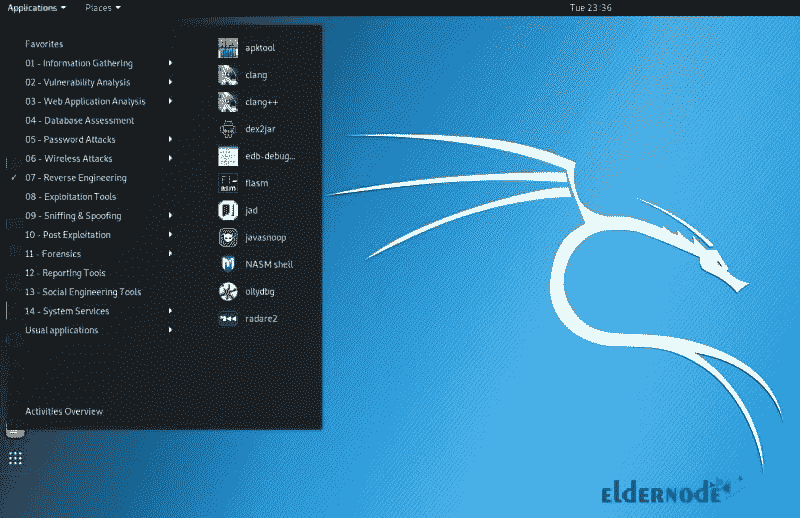

# Kali Linux 服务器及其应用简介- ElderNode 博客

> 原文：<https://blog.eldernode.com/introduction-kali-linux-server-and-its-applications/>

【更新】 Kali Linux 是基于 Debian 的 Linux 发行版。它是专门为网络分析师和渗透测试人员设计的操作系统。由于开源操作系统，操作系统有许多扩展和版本，每个扩展和版本都是为特定的目的和用途而设计和开发的。其中一个版本是 Kali Linux 操作系统，它对黑客攻击和安全特别有用，是一个强大的操作系统。本教程呈现**介绍 Kali Linux 服务器及其应用**。在 [Eldernode](https://eldernode.com/) 上选择一个完美的包来购买自己的 [Linux VPS](https://eldernode.com/linux-vps/) 。

## Kali Linux 服务器简介

### **什么是 Kali Linux？**

到目前为止，个人和公司已经提供了数百个不同的 Linux 版本。这些发行版中的每一个都有自己的特点。像 [Ubuntu](https://blog.eldernode.com/tag/ubuntu/) 、OpenSUSE、 [Fedora](https://blog.eldernode.com/tag/fedora/) 、BackTrack 等等操作系统。我们将更多地关注 Kali Linux 操作系统。正如我们提到的，Kali 是一个专门面向专业渗透测试人员和安全专家的 Linux 发行版。所以，如果你对 Linux 不熟悉，Kali Linux 不是一个推荐的发行版。

### **卡利 Linux 的优势**

Kali Linux 非常适合那些 Linux 中级用户和已经掌握 Linux 命令的用户。让我们回顾一下这种最先进的渗透测试分布的优势:

1-预装了 600 多种渗透测试和网络安全工具。

2-完全免费和开源。

3-它支持多种语言。

4-可轻松用于 Rasberry Pi。

5-广泛的无线设备支持

### **卡利 Linux 缺点**

可能 Kali Linux 最大的缺点就是不推荐给刚接触 Linux，想学习 Linux 的人。以下是其他一些例子:

1-有点慢。

2-某些软件可能会出现故障。

### **最强大的黑客和入侵工具**

操作系统的设计和开发旨在对各种类型的计算机系统进行入侵测试和漏洞检测。在 [Kali Linux](https://blog.eldernode.com/tag/kali-linux/) 之前，安全专家和黑客使用 Linux 备份来执行他们的测试和入侵。但是随着 Kali Linux 的引入，大多数人迁移到了它，并以某种方式用回溯替换了 Kali Linux。

Kali Linux 操作系统包括数百种不同的工具，用于执行安全测试和入侵计算机系统。这些工具中的每一个都有强大的功能和特殊的特性。

这个强大的操作系统具有非常高的渗透能力。任何在黑客和安全领域工作的人都应该熟悉这个操作系统及其各种工具。事实上，Kali Linux 已经成为黑客轻松访问其他系统以及安全专业人员识别和解决漏洞的绝佳工具。

### 各种 Kali Linux Hack 工具

如前所述， [Kali Linux](https://blog.eldernode.com/install-and-configure-kali-linux-on-vps/) 操作系统有超过 600 个渗透性测试和黑客工具。其中一些工具的渗透能力极其强大，只需要很少的编程知识就可以轻松处理复杂的入侵。然而，Kali Linux 为人们提供了工具，人们可以用他们的知识来使用它。

## **Kali Linux 服务器十大工具**

**1- Aircrack-ng:** 无线通信中拦截和破解密码的工具

2- Burp 套件:一个渗透使用 HTTP 协议的网络系统的工具

**3- Wireshark:** 分析网络协议中数据包的工具

**4- Sqlmap:** 通过注入 SQL 代码进行渗透测试的工具

**5- Owasp Zap:** 基于 Web 的工具漏洞检测

6- Metasploit: 一个编码和黑客工具的环境

**7- Nmap:** 网络搜索和扫描工具，识别网络中的所有活动节点

**8- Maltego:** 在数据渗透之前识别和收集数据的工具

9-开膛手约翰:破解密码的工具

**10- THC 九头蛇:**进行蛮力攻击

除了上面提到的工具，Kali Linux 操作系统更完整的**分类如下:**

**信息收集**:包括一套收集信息的工具

**Web 应用**:包括一套穿透基于 Web 的应用的工具

**报告工具**:报告和收集信息的工具

**硬件黑客**:Android 和 Arduino 黑客工具

**压力测试**:一套上传和测试系统负载的工具

**逆向工程**:一套逆向工程系统的工具

**嗅探/欺骗**:一套用于检测和执行假冒攻击的工具

**漏洞利用工具**:执行黑客和入侵代码并利用漏洞的工具

**无线攻击**:一套攻击无线设备和网络的工具

**密码攻击**:破解密码的工具

**漏洞分析**:系统漏洞分析和数据收集

## 结论

在本文中，向您介绍了 Kali Linux，并了解了它的应用程序。Kali Linux 被认为是道德黑客最推荐的 Linux 发行版之一。虽然人们认为 Kali 是一种黑客或破解社交账户或网络服务器的工具，但黑客和网站管理员可以利用一些工具轻松扫描您的网络服务器或网页。