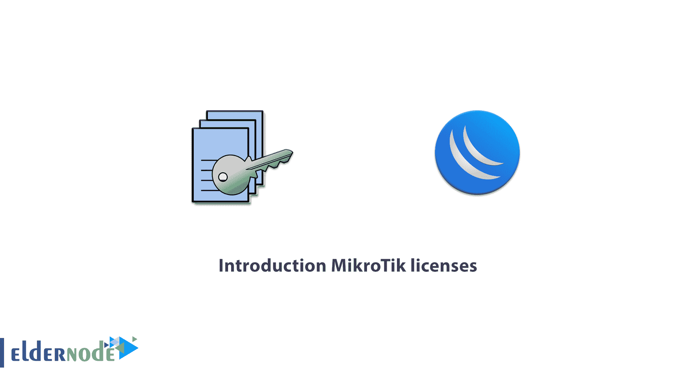
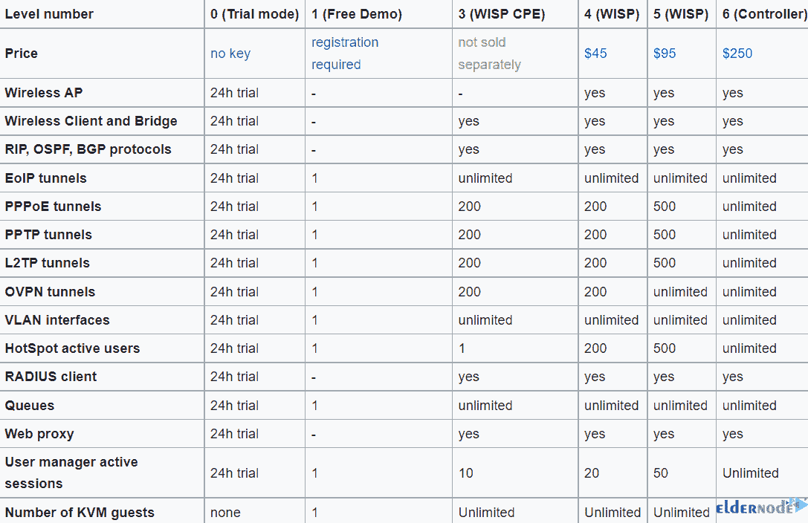
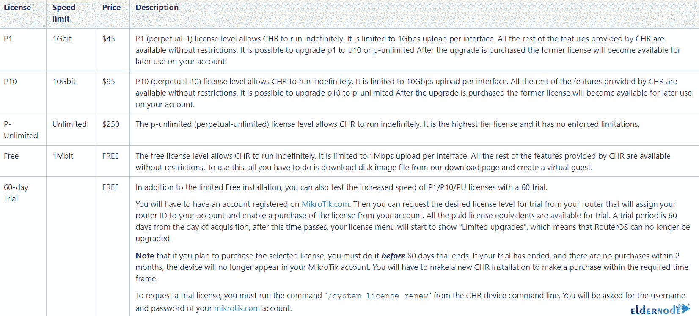
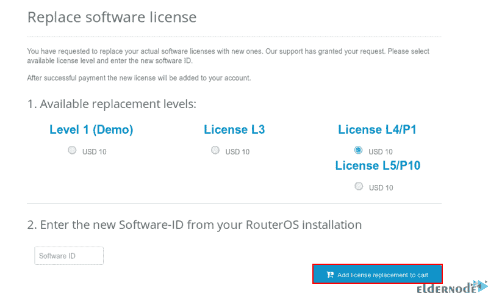

# MikroTik 许可证简介- MikroTik 服务器许可证

> 原文：<https://blog.eldernode.com/introduction-mikrotik-licenses/>



Mikrotik 是一家通过销售无线路由器起家的公司，在扩大业务后，推出了一款名为 Mikrotik Router OS 的操作系统。路由器操作系统是一个基于 Linux 的操作系统，可以安装在常规系统上。要使用 Mikrotik 操作系统，您必须购买 Mikrotik 许可证。有不同类型的 Mikrotik 许可证，这里我们将有**介绍 Mikrotik 许可证**。如果您想购买 [**Mikrotik VPS 服务器**](https://eldernode.com/mikrotik-vps-server/) ，我们建议您查看 [Eldernode](https://eldernode.com/) 网站上提供的套装。

## **mikro tik 执照简介**

许可证密钥是您从电子邮件或“mikrotik.com”帐户收到的一组符号。Mikrotik 许可证是根据路由器的硬件规格或路由器其他功能的使用来确定的，例如支持大量用户管理器客户端或使用不同类型隧道的客户端的能力。

### **mikro tik 装置的特点**

–>稳定性

–>经济实惠

–>启动时高速

–>高安装速度

–>高配置速度

–>可调开**进口**和**出口**

–>自动操作，无需登录任何服务

### **mikro tik 是做什么用的？**

–>虚拟专用网

–> NAT

–> MPLS

–>路由

–>防火墙

–>无线

–>代理服务器

–> DHCP 服务器

–>负载平衡

–>服务质量

## **Mikrotik 许可等级**

RouterOS 许可证预装在 **RouterBOARD** 设备上，您无需购买许可证密钥。对于 x86 系统，您必须获得许可证密钥。

RouterOS 许可证方案基于软件 ID，其中 RouterBOARD 软件 ID 连接到存储介质(HDD、NAND ), x86 软件 ID 连接到 MBR，CHR 系统 ID 仅限于 MBR 和 UUID。

许可证信息可从 CLI 系统控制台获得:

```
/system license print
```

安装后，RouterOS 以试用模式运行。在 24 小时内，您可以注册 1 级或购买其他级别。您可以在下表中看到不同级别的许可证:



级别 2 是旧许可证格式(2.8 之前)的过渡许可证，不再提供。您需要购买新的许可证才能升级。

级别 3 是无线站许可证(客户端或 CPE ),不适用于 x86 PCs。

### **所有 Mikrotik 许可证的共同特征**

–>无限期使用的可能性。

–>能够使用无限数量的接口。

–>每个许可证特定于一个安装。

–>无限制的软件升级。

### **CHR 许可等级**

CHR 是 RouterOS 的一个版本，作为虚拟机运行，有 4 个许可证级别和一个试用版，您可以测试每个昂贵的许可证级别 60 天。

如果你想获得免费试用许可，你必须在**Mikrotik.com**上有一个账户；管理许可证的位置。

永久许可证是一种终身许可证，可以转移到 CHR 的另一个实例。正在运行的 CHR 实例必须能够访问帐户服务器以更新其许可证，否则它将不允许 RouterOS 升级到较新的版本。

一旦运行的测试系统获得许可，从 CHR 手动运行以下命令来激活它:

```
/system license renew
```

请在系统截止日期前执行此操作，否则您将不得不从头安装 CHR。



如果使用多个相同类型的虚拟系统，下一个设备可能与原始设备具有相同的系统 ID。为了防止这种情况，在第一次引导后，在请求试用许可证之前运行以下命令:

```
/system license generate-new-id
```

只有当 CHR 在 RouterOS 许可的免费版本中运行时，才使用上述命令。如果您已经获得了付费或试用许可证，并且使用了**重新生成**功能，则您不能再更新您当前的密钥。

要使用多个虚拟机，从 **Mikrotik 网页**下载磁盘镜像，根据使用的虚拟机数量复制磁盘。这样，从每个虚拟磁盘映像创建一个新的虚拟机系统。在运行或存储下载的文件之前，制作磁盘映像的副本。

### **从 RouterOS v3 (2009)** 升级

如果尽管引入了 RouterOS 3.25 和 4.0beta3 作为新的 SoftID 格式，但您的许可证菜单显示旧的和新的 SoftID，或者 RouterOS 仍然像以前一样工作，您可能需要升级您的许可证以利用一些新功能。为此，单击 Winbox 中的**更新许可证密钥**按钮。新软 id 的符号如下:

XXXX-XXXX (4 个符号，破折号，4 个符号)

**动作将按以下顺序进行:**

–> Winbox 会用你的旧软 ID 联系**Mikrotik.com**，让 Mikrotik 检查你的数据库，查看你的关键细节。

–>服务器生成一个名为 **upgrade** 的新密钥，并将其放在与之前相同的帐户中。

–> Winbox 将自动使用新密钥许可您的。

–>然后必须重启才能解锁新的 RouterOS 功能。

***注:*** 当 RouterOS 应用新密钥时，旧密钥存储在 Files 文件夹中的一个文件中，以便旧密钥始终可用。

### **如何改变许可等级**

没有许可证级别升级，如果您想使用另一个许可证级别，请购买相应的级别。这是软件公司使用的策略，购物时要明智选择。

### **更换许可密钥**

如果意外丢失许可证或驱动器出现故障，您可以向 Mikrotik 支持团队申请一个特殊的密钥。它的价格是 10 美元，功能和你丢失的钥匙一样。

**要申请更换密钥，您可以遵循以下步骤:**

首先在**mikrotik.com**进入您的账户管理，填写**支持联系表**或发邮件至 **[【邮件保护】](/cdn-cgi/l/email-protection)【tik.com】**。然后发送所需信息，并向 Mikrotik 支持团队解释请求更换密钥的原因。

确认支持人员并将替换密钥添加到您的帐户后，再次检查您的帐户并选择**从替换密钥**制作密钥选项。

现在选择要替换的适当许可证级别，输入新的**软件 ID** 。然后点击**将许可证替换添加到购物车**，完成支付过程。



最后，您将收到一封带有新许可证的电子邮件。

## 结论

正如我们所讨论的，要使用 Mikrotik 操作系统，您需要获得 Mikrotik 许可证。在本文中，我们熟悉了 Mikrotik 的特性，并研究了其不同级别的许可。我希望它对你有用。