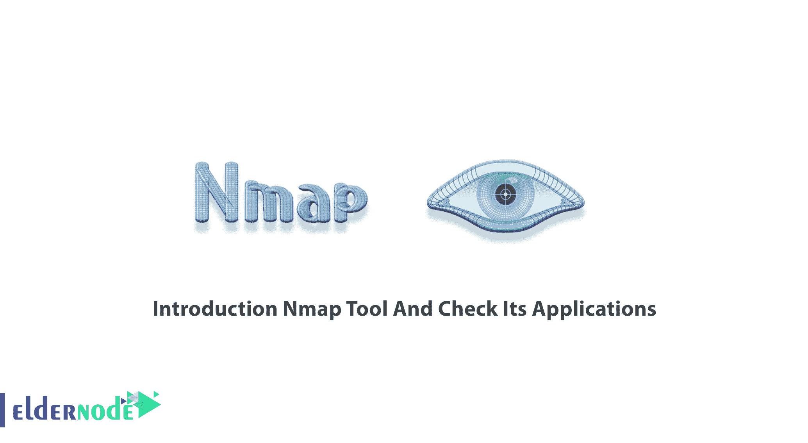
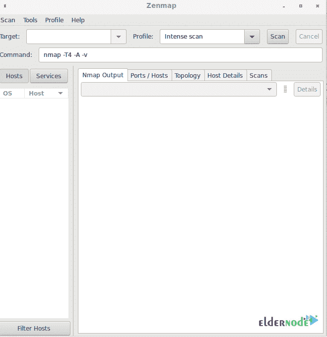
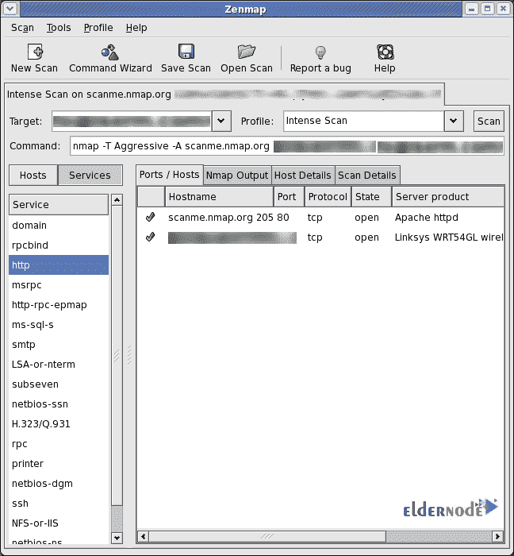

# 介绍 Nmap 工具并查看其应用

> 原文：<https://blog.eldernode.com/introduction-nmap-tool-and-check-its-applications/>

Nmap 是网络映射器的缩写，是一种网络发现和安全审计工具。作为管理员，您需要一个网络扫描工具，能够使用 IP 数据包来识别连接到网络的所有设备。Nmap 是一个免费的开源网络扫描器，提供关于它们运行的服务和操作系统的信息。虽然网络映射器是为企业级网络开发的，但它也用于较小的公司。然而，它是为快速扫描大型网络而设计的，但对单台主机也能很好地工作。本文将介绍【Nmap 工具并检查其应用。如果您准备购买完全托管的 **[Linux VPS](https://eldernode.com/linux-vps/)** ，您可以依靠我们的技术团队，并在 [Eldernode](https://eldernode.com/) 订购您考虑的软件包。

## **介绍 Nmap 工具**

Nmap 是在 GPL 许可下发布的最流行的网络发现工具之一。要映射您的网络，您可以使用 Nmap 并查找网络上的活动主机，执行端口扫描、ping 扫描、操作系统检测和版本检测。不仅是管理员、网络管理员和渗透测试人员，恶意黑客也会使用这个免费工具。此外，Nmap 提供了强大的扫描选项，因为它简单且易于记忆标记。Nmap 最初是为 [Linux](https://blog.eldernode.com/tag/linux/) 编写的，但是已经移植到各大操作系统，比如 [Windows](https://blog.eldernode.com/tag/windows/) ，Solaris，HP-UX 等。

## **Nmap 应用**

该程序可用于许多不同的操作系统，如 Linux、Free BSD 和 Gentoo。它最常用于命令行界面。Nmap 现在用于许多网站监控工具，以审核 web 服务器和物联网设备之间的流量。Nmap 在**中使用三个核心进程**:

1- Nmap 为您提供网络中每个活动 IP 的详细信息，然后可以扫描每个 IP。通过这种方式，您可以检查 IP 是否被合法服务使用，或者被外部攻击者使用。

2- Nmap 提供有关您的网络的信息。您可以使用它并提供活动主机和开放端口的列表，以及识别每个连接设备的操作系统。因此，在持续的系统监控中，您将拥有一个有价值的工具，以及 pen 测试的一个关键部分。您已经了解了 Metasploit 框架，那么您可以使用 Nmap 和它一起探测并修复网络漏洞。

3-你可以使用 Nmap 来扫描你自己的网络服务器(特别是当你在家管理你的网站时),它模拟了黑客攻击你网站的过程。所以，如果你正在寻找一个工具来保护个人和商业网站，你会发现这个工具很有价值。它通过攻击你自己的站点来帮助你使用一种强有力的方法来识别安全漏洞。

### **Nmap 是如何工作的？**

Nmap 是一款极其强大的软件。如果你对这个工具有足够的背景知识，你就可以很容易地正确使用它。

Nmap 检查网络中的主机和服务。软件平台发送信息给主机和服务。一旦收到响应，将读取并解释该响应，以使用该信息来创建网络图。因此，它将提供一个图，其中包括每个端口的详细信息，包括每个端口正在做什么，谁或什么正在使用它，主机如何连接，什么正在通过防火墙，什么没有通过防火墙，以及列出出现的任何安全问题。

使用一个复杂的脚本系统与网络的每个部分进行通信，Nmap 将能够完成所有提到的活动。由于 Nmap 脚本能够进行漏洞检测、后门检测、漏洞利用和网络发现，因此这些脚本充当网络组件及其人类用户之间的通信工具。

### **Nmap 扫描什么？**

作为管理员，您可以使用 Nmap 扫描:

–开放端口和服务

–发现服务及其版本

–猜测目标机器上运行的操作系统

–获得准确的数据包路由，直到目标机器

–监控主机

### **Nmap 扫描类型**

使用 Nmap，允许您使用各种扫描。让我们回顾一下 Nmap 可以执行哪些扫描:

–TCP 扫描

–TCP 扫描

–同步扫描

–确认扫描

–手指扫描

–零扫描

–圣诞节扫描

–RPC 扫描

–空闲扫描

另外，您可以参考 [Nmap 命令](https://blog.eldernode.com/tutorial-nmap-commands/)了解更多信息。

### Nmap 特性

为了执行各种活动，如操作系统检测、查找开放端口和网络漏洞，Nmap 使用 NSE 脚本。除了端口扫描，Nmap 还提供许多附加功能。下面就让我们来看看:

–主机发现

–操作系统检测

–服务版本检测

–关于目标的网络信息，如 DNS 名称、设备类型和 MAC 地址

–能够扫描众所周知的漏洞。

### **Nmap 优势**

Nmap 被誉为最好的黑客工具。以下是用户报告的一些优点，以鼓励其他人开始使用它:

–内置脚本允许漏洞测试

–枚举

–端口扫描

–漏洞检查

–网络扫描

–漏洞检查

–打开/关闭端口。

–操作系统检测

–易于编写脚本和分析

–IDs 主机

–检查防火墙规则

–用户社区支持无处不在

–高度准确的端点识别

–指纹识别应用/设备的独特流程

–NMap 易于使用且高度可配置

### **Nmap 缺点**

一些用户说很难提及任何事情，但像往常一样，让我们看看这个流行工具的暗点是什么:

–模块不够快

–新手很难使用它，因为开关太多了

–只有 CLI，开发人员会考虑基于 web 的版本。

–不受供应商支持

–如果没有网络，您不能使用此工具，这取决于网络及其安全性。

–Nmap 脚本是用 Lua 编写的，Lua 不是主流语言。

## **如何使用 Nmap？**

之前，您学习了[如何在 Linux](https://blog.eldernode.com/install-nmap-on-linux/) 上安装 Nmap。但是，要开始使用 Nmap，您需要熟悉命令行界面。不是为了基本的网络监控，但是如果您需要高级使用，您应该能够编写脚本来自动化常见任务。

Zenmap 是官方的 nmap 安全扫描器 GUI。Zenmap 界面非常直观。当您从图形界面启动 Zenmap 时，您会发现以 root 用户身份运行它的选项。

***注:*** 对于 Windows，Nmap 自带自定义安装程序(namp <版本> setup.exe)。因此，您可以下载并运行这个安装程序，它会自动在您的系统上配置 Nmap。

此外，作为系统管理员，您将能够轻松使用 Nmap，因为您熟悉它提供的大多数工具。Nmap 将各种各样的工具整合到一个程序中。因此，它不会强迫你在独立和离散的网络监控工具之间跳跃。一旦安装了 Nmap，就可以使用以下功能了:

–运行 Ping 扫描

–运行主机扫描

–在 Kali Linux 中使用 Nmap

Nmap 的大多数常见**功能都可以使用一个命令来执行，该程序还使用了许多“快捷”命令来自动执行常见任务。以下是常见的 Nmap 函数:**

–Ping 扫描

–端口扫描

–主机扫描

–操作系统扫描

–输出到文件

–扫描顶部端口

–禁用 DNS 解析

## 结论

在本文中，向您介绍了 Nmap，并且您回顾了它的所有应用。Nmap 用于提供有关您的网络以及连接到网络的设备的详细实时信息。从现在开始，当它扫描整个系统并绘制每个部分的地图时，您就有了识别网络上活动的问题的解决方案。如果使用得当，Nmap 是合法的，因为它可以帮助您保护您的网络免受黑客攻击。Nmap 用于互联网安全公司，因为它是扫描系统和了解黑客可能利用的弱点的理想选择。