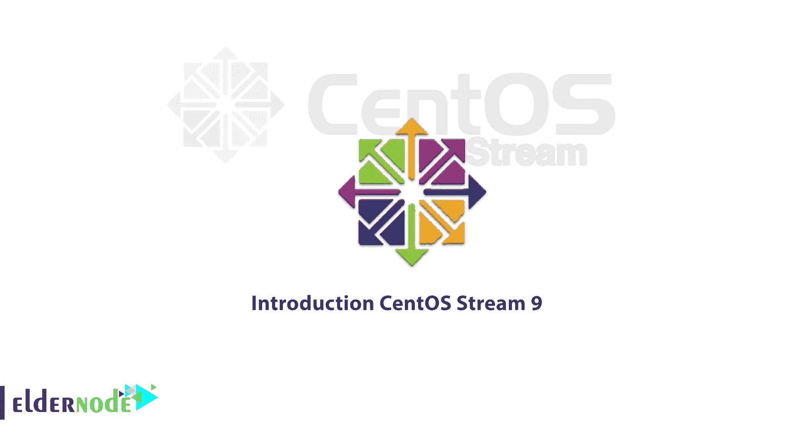
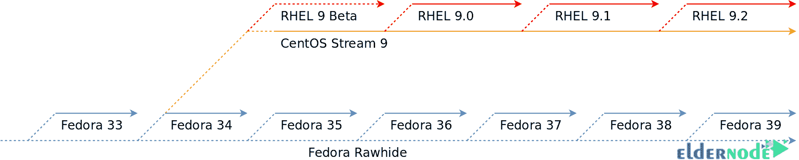
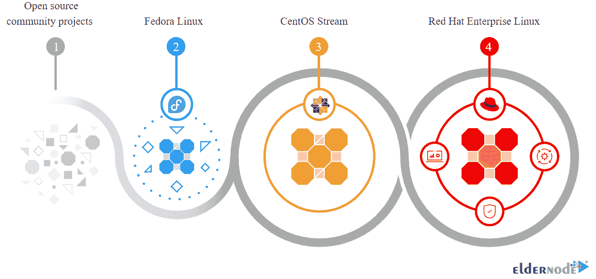
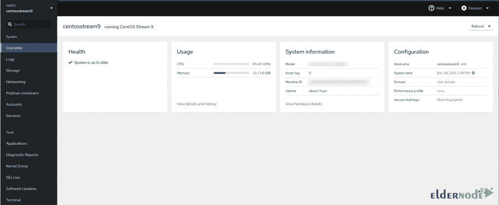
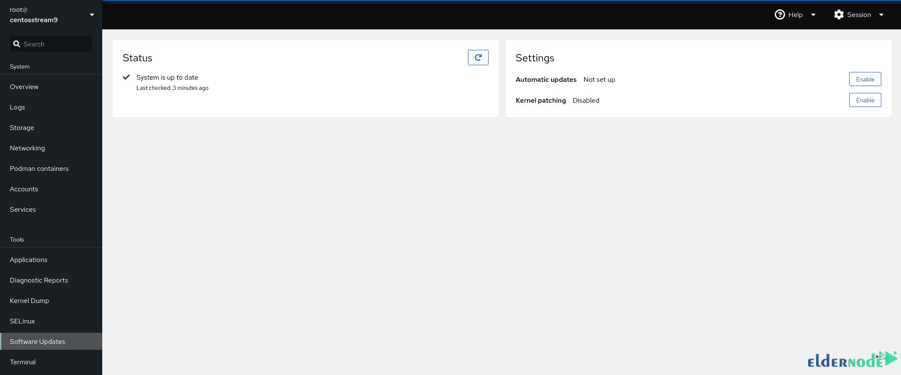

# CentOS Stream 9 简介- Eldernode 博客

> 原文：<https://blog.eldernode.com/introduction-to-centos-stream-9/>



2021 年初，红帽宣布 CentOS 将于 2021 年结束，但 CentOS Stream 将在该日期后继续存在，并作为红帽企业 Linux 的上游分支。于是 CentOS 8 在 2021 年结束，将重心转移到 CentOS Stream。CentOS Stream 是一个不断更新的发行版，允许提前访问即将推出的 RHEL 版本的开发包。在本文中，您将了解 CentOS Stream 9 的**简介。你可以在 [Eldernode](https://eldernode.com/) 上看到新的优惠，购买自己的 [**CentOS VPS**](https://eldernode.com/centos-vps/) 。**

## **什么是 CentOS 流？**

CentOS Stream 是一个稳定的流，在原始版本的基础上进行小的错误修复和改进。另外，CentOS Stream 基于 Fedora Linux，是有效的红帽企业 Linux 上游。事实上，这种方法提供了分布共享和一种直接影响 RHEL 外观的方式。



### **CentOS 流 9 功能**

中央音流 9 是中央音的一种对位法。过去，CentOS 的升级速度很慢，而且 CentOS 一直出奇地稳定。相反，CentOS 流总是在变化。您可以在 CentOS Stream 上安装您喜爱的软件的最新版本。



CentOS 基于 Fedora 34，包括几个新的应用程序:

–>内核 5.14

–> GCC 11.2

–> Python 3.9

–> Perl 5.32

->

->

–> OpenSSH 8.6p 1

–> GNOME 40

–>默认组 v2

服务器也有一些一般性的变化。您将收到的新软件包括:

–> PHP 8.0

–> node . js 16

–> Apache httpd 2.4

–> Maria db 10.5

–> MySQL 8.0

–> PostgreSQL 13

–> Nginx 1.20

### **如何获得 CentOS 流 9**

要开始使用 CentOS Stream 9，请前往 [**下载页面**](https://centos.org/centos-stream/) 并启动虚拟机。还有在容器或云提供商上运行 CentOS Stream 9 的选项:

```
# Start with Podman
```

```
podman run -it --rm quay.io/centos/centos:stream9 bash
```

```
# Start with Docker
```

```
docker run -it quay.io/centos/centos:stream9 bash
```

通过运行 **uname -r** ，你会看到新安装的 CentOS 9 Stream 版本运行的是内核 5.14.0-34.el9.x86_64。如果您想通过 Cockpit Web 界面管理您的安装，您必须使用以下命令启用它:

```
sudo systemctl enable --now cockpit.socket
```

激活后，将浏览器设置为 **https://SERVER:9090** (使用 CentOS Stream 9 服务器的 IP 地址)并使用 root 用户信息登录。

当您进入驾驶舱时，您会看到 Podman 支持已经启用，因此您可以使用这个突出的图形用户界面开始管理您的集装箱:



安装时，确保驾驶舱内的一切都是最新的:



## 结论

CentOS Stream 于 2019 年推出，实际上是滚动发布。在发布滚动的定义中，可以说是在各个版块不断更新的 Linux 开发。在本文中，您了解了 CentOS Stream 9，并看到 Stream 版本几乎是 CentOS 的对位法。