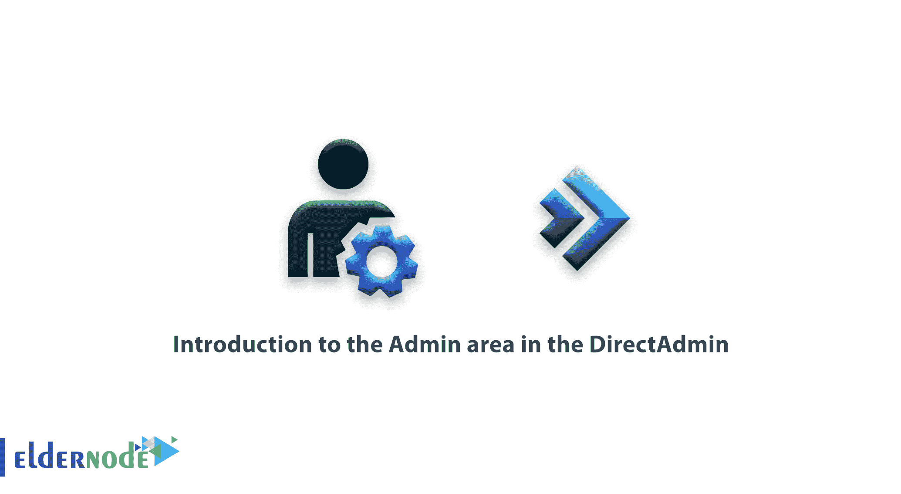
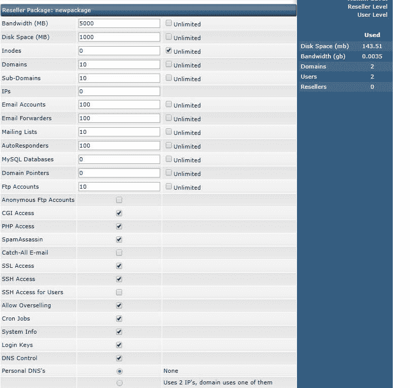
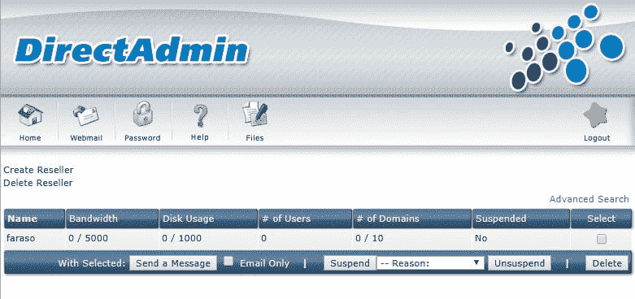
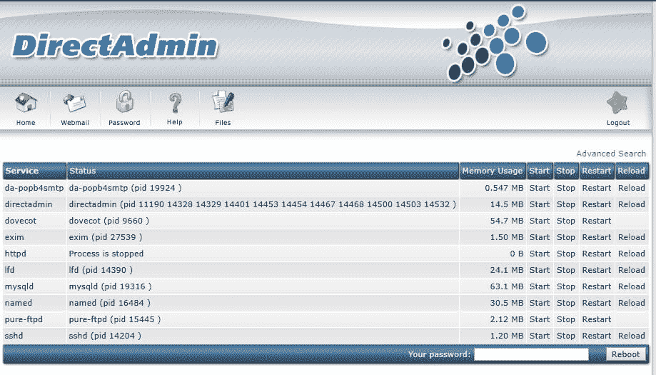
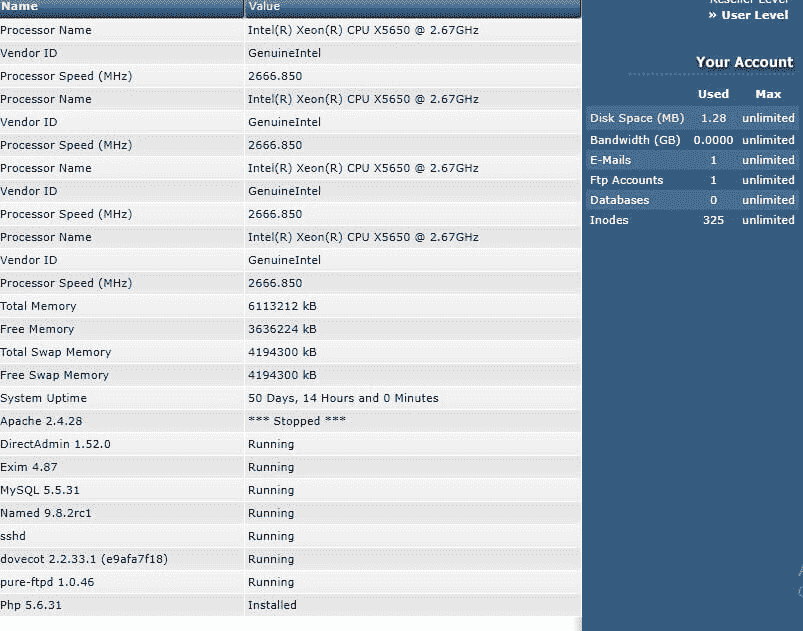
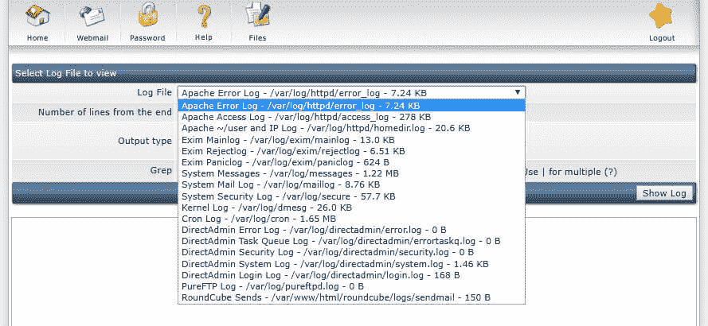

# direct Admin-ElderNode.com 中的管理区介绍

> 原文：<https://blog.eldernode.com/introduction-to-the-admin-area-in-the-directadmin/>

**管理区简介** [**DirectAdmin**](https://blog.eldernode.com/tag/direct-admin/) ，在这个区域中，你可以对你的服务器应用所有的管理操作。这些操作包括:

### 管理经销商包:

单击管理经销商包后，您将看到一个类似于下图的页面，您必须在其中指定主机必须创建的资源和限制。

您应该为代表考虑的一些最重要的设置是分配的 IP 数量、允许的域数量、创建自定义 DNS 的可能性。

## **[direct Admin](http://eldernode.com/tag/directadmin/)**中的管理区介绍

允许“超额销售”选项还允许代理销售或创建比可用数量更多的主机。

例如，它有 10 GB 的代理空间，但在共享主机细分市场中，代理可以拥有超过销售量的空间，但如果他消耗超过 10 GB，他的授权帐户将被阻止。

### 创建经销商:

通过此部分，您可以在 admin DirectAdmin 服务器上创建代理，并允许他们为自己创建和管理用户。要使用此部分，您首先需要从“管理经销商套餐”部分创建代理计划。

在 DirectAdmin 中创建代理非常简单，与创建主机没有什么不同。完成代理创建页面(包括用户名、电子邮件、密码、域和 IP 字段)后，选择适当的代理计划，然后选择“提交”。就像创建用户部分一样，使用“Customize”选项，您可以用所需的资源定义创建的经销商。

### 列出经销商:

在本节中，您将在 DirectAdmin 中找到所有委托。在此部分，您将看到一个类似于以下用户列表的页面:

单击每个“**经销商**”查看专用资源的详细信息，并根据需要增加资源。您也可以使用“**暂停**选项暂停代理。您也可以使用“**取消暂停**选项启用暂停的账户。

如果您想查看导致代理被阻止的原因或详细信息，请单击代理以显示您正在查找的代理帐户的完整详细信息。最常用的 DirectAdmin 选项之一是“**临时带宽增加**”代理选项，您可以在月底临时将额外流量分配给用户或代理。

### IP 管理:

通过这一部分可以很容易地将 IP 添加到 DirectAdmin 中。通过输入所需的 IP 和子网，您可以轻松地将 IP 添加到 DirectAdmin。您还可以看到多个用户共享可用的 IP。

### DNS 管理:

代表、用户等的所有 DNS 设置和记录。可通过本部分进行访问和修改。当对用户禁用此访问时，您必须由系统管理员根据此部分在 DNS 服务器上创建所需的区域。

### 服务监控:

在这一部分，您可以看到服务器上所有可用服务的状态，并且可以管理它们。请注意下图:

例如，在此图中，您可以看到，httpd 处于停止状态，它可能已关闭。

该值表示您的 web 服务器已经手动关闭或由于错误而关闭。在这种情况下，您的任何站点都不会打开。要解决这个问题，只需在 DirectAdmin 上单击 Start 或 Restart httpd 行来启动 webserver 服务。

在某些情况下，您可能无法通过 DirectAdmin 本身解决与活动或有问题的服务器相关的问题，您可能需要通过 **ssh** 检查服务日志。

如果您不熟悉 **ssh** 及其命令，并且 [DirectAdmin](https://www.directadmin.com/) 无法修复它，最好联系您的服务器管理员来修复问题，或者向专家咨询。

### 系统信息:

如果您想快速查看您的服务器详细信息，您可以在此处采取行动:

正如您在这张图片中看到的，CPU、RAM、交换空间等的数量。完全显示出来。您还可以在这里找到完整的服务器正常运行时间。

请记住，如果您查看某个特定服务的**已停止的**服务的状态，您将无法管理它，您将能够从**系统监视器**或 **ssh** 启动或重启该服务。

### 日志查看器:

最好使用 **ssh** 查看日志。但是 DirectAdmin 本身具有一些特性，使得选择日志文件和查看现有日志变得很容易。

所有日志都是可选的。您也可以使用“从末尾开始的行数”选项选择要查看的底部行数。

*如果您没有足够的技能，最好不要通过 ssh 操纵重要和敏感的服务器。

祝您好运

如果需要 [DirectAdmin VPS](https://eldernode.com/) ，现在订购 **[Directadmin VPS 服务器](https://eldernode.com/directadmin-vps-server/)**