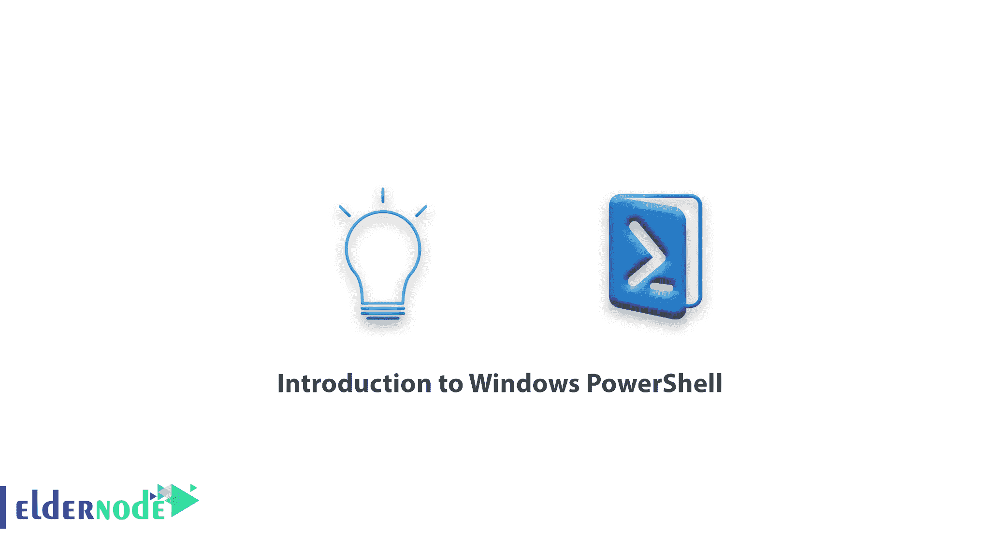

# Windows PowerShell 简介- Windows VPS 服务器

> 原文：<https://blog.eldernode.com/introduction-to-windows-powershell/>



Windows PowerShell 简介。 [Windows PowerShell](https://technet.microsoft.com/en-us/library/ee332526.aspx) 是微软在 Windows 中安装的高级命令环境，为用户提供了控制、管理以及将 Windows 服务配置为**外壳**的能力。本文将全面讲解 Windows PowerShell，告诉你 PowerShell 和 [CMD](https://docs.microsoft.com/en-us/windows-server/administration/windows-commands/cmd) 的区别。和我们在一起。

[**在 Eldernode**](https://eldernode.com/windows-vps/) 选择您的完美 Windows 虚拟专用服务器包

## Windows PowerShell

当今世界，与 Windows 打交道的人必须熟悉 CMD 或命令提示符环境。
命令提示符或 CMD 是一个简单的文本环境，只支持很少的命令，自 Windows NT 诞生以来就一直在 Windows 上使用。

命令提示符使用两组命令，包括:

**内部命令:** 内部命令位于【Command.com】文件内。像方向命令

**外部命令:** 有单独文件，可以在命令提示符环境下执行和控制的命令。比如 netsh 命令

现在，通过我们向您提供的关于 CMD 的简短描述，以及这个语法环境已经存在了 20 多年的事实，可以认识到它不再具有用户所必需的能力和效率，尤其是在执行命令领域的专业人员。

所以在 2006 年的**年，微软推出了名为 [Windows PowerShell](https://eldernode.com/tag/powershell-commands/) 的新命令环境，以提高其 Windows 命令环境的质量。**

微软概述了开发和发布 Windows PowerShell 的原因，其中两个原因最为突出。

Windows PowerShell 简介。

### Windows PowerShell 产生和发展的主要原因

**1。** 为运行，控制，管理所有服务并启动它们创建一个完整的文本环境。

**2。** 不落后于 Linux，因为 Linux 终端的功率非常高。

Linux 终端环境非常强大，可以说包括控制和运行所有服务在内的各种任务都可以用 Linux 命令来完成。正因如此，为了不落后于 Linux，微软开始生产和开发一个名为 Windows PowerShell 的环境，以便能够为其用户提供比以前更多的使用文本环境的能力。

### 【Windows PowerShell 和 CMD 的区别

这两种 Windows 命令文本环境的主要区别之一是 Windows PowerShell 无可争议的强大功能。

网络管理员、程序员和专业 Windows 用户将能够在 PowerShell 的 Windows 图形环境中运行和管理他们拥有的任何服务和命令。

CMD 语法文本环境执行命令的能力有限。

在 Windows PowerShell 中，您将能够编写和执行专业脚本，如 **嵌套** 脚本和 **多步** 脚本。

命令提示符环境支持有限的命令，并且不能将命令作为一个模块添加。

在 Windows PowerShell 中，您将能够向新的和外部的服务添加模块，并控制和管理它们。

### Windows PowerShell 的结构

借助的 Windows PowerShell。net 框架设计开发。因此，在其中编写和执行命令类似于**。net** 编程语言。用户也可以使用*【c#】*和 ***。net*** 命令作为 PowerShell 中的脚本。

以为例， PowerShell 中的一个简单命令如下:

```
New-NetIPAddress –InterfaceAlias “Ethernet” –IPv4Address “192.168.0.1” –PrefixLength 24 -DefaultGateway 192.168.0.254
```

在上面的示例中，将在系统上设置一个静态 IP 。

### 使用 PowerShell 的提示

起初，当你遇到 PowerShell 命令时，你可能会认为你必须记住这么长时间的命令。但是我们必须告诉你这不是真的。

Windows PowerShell 遵循某些规则和规定，这使得它非常容易。此外，使用命令提示符命令一开始可能看起来很难，但是只要稍加努力和坚持，你就可以确信你将很容易学会 PowerShell。

### 如何打开 Windows PowerShell

有三种不同的方法可以打开 Windows PowerShell。

**1。** 按 Winkey + R 打开 Run，然后进入 powershell 点击 OK 。

**2。** 从开始菜单，搜索 windows powershell 并打开。

**3。** 在 CMD 环境下，通过进入 powershell 并按下 Enter ，将进入 PowerShell 环境。

**最后**，我们会提到 PowerShell 的一些好处和特性。

### Windows PowerShell 的优势和特性

**–**能够在 PowerShell 中执行所有 CMD 命令

**–**面向对象

**–**能够用 net 语言和 PowerShell 脚本语言编写脚本

**–**结构化命令

**–**增加不同模块的能力

**–**管理和控制所有 Windows 服务器和客户端服务

**–**PowerShell ISE 工具的存在简化了脚本编写

**–**能够执行多步和选择性命令

**–**能够在输入部分命令后自动输入命令

**–**有系统控制命令来改善和加快用户的需求

**–**远程执行命令的能力

**–**引导 PowerShell 控制服务器的能力(在 Windows 10 系列中)

**亦作，见:**

[如何在 PowerShell 中下载文件](https://eldernode.com/download-files-in-powershell/)

[PowerShell 中的 Get-Help 命令](https://eldernode.com/get-help-command-in-powershell/)

[使用 PowerShell 管理 Windows 服务](https://eldernode.com/manage-windows-services-with-powershell/)

[如何在 PowerShell 中管理文件和文件夹](https://eldernode.com/manage-files-and-folders-in-powershell/)

**尊敬的用户**，我们希望您能喜欢这个[教程](https://eldernode.com/category/tutorial/)，您可以在评论区提出关于本次培训的问题，或者解决[老年人节点培训](https://eldernode.com/blog/)领域的其他问题，请参考[提问页面](https://eldernode.com/ask)部分，并尽快提出您的问题。腾出时间给其他用户和专家来回答你的问题。

Windows PowerShell 简介。

好运。