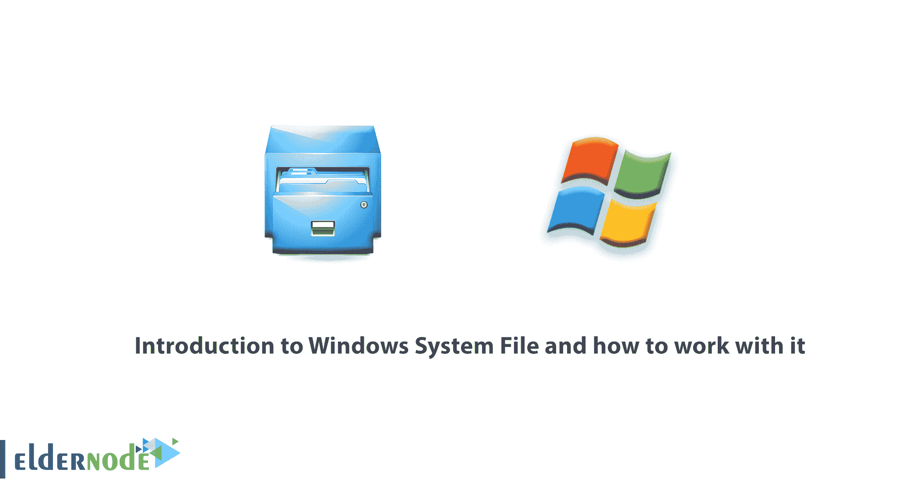
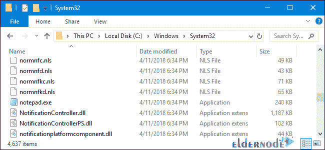
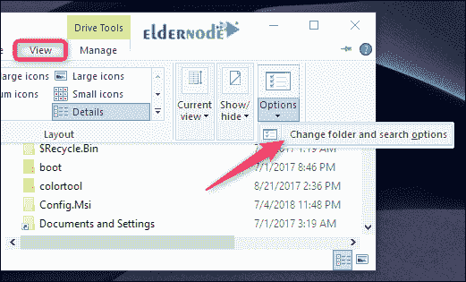
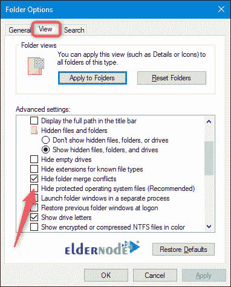
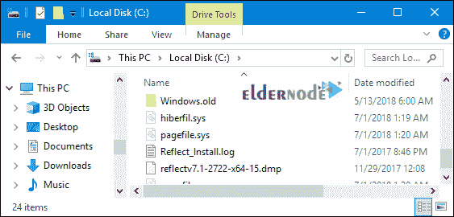
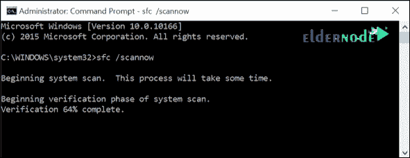

# 介绍 Windows 系统文件以及如何使用它- ElderNode 博客

> 原文：<https://blog.eldernode.com/introduction-to-windows-system-file/>

介绍 Windows 系统文件以及如何使用它。从技术上讲，Windows 系统文件是任何打开了隐藏系统属性的文件。实际上，系统文件就是 Windows 正常运行所依赖的那些文件。这些范围从硬件驱动到配置和 [DLL 文件](https://en.wikipedia.org/wiki/Data_definition_language)，甚至是构成 Windows 注册表的各种 hive 文件。

一般来说，最好不要管系统文件。删除、移动、重命名或更改这些文件可能会导致整个系统出现故障。因为这个事实，它们经常被隐藏，并被设为只读。

在本文中，我们将告诉你什么是 Windows 系统文件以及它是如何工作的。

***[在 Eldernode](https://eldernode.com/windows-vps/)*** 选择您的完美 Windows 虚拟专用服务器包

### 系统文件存储位置

系统文件通常位于被标识为系统文件夹的特定文件夹中。为了进一步防止意外删除，默认情况下，这些文件在 Windows 中是隐藏的。它们也不会出现在搜索中。

系统文件可以**存储**在你的 PC 上的许多位置。

你的系统驱动器的根文件夹(**C:\**)，例如，保存着你的页面文件( pagefile.sys )和休眠文件( hiberfil.sys )等系统文件。

Windows 系统文件大部分存储在 ***C:\Windows*** 中，尤其是像 ***/System32*** 和 ***/SysWOW64*** 这样的子文件夹中。但是，您还会发现系统文件分散在用户文件夹(如 appdata 文件夹)和应用文件夹(如 ProgramData 或 Program Files 文件夹)中。

### 教程在 Windows 中显示隐藏的系统文件

虽然系统文件在 Windows 中默认情况下是隐藏的，但是让 Windows 显示它们还是很容易的。只要记住，**删除**、**移动**、**编辑**，或者**重命名**这些文件都会导致各种各样的问题。我们的建议是在大多数情况下隐藏系统文件。

如果您在应用一些修改或调整时有意使用系统文件，请显示它们，然后在完成后再次隐藏它们。

要在窗口中显示系统文件，首先打开一个文件浏览器窗口。

在文件浏览器中，打开查看 > > 选项 > > 更改文件夹和搜索选项。

在文件夹选项窗口，切换到视图选项卡，然后**去掉隐藏受保护操作系统文件(推荐)选项上的勾**。

完成后点击确定。

你现在可以看到隐藏的系统文件。

**注意** 系统文件的图标看起来比非系统文件的图标要暗，以帮助表示它们的重要性。

### 如果系统文件损坏会发生什么？

这真的取决于哪些系统文件被损坏，所以症状可能包括应用程序无法启动(或者 T2 崩溃)，T4 蓝屏错误，甚至 Windows 无法启动。

如果您怀疑系统文件损坏或丢失，有几个内置的系统工具可以帮助您。

**系统文件检查器** ( SFC )扫描 Windows 系统文件，并可以替换任何它发现丢失或损坏的文件。

**部署镜像服务和管理** ( DISM )命令可以用来帮助修复阻止 SFC 完成其工作的底层问题。一起使用它们，你应该能够成功地修复丢失的或损坏的系统文件。

**SFC** 扫描您的计算机，查看是否有任何 Windows 系统文件损坏或任何其他更改。如果找到修改过的文件，它会自动用正确的版本替换它。

如果所有其他的都失败了，并且这两个选项都不起作用，你可以随时刷新或重置你的电脑回到默认状态。

**注意:** 此选项只应作为最后手段使用。您所有的个人文件将被保留，但任何售后下载的应用程序将被删除。

**尊敬的用户**，我们希望您能喜欢这个[教程](https://eldernode.com/category/tutorial/)，您可以在评论区提出关于本次培训的问题，或者想解决[老年人节点培训](https://eldernode.com/blog/)领域的其他问题，请参考[提问页面](https://eldernode.com/ask)部分，并尽快提出您的问题。腾出时间给其他用户和专家来回答你的问题。

好运。