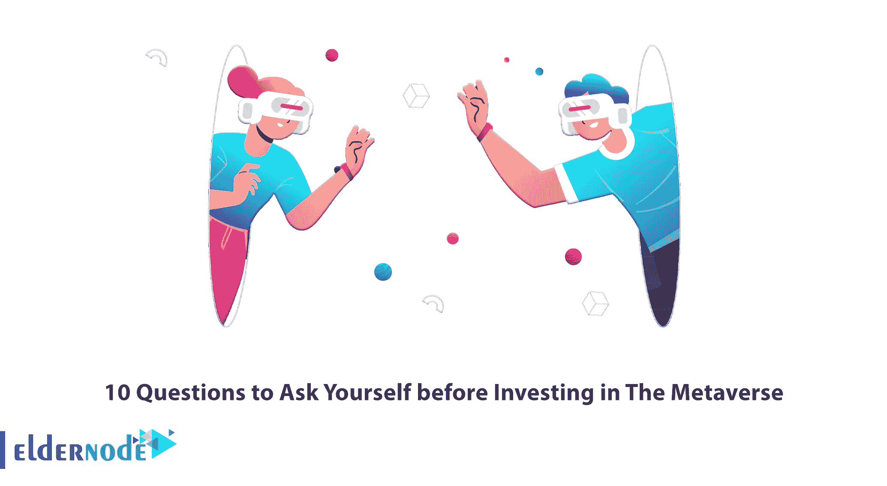

# 投资元宇宙前要问自己的 10 个问题

> 原文：<https://blog.eldernode.com/investing-in-the-metaverse/>

元宇宙是几个独立的虚拟世界的组合，人们可以通过网络随时访问它们。该行业预计将成为数十亿美元的行业。这个平台提供了各种各样的投资机会，投资者想要进入元宇宙的投资领域也就不足为奇了。这篇文章将解释在投资元宇宙之前应该问自己的 10 个问题。如果你想购买自己的 [**比特币 VPS**](https://eldernode.com/bitcoin-vps/) 主机，可以查看 [Eldernode](https://eldernode.com/) 网站上提供的套餐。

## **投资元宇宙**

元宇宙由 Meta 和 verse 两个词组成，是一个分散的、开源的、可互操作的平台，用于构建在基底上的可编程数字资产和身份。它允许用户相互之间以及与其他组件进行交互。在元宇宙世界中，人们的角色是在线的和虚拟的。这个虚拟世界集成了社交网络、视频游戏、虚拟现实(VR)和增强现实(AR)技术以及区块链的各个方面。

在本教程的续篇中，我们将解释在投资元宇宙之前要问自己的 10 个问题。

### **1-如何加入元宇宙平台？**

你应该知道如何加入元宇宙平台。加入元宇宙的第一步是选择元宇宙平台。你可以在这个平台上投资，购买或出售物品，创建一个头像，以及通过选择你的平台做许多其他事情。下一步是建立一个数字货币钱包，并将其连接到所选平台的虚拟[市场](https://blog.eldernode.com/tag/marketing/)。用户应该创建一个钱包，用数字货币支付或在元宇宙接收它们。

钱包接入平台后，就该买数字货币了。为此，请访问有效的在线交换网站。最后，创建一个头像。Avatar 实际上是元宇宙用户的虚拟版本，用户可以使用它在虚拟世界中相互交流。

### **2-如何工作？**

你要选择你要投资的平台，登陆。要有广告牌或售货亭，必须检查平台周围的环境。大多数元宇宙平台允许你跳进一个虚拟的房地产地图。分散式平台同时呈现该设计周围的部分世界，你可以看到你的邻居、天际线、走在街上的人等等。但沙盒平台只构建你所在的区域，无论是具体的一块土地，还是更大的房产。

### **3-元宇宙有哪些用途？**

元宇宙的第一个用途是游戏。视频游戏产业是元宇宙扩张的最重要因素。在这个虚拟世界中，你可以与他人互动，同时玩 3D 游戏。像《《我的世界》》或《堡垒之夜》这样的元宇宙游戏是这个行业中最早也是最大的游戏。

元宇宙的另一个用途是它允许用户与不同地方的人交流。此外，个人接触将被添加到网上聊天，这是升级到一个新的水平。元宇宙允许员工与其员工交流并参加会议。这降低了企业的运营成本，并最大限度地减少了旅行或使用物理空间的需求。它可以将视频会议提升到一个新的水平，这样您就可以作为全尺寸的化身参加会议。

### **4-加密货币在元宇宙有哪些用途？**

加密货币在元宇宙被用作一种支付方式。用户使用元宇宙加密技术购买任何产品或服务。你也可以用它们来投资。它还经常被用作虚拟世界的游戏内货币，允许玩家在游戏内交换游戏物品(甚至是金钱)，或者在交易所兑换成其他货币。元宇宙的交易管理和加密发行由网络共同完成。

### **5-元宇宙为投资者提供了哪些机会？**

随着时间的推移，在元宇宙投资的机会会越来越多。你可以购买涉及元宇宙一个或多个方面的公司股票，或者投资元宇宙房地产。此外，你还可以投资于[加密](https://blog.eldernode.com/bitcoin-and-altcoin-wallets-plugin/)、NFT 和其他数字资产。

### **6-投资元宇宙有哪些风险？**

由于元宇宙是新成立的，它允许诈骗盛行，目前还不清楚哪些公司和申请将会成功。所有尝试这样做的公司都会努力让这个开发成功，但是只有其中的一部分会成功。你应该意识到智能合约和加密货币的不可改变性，并完全协商条款以避免诈骗。

### **7-哪些产品和服务是元宇宙的一部分？**

现在有许多产品和服务可以在常规零售模式中获得，这可能是元宇宙的一部分。一些服务和产品是:

–保护用户身份和财务的安全性

–连接性可容纳无限数量的元宇宙游客

–互动平台或虚拟世界，相当于互联网上的一个网站

–虚拟现实耳机等沉浸式硬件

–3D 创建软件，用于构建场景或创建在元宇宙买卖的物品

–半导体为元宇宙提供动力和导航

### **8-投资元宇宙的最佳方式是什么？**

许多科技公司积极投资元宇宙项目。你可以尝试在元宇宙投资的一些最常见的方法是购买元宇宙代币和购买游戏内的虚拟土地。购买元宇宙代币是投资元宇宙最简单、最方便的方式之一。元宇宙代币的价值也像数字货币一样变化。流行的元宇宙平台提供了类似游戏的环境，在这里你可以建立和交易视觉资产和体验。越来越受欢迎的虚拟房地产提出了一个简单的解决方案，如何投资于加密元宇宙。

### **9-你为什么要投资元宇宙？**

元宇宙为改变生活方式和通信提供了巨大的潜力，你已经看到它的发展在新冠肺炎疫情之后加速。许多公司，如脸书，正在投资软件和硬件来支持元宇宙的虚拟显示器。这些虚拟世界的可扩展性除了一些游戏或知名平台如分散之外，还没有在区块链上取得很大进展。

### 投资元宇宙有利可图吗？

一项财产或货币的盈利能力无法准确表述，但一般来说，通过购买土地并在元宇宙投资 10 年，大约可以获得 1500%的利润。购买房地产通常总是有利可图的，从长远来看，任何人都购买并获利。

## 结论

元宇宙是一个数字化的在线世界，可以与我们的现实世界融为一体，在几分之一秒内为每个人提供丰富的信息和数据。在本帖中，我们解释了在投资元宇宙之前要问自己的 10 个问题。如果你有任何问题，你可以。请在评论区联系我们。我希望这篇教程能帮助你投资元宇宙，你会发现它很有用。