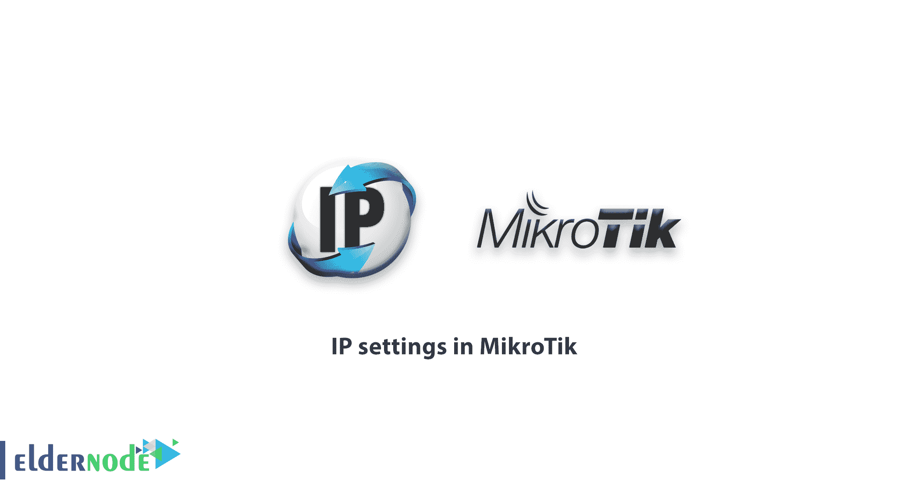

# 如何在 MikroTik - ElderNode 博客中配置 IP 设置

> 原文：<https://blog.eldernode.com/ip-settings-in-mikrotik/>

MikroTik 中的 IP 设置；如您所知，路由器运行在网络的第三层(IP)。路由器接口上有 IP 是配置路由器的要求之一。在本教程中，我们将解释如何在 [MikroTik](https://blog.eldernode.com/tag/mikrotik/) 路由器接口上设置 IP。你可以使用 [Eldernode](https://eldernode.com/) 提供的套装来购买 [MikroTik VPS](https://eldernode.com/mikrotik-vps-server/) 服务器。

### 在路由器板端口上设置 IP:

在 [MikroTik](https://mikrotik.com/) 接口上设置 IP 是我们配置 MikroTik 路由器或任何其他路由器的第一步。我们可以在 MikroTik 的每个端口上设置一个或多个 IP，但在此之前，最好根据需要重命名我们的接口。

从右侧菜单中选择接口选项。然后进入**界面列表**窗口。在此窗口中，您将看到路由器接口列表。该列表包括所有真实接口(如以太网、无线等。)和虚拟接口(如 VLAN、VPN 等。).

双击每个接口的名称进入该接口的设置窗口。在这里，您可以将界面重命名为所需的界面。

要通过 **IP- >地址**菜单将 IP 分配给 MikroTik 路由器接口，您将进入**地址**列表窗口。如果 **D** 字符在 **IP** 旁边，则自动设置(使用 **DHCP** )。

点击**添加**按钮将弹出如下窗口，我们可以为端口分配 IP。

显然，不同的端口需要接收不同范围的 IP；否则，我们将得到一条错误消息。

DHCP 客户端:

### MikroTik 可以通过 **DHCP** 接收每个端口的 IP。为此，请进入 **IP- > DHCP** 客户端菜单。

点击**添加**标志将会打开如下所示的窗口。

在此窗口中，我们首先需要指定 DHCP 客户端在哪个端口**上启用。(每个端口的设置必须单独设置)。如果启用了**使用对等 DNS** 选项，并且您的 DHCP 服务器也可以发送 DNS 地址，则该接收地址将应用于 MikroTik。(如果您之前已经手动设置了 DNS 地址，这些设置将被覆盖)。**

当 **DHCP 服务器**能够发送 **NTP** 设置时，使用**使用对等 NTP** 选项。如果是这样，NTP 设置将通过 DHCP 下载，并被您的手动设置覆盖。

如果添加默认路由设置为是，网关设置将通过 DHCP 下载添加到根表，但是如果系统上已经有默认路由设置，新设置将被忽略。

祝您好运

Goodluck.