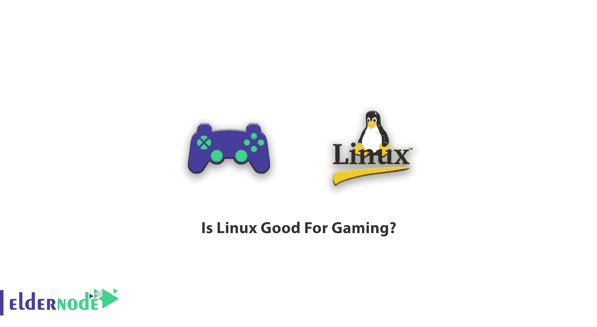
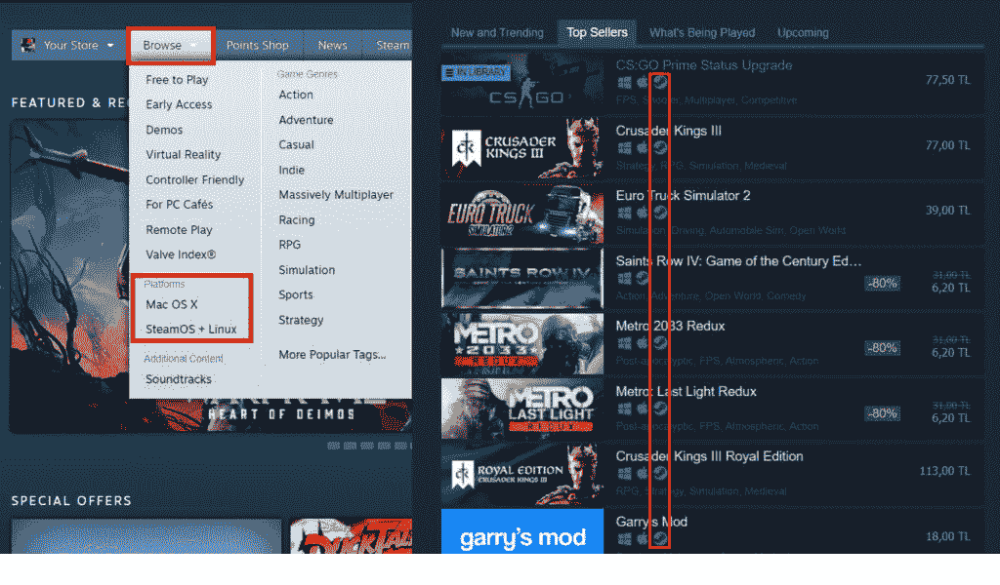
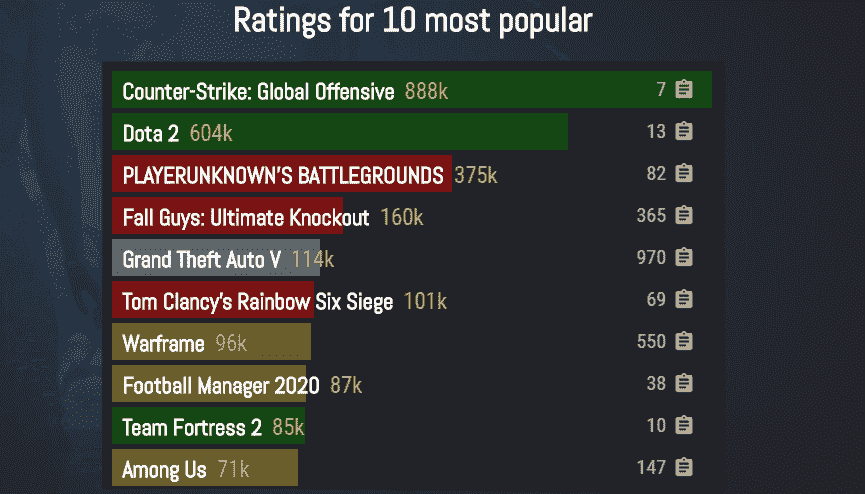
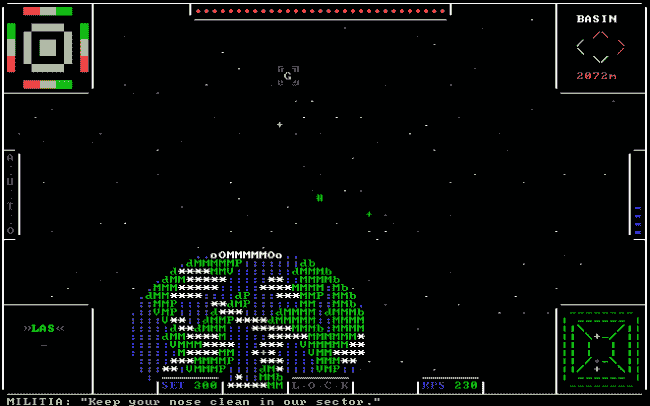

# Linux 适合游戏吗？-埃尔德诺德

> 原文：<https://blog.eldernode.com/is-linux-good-for-gaming/>

Linux，最流行、最常用、最知名的开源操作系统。您已经熟悉了其他一些操作系统，如 Windows、iOS 和 Mac OS。但是，我们来看看一个操作系统的任务是什么。它管理与您的台式机或笔记本电脑相关的所有硬件资源。为了管理软件和硬件之间的通信，你需要一个 [Linux 服务器](https://eldernode.com/linux-vps/)来让你的软件正常运行。在这篇文章中，我们将讨论 Linux 是否适合游戏。

既不像文字处理器，也不像办公套件那样是一套程序，但 Linux 是计算机/服务器硬件和在其上运行的程序之间的接口。

## Linux 适合游戏吗？

简短的回答是**是的**！但我们不是来给你一个简短的答案的。加入我们来看看在 Linux 上玩游戏的优势和劣势。这有助于你做出最终决定。

### 可以在 Linux 上玩游戏吗？

### 让我说清楚！如果你知道自己是某个游戏玩家，你不会发现 **GNU/Linux** 是游戏的正确平台。不要担心！我有 Linux 粉丝的入场说这个词。当然，这并不是忽视 Linux 游戏的足够理由。在下面，你可以发现为什么人们仍然在 Linux 上玩游戏:

Linux 是开源和免费的。

Linux 是非常可定制的。

超过 6000 种不同的游戏。

通过“Wine”软件在 Linux 下玩 Windows 游戏。

Linux 不需要高端版本就能运行良好。

有哪些适合游戏的Linux 发行版？

### steams OS Linux 发行版

Lakka Linux 发行版

Linux 发行游戏漂移

Ubuntu GamePack Linux 发行版

Linux 上有哪些类别的游戏？

### 正如我们提到的，有很多游戏可以在 GNU/Linux 上体验。下面是一个在 Linux 上分类的游戏列表，从质量的角度来看是不一样的:

原生 Linux 游戏

Linux 上的 Windows 游戏

浏览器游戏

终端游戏

原生 Linux 游戏

原生 Linux 游戏是由发行商和开发者在 Linux 上正式支持的游戏。在这种情况下，你只需要下载并运行标题来播放它，没有任何可能的缺陷。

### 当然，官方支持 Linux **的游戏数量并不**多，但也有一个可以接受的范围。你可以从 [GOG](https://www.gog.com/) 商店、 [Itch.io](https://itch.io/games/platform-linux) 套件、[便携式 Linux 游戏](https://portablelinuxgames.org/)网站、免费开源网站[penguspypengspy](http://www.penguspy.com/#/All/free_and_commercial/open_closed/sort=1/view=1/limit=0)以及当然还有 Steam 上合法找到官方的 Linux 游戏。您也可以在您的 Linux 发行软件库中寻找这些游戏。

Steam 上的 Linux 游戏

Valve 软件是少数几个支持 Linux 游戏的系列之一。要查看 Steam 上可用的游戏列表，安装好 Steam 平台后，进入商店，从顶栏选择浏览，从当前类别中选择 Linux 如图所示，Steam 甚至支持 Mac 版的游戏。

### 

***注意*** :如果你在商店主页面找游戏，在商店搜索 Linux 游戏时要注意 Linux 支持标志。

Linux 上的 Windows 游戏

在一些工具的帮助下，可以在 Linux 发行版上运行一些 **Windows 游戏，但有时输出的游戏质量并不理想。要了解游戏是否有能力在 Linux 上运行，可以使用质子数据库。**

### 该网站根据 Linux 系统上的性能质量，用五种颜色对非原生游戏进行分类。

**绿色**:原生 Linux 游戏
**白金**:在 Linux 系统上运行最好。
**黄金**:以可接受的方式，以良好的近似性执行。
**白银**:他们运行起来有小问题，但一般都是可玩的。
**红色**:它们无论如何都不适用，不可玩。

浏览器游戏

随着 web 开发知识的进步，基于浏览器的游戏为我们提供了比过去更具吸引力的选择，只需点击几下鼠标。体验游戏的最佳选择之一是谷歌浏览器 T2。你也可以搜索找到许多在浏览器上可以找到的竞争性和在线标题。

终端游戏

也可以通过终端玩；当然，这取决于你对游戏的期望和定义！但是如果目标是娱乐，Linux 终端为您提供了有趣和怀旧的选择。

###  
你可以玩类似 Hangman 的游戏，著名的贪吃蛇游戏，类似巴斯泰托女神的房屋建筑，甚至是终端上的 Pacman。如果你不年轻的话，这些标题会非常令人难忘和有趣。然而，接收和使用这些标题的方法不在本文讨论范围之内，但是稍加搜索，您就会发现一些不错的选项。

Windows/Linux 游戏的总比较

[Windows](https://eldernode.com/windows-vps/)操作系统通常提供一种称为“向后兼容性”的功能，通过为该版本的 Windows 设置兼容性，允许为早期版本的操作系统构建的程序向后兼容。对于大多数应用程序来说，包括电脑游戏，它运行良好且高效。它们需要几年的时间来适应当前的系统工具和库，否则，它们将无法运行，您将不得不在旧版本的 Linux 发行版上安装和运行它们。

### Windows 的高市场份额，以及操作系统本身的独特性，导致了电脑游戏的数字化和实体化发行。在这个平台上，游戏既可以在网上商店买到，也可以在 DVD 上买到。和蓝光。此外，缺乏向后兼容性，如果您购买了一款游戏，几年后您可能无法在较新的发行版上运行它，因为操作系统的各种组件发生了大量不兼容的变化。在类似 Unix 的世界中，包括 Linux，发行版和操作系统的数量很大，并且彼此不兼容，这意味着您不能在不同的 Linux 发行版上轻松地安装和运行预编译的程序。正因如此，Linux 游戏主要在一个服务和框架下发布，比如 Steam，这使得在不同的发行版上安装游戏成为可能，这使得在 Steam 等服务和在线商店之外发行一款游戏变得非常困难。

结论

在本文中，您回顾了 Linux 是否适合游戏。正如您所了解的，尽管 Linux 操作系统存在各种问题，但您仍然可以在这些系统上享受游戏体验。如果你还在想哪个是更好的选择？在 Windows 或 Linux 上玩游戏，虽然很难回答，但我可以说这真的取决于你的优先级和你的偏好。如果你渴望了解更多关于使用 [Linux](https://blog.eldernode.com/tag/linux/) 的知识，可以在我们的网站上找到相关文章。

## Conclusion

In this article, you reviewed whether if Linux is suitable for gaming or not. As you learned, despite all the problems with Linux OSes, you can still enjoy the gaming experience on these systems. If you are still thinking which is a better choice? Gaming on Windows or Linux, while it is difficult to answer, I can say that it really depends on your priorities and your preferences. In case you are eager to learn more about working with [Linux](https://blog.eldernode.com/tag/linux/), find the related articles on our website.