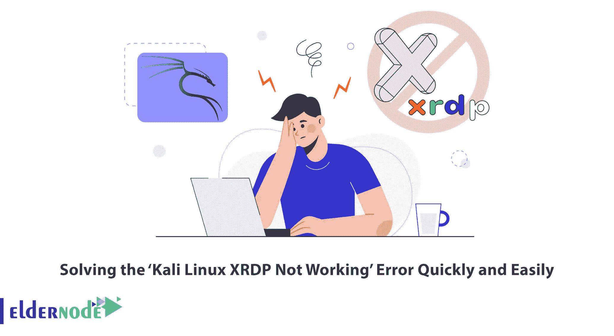

# 快速轻松地解决“Kali Linux XRDP 不工作”错误

> 原文：<https://blog.eldernode.com/kali-linux-xrdp-not-working/>



XRDP 是微软 RDP 的一个免费程序，允许远程桌面连接到 Linux 操作系统。在您的 Kali Linux 上安装此程序后，您可能会遇到“Kali Linux XRDP 不工作”错误。这篇文章将教你如何快速简单地解决“Kali Linux XRDP 不工作”的错误。如果你打算购买一台 Linux VPS 服务器，你可以在 [Eldernode](https://eldernode.com/) 网站上查看提供的软件包。

要远程管理 [Kali Linux](https://blog.eldernode.com/tag/kali-linux/) ，一般使用 SSH 服务和命令行，但是您可能对能够远程控制像 Windows 这样的 Kali Linux 图形环境感兴趣。在这种情况下，Xrdp 软件就是您的解决方案。XRDP 是微软远程桌面协议的开源版本，它允许您以图形方式控制远程系统。如果您遇到“Kali Linux XRDP 不工作”错误，请按照下面的步骤快速轻松地解决它。

### **如何解决“Kali Linux XRDP 不工作”错误**

这可能是因为 Kali Linux 上的远程桌面没有启用 XRDP。要使用 XRDP 启用远程桌面，请按照以下步骤操作。

首先，打开您的终端，使用以下命令更新您的系统:

```
sudo apt update
```

```
sudo apt upgrade
```

使用以下命令检查您的系统上是否安装了 XRDP:

```
sudo apt install xrdp
```

现在您应该安装 tigervnc，它有助于规避 XRDP 上的一个错误:

```
sudo apt install tigervnc-common
```

```
sudo apt install tigervnc-scraping-server
```

```
sudo apt install tigervnc-standalone-server
```

```
sudo apt install tigervnc-viewer
```

```
sudo apt install tigervnc-xorg-extension
```

添加用户，如下所示:

```
sudo adduser xrdp ssl-cert
```

现在将以下内容添加到 xsession 文件中:

```
sudo echo xfce4-session > /etc/.xsession
```

使用所需的文本编辑器打开 startwm.sh 文件:

```
vim /etc/xrdp/startwm.sh
```

并删除文档末尾显示的行:

```
test -x /etc/X11/Xsession && exec /etc/X11/Xsession  exec /bin/sh /etc/X11/Xsession
```

然后将以下字符串添加到文档的末尾:

```
startxfce4
```

**保存**文件并关闭。

最后，**使用下面的命令启用**并**启动**XRDP 服务:

```
sudo systemctl enable xrdp
```

```
sudo systemctl start xrdp
```

打开 RDP 客户端并尝试登录。输入您的用户名和密码，并记住从下拉菜单中选择 Xvnc 会话:


就是这样！

结论

## 在本文中，我们向您介绍了“Kali Linux XRDP 不工作”错误，并教您如何快速轻松地解决它。我希望这篇教程对你有用，并帮助你解决这个错误。如果你面临任何问题，你可以在评论区问我们。

In this article, we introduced you to the ‘Kali Linux XRDP Not Working’ Error and taught you how to solve it quickly and easily. I hope this tutorial was useful for you and helps you to solve this Error. If you face any problems, you can ask us in the Comments section.