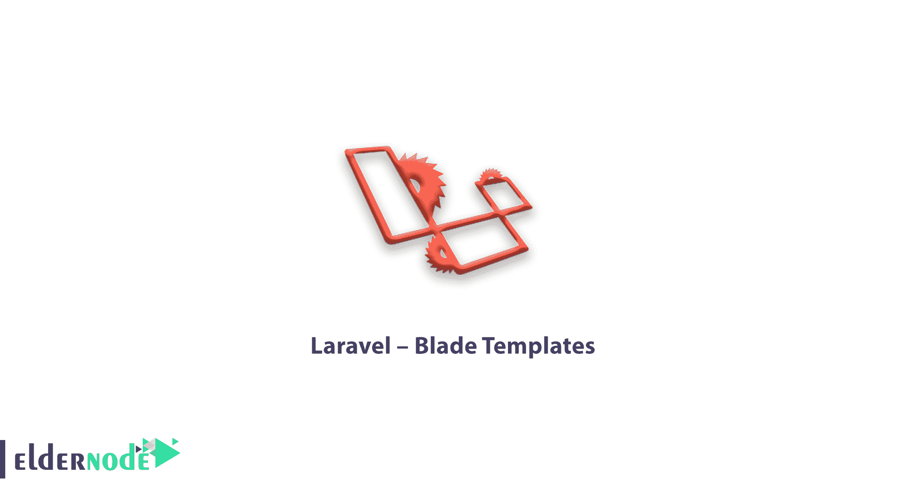

# Laravel -刀片模板-教程 Laravel | ElderNode 博客

> 原文：<https://blog.eldernode.com/laravel-blade-templates/>

Laravel-Blade Templates， [Laravel](https://eldernode.com/tag/laravel/) 5.1 引入了使用 Blade 这一模板引擎来设计独特布局的概念。如此设计的布局可以被其他视图使用，并且包括一致的设计和结构。

### laravel–刀片模板

与其他模板引擎相比，Blade 在以下方面是独一无二的:

1)它不限制开发者在视图中使用普通的 PHP 代码。

2)这样设计的叶片视图被编译和缓存，直到它们被修改。

所有视图都存储在 resources/views 目录中，Laravel 框架的默认视图是 welcome.blade.php。

创建刀片模板布局的步骤:

第一步:

1)在资源/视图文件夹中创建一个布局文件夹。

我们将使用这个文件夹来存储所有布局。

2)创建一个文件名 master.blade.php，它将有以下相关代码。

第二步:

1)在这一步中，您应该扩展布局。扩展布局包括定义子元素。Laravel 使用 Blade @extends 指令来定义子元素。

扩展布局时，请注意以下几点:

1)在叶片布局中定义的视图以独特的方式注入容器。

2)视图的各个部分被创建为子元素。

3)子元素作为 child.blade.php 存储在布局文件夹中

第三步:

要在视图中实现子元素，您应该按照需要的方式定义布局。

我们希望你能从上面的文字中找到与 Laravel 相关的信息。