# 如何在 Windows RDP - Eldernode 博客上安装和使用 LastPass

> 原文：<https://blog.eldernode.com/lastpass-on-windows-rdp/>

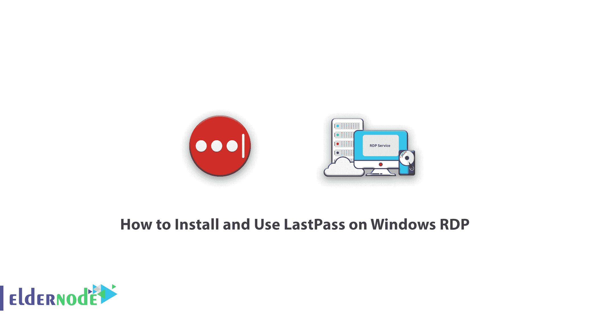

了解如何在 Windows RDP 上安装和使用 LastPass。LastPass 是一项在线服务，可以很好地管理您的密码。在当今的数字世界中，记住大量复杂的密码几乎是不可能的，因为大部分工作是通过登录互联网网站来完成的，每次登录都需要单独的用户名和密码。LastPass 是最流行的密码管理程序之一，它为用户提供了所有必要的工具来生成密不透风的密码，并将其保存在一个地方。在本文中，我们试着教你如何在 RDP 的 [Windows](https://blog.eldernode.com/tag/windows/) 上安装和使用 LastPass。如果你需要购买一个[管理 RDP](https://eldernode.com/buy-rdp/) 服务器，你可以在 [Eldernode](https://eldernode.com/) 中看到可用的软件包。请和我们在一起。

## 教程在 Windows RDP 上安装和使用 LastPass

如果你在很多网站都有帐户，你可能是所有网站都使用相同密码的用户之一。为不同的网站选择相同的密码在安全方面是非常危险的。即使您选择了不同的密码，也很难记住密码，您可能会忘记密码。这就是为什么你需要像 LastPass 这样的软件。在这篇文章的后续部分，我们想教你如何使用 LastPass 软件。

### LastPass 服务和功能

该服务作为单独的扩展安装在[谷歌 Chrome 浏览器](https://blog.eldernode.com/install-google-chrome-on-rdp-admin/)和其他浏览器中，并免费提供以下服务:

**–**能够存储所有密码

**–**能够自动完成您在各个网站的登录信息

**–**检查密码的强度

**–**生成可定制的强大密码

**–**能够安全地书写和存储文本

**–**能够在一个系统上保存密码，并在另一个系统上使用

## 在 Windows RDP 上安装和使用 LastPass

在本文的后续部分，我们将教你如何在 Windows RDP 浏览器中安装 LastPass 软件作为扩展。和我们在一起。

### 如何安装 LastPass 作为扩展

要在浏览器上安装 LastPass，必须先登录 [LastPass 网站](https://www.lastpass.com/)。

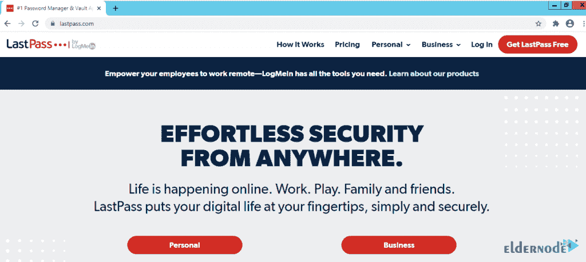

在下一页，要在网站上注册，您必须填写必填字段。然后点击**注册——这是免费的**订阅。

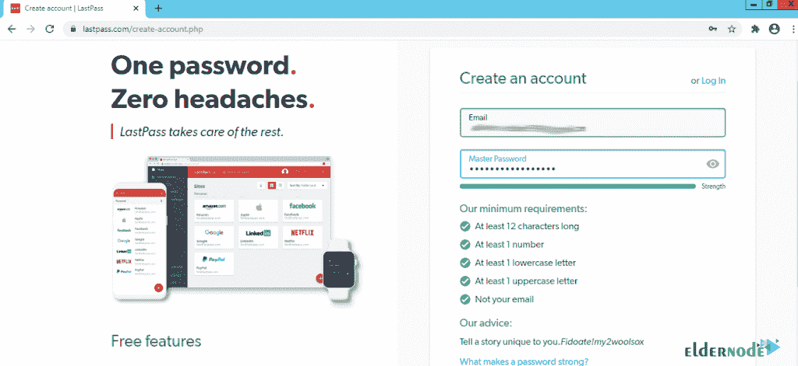

需要注意的是，注册时必须创建强密码。该密码应包括以下内容:

**1-** 至少 12 个字符长
**2-** 至少 1 个数字
**3-** 至少 1 个小写字母
**4-** 至少 1 个大写字母
**5-** 不是你的邮箱

填写完这些字段后，点击**注册——登录您的帐户是免费的**。

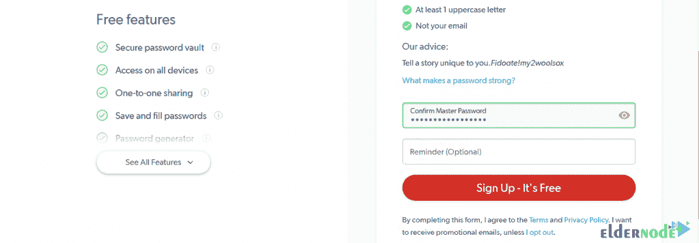

完成注册后，您将立即被重定向到与下图类似的页面。在这个页面上，要将 LastPass 扩展添加到 Chrome 浏览器，必须点击**添加到 Chrome** 。

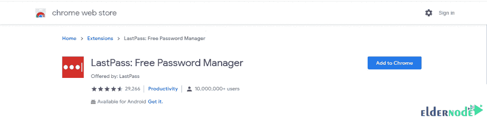

然后点击**添加扩展**进入你的 LastPass 仪表盘。在右上角，您将看到 LastPass 图标的图像，表示安装成功。

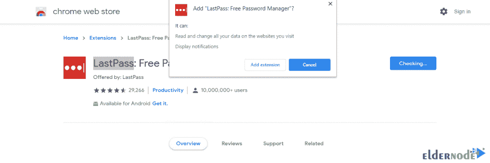

您可以在其他浏览器中安装 LastPass。要用你想要的浏览器来做这件事，回到 LastPass 主网站，在页面底部的**获取 LastPass** 部分选择你想要的**浏览器**。**比如**，我们这里选择[火狐](https://blog.eldernode.com/install-firefox-on-rdp-admin/)。

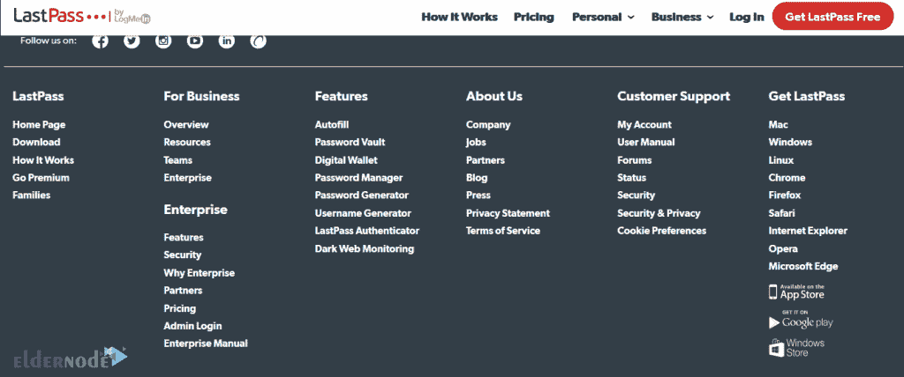

在下一个屏幕上点击**快速安装**。

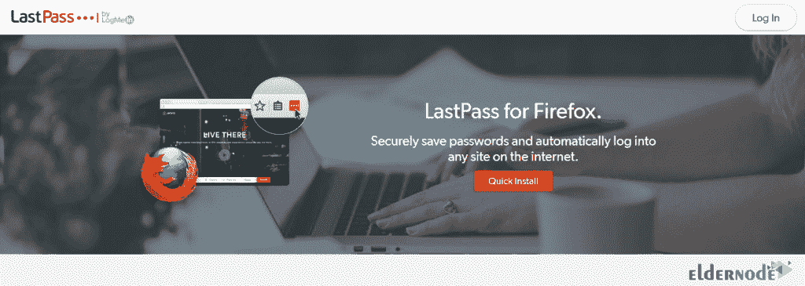

下一步，点击**添加到 Firefox** 。然后点击**添加**在浏览器上安装 LastPass。

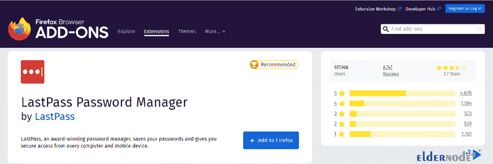

*

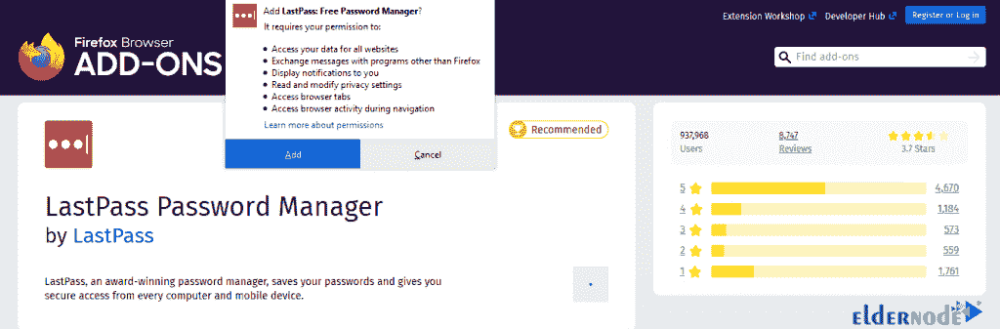

安装后，点击程序图标，然后选择**接受**。

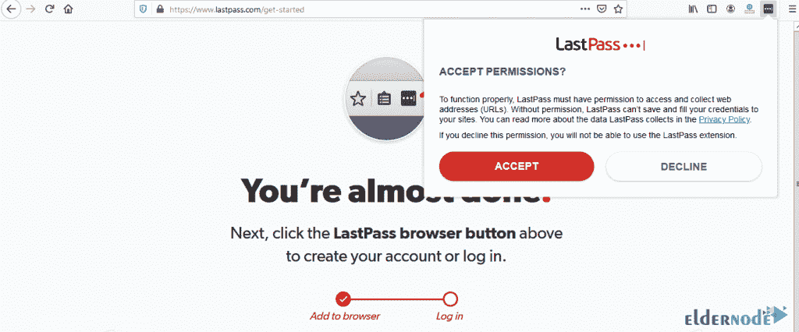

要**登录**到你的账户，你必须输入你的**邮箱**和**密码**，点击**登录**。

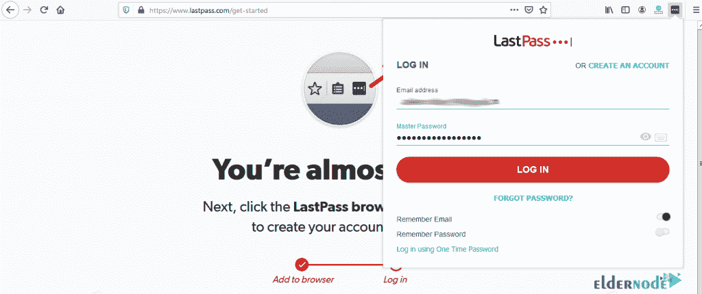

最后，你会注意到 LastPass 图标变成了红色。这意味着帐户登录已成功完成。点击**打开我的金库**进入仪表盘。

*

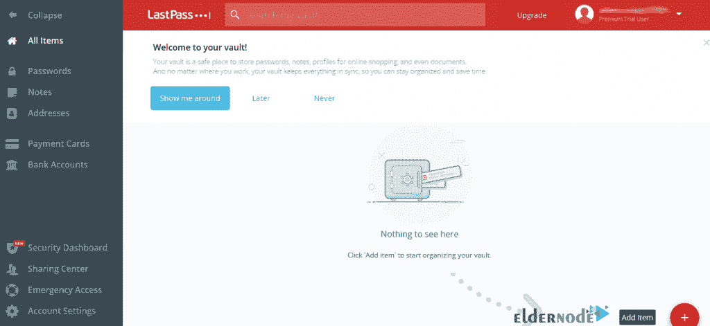

## 结论

密码安全和记忆多个帐户的长而复杂的密码是大多数用户都有麻烦的事情。现在建议用户在系统上安装密码管理软件。这将保护您的密码和用户名免受黑客攻击和网站，您将不再需要键入您的用户名和密码。这就是为什么在本文中，我们试图向您介绍 LastPass 软件，并教您如何在 Windows RDP 上安装和使用 LastPass。