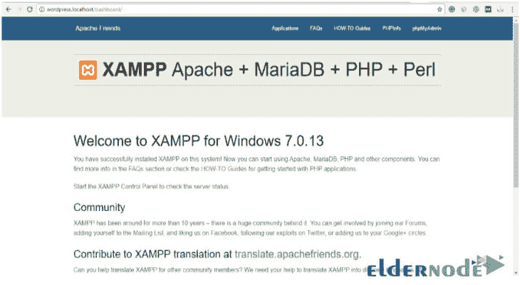

# 使用 XAMPP -埃尔德诺德博客了解如何在 Windows 10 中设置 VPS

> 原文：<https://blog.eldernode.com/learn-how-to-setup-vps-in-windows-10-using-xampp/>

了解如何使用 XAMPP 在 Windows 10 中设置 [**VPS**](https://eldernode.com/vps/) 。在本教程中，你将学习如何在 Windows 10 中运行一个 **XAMPP 虚拟** **私有** **服务器**。这将允许您在本地和您自己的系统上运行您的站点信息。

许多开发者倾向于在本地环境中创建网站。如果你正在使用 WordPress，建立 XAMP 或者 T2 WAMP 栈是一件简单的事情。 **XAMPP** 或 **WAMP** 栈确保当你实时运行项目时，数据库可以平滑地移动。

在这个[教程中，](https://eldernode.com/category/tutorial/)我们想向你展示如何在 Windows 10 中用 XAMP 为 [**WordPress 网站**](https://eldernode.com/category/wordpress/) 设置和配置一个虚拟私人服务器。

了解如何使用 XAMPP 在 Windows 10 中设置 VPS。

## **创建虚拟专用服务器**

首先你需要去“**C:/xampp/Apache/conf/extra**”。

然后用文本编辑器编辑“ **httpd-vhosts.conf** ”。

该文件如下所示:

清除文件文本并输入以下代码:

| <VirtualHost *:80>document root " c:/xampp/htdocs/WordPress "服务器名称 WordPress.localhost |

在上面的代码中:

*   **虚拟主机:**大多数 web 服务器使用端口 80 作为默认端口。但是，您可以将端口更改为 8080、8081。
*   **文档根目录:**包含站点文件的文件夹。我们在这里命名了 WordPress 文件夹。
*   **Servername:** 这是我们虚拟专用服务器的 URL。
*   **目录:**这是一个虚拟私有服务器目录。

现在转到“**窗口>搜索>运行**并复制下面一行:

然后用文本编辑器打开宿主文件。

将下面一行添加到宿主文件中:

| WordPress.localhost |

完成后，检查“ **wordpress.localhost** ”是否在浏览器中打开。

您可以看到该域已经成功添加。现在，您可以在虚拟专用服务器上运行您的程序。

### 在 [VPS](https://eldernode.com/vps/) : 上启动 WordPress

了解如何使用 XAMPP 在 Windows 10 中设置 VPS。

假设你已经安装了 XAMPP 服务器并启动了一个 WordPress 网站。

#### 数据库变化:

现在是改变数据库 URL 的时候了。(设置虚拟主机的一个非常重要的步骤)

为此，请转到“**http://localhost/phpmyadmin/**”并选择您的数据库。在这里，我的数据库是“ **WordPress** ”。

然后进入 **WordPress > wp _options** ，将 siteURL 从“**http://localhost/WordPress/**”改为“**http://WordPress . localhost**”。此外，将主页 URL 从“**http://WordPress/WordPress/WP-admin**”更改为“**http://wordpress.localhost/wp-admin**”。

重启 **apache** ，看到你的虚拟私有服务器地址，这里是“ **wordpress.localhost** ”。检查域是否设置成功。

自从与 XAMPP 合作推出虚拟服务器后，最终结果如下:

了解如何使用 XAMPP 在 Windows 10 中设置 VPS。

祝您好运