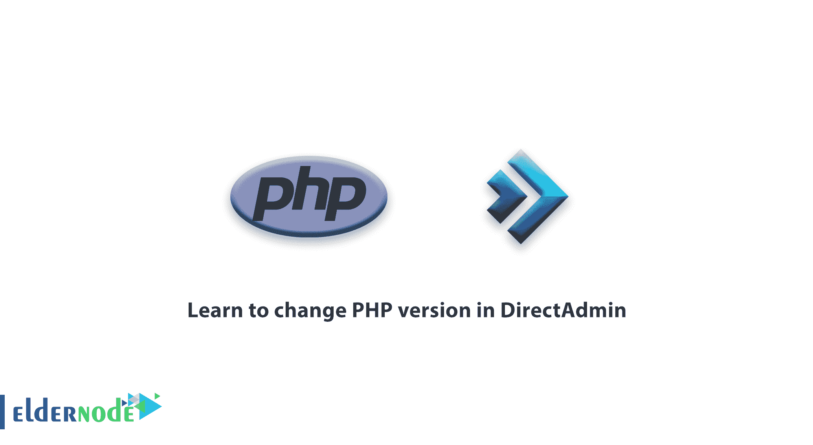

# 学习在 DirectAdmin - Directadmin 服务器中更改 PHP 版本

> 原文：<https://blog.eldernode.com/learn-to-change-php-version-in-directadmin/>

学会更改 PHP 版本在 DirectAdmin 中，web 服务器管理员面临的问题之一就是更改 [DirectAdmin](https://blog.eldernode.com/tag/direct-admin/) 的 PHP 版本。今天我们将教你如何改变你的 [DirectAdmin 服务器](https://blog.eldernode.com/tag/direct-admin/)上使用的 PHP 版本。和我们在一起。

## **学习在 DirectAdmin** 中更改 PHP 版本

**在 [DirectAdmin](https://www.directadmin.com/) :** 中同时使用多个版本的 PHP

DirectAdmin 支持同时启动多个版本的 PHP。目前，PHP 最常见的组合是 5.6 和 7。

在本教程中，我们将使用“**custom build”**来启动 PHP 的两个版本。在开始培训之前，你需要确保你的服务器使用了 **CustomBuild** 2.0。否则，你必须更新它。

**注意:** DirectAdmin 支持 1.50.1 版及更高版本 PHP。

#### **步骤一:**

#### **变更为自定义构建配置:**

有两种方法可以改变 **CustomBuild** 的配置:对“ **options.conf** ”文件进行修改，或者通过修改代码来使用我们在这里制作的代码。要配置 PHP 5.6 和 7 的两个版本，首先转到 CustomBuild 文件夹。

CD/usr/local/direct admin/custom build

### **步骤二:**

### **配置 PHP 版本:**

使用以下命令自定义版本:

a)。/build set php1_mode PHP-fpm

b)。/build set php2_mode PHP-fpm

c)。/build set php1_release 7.0

d)。/build set php2_release 5.6

**注:**

使用上面的命令，两个版本的 PHP 都以" **PHP-fpm"** 模式启动。

如果您使用的是“**Nginx”**和“ **Apache 反向代理”**，这一点非常重要。

如果不使用反向代理，必要时可以更改 PHP 模式。

不建议使用早于 5.6 的 PHP 版本，因为它们已经到了生命的尽头，所以不会更新。因此，如果可能的话，建议您使用 **PHP 7** ，并且只使用 5.6 版本来临时支持旧的应用程序。

打开“ **options.conf** ”文件:

CD/usr/local/direct admin/custom build

vi 选项. conf

在文件中可以看到一些基本行:

php1_release=7.0

php1_mode=php-fpm

php2_release=5.6

php2_mode=php-fpm

如果您没有看到上述内容，请再次租赁订单。

### **第三步:重新编译 PHP:**

覆盖并重新编译 PHP 设置:

。/build php n

。/build rewrite_confs

步骤 4:配置 PHP 版本:这可能需要一些时间，请不要断开连接。在开始这个过程之前，最好将服务器置于“屏幕会话**”**，这样你的系统或者“**SSH”**就不会被中断。

现在，您可以在该服务器上托管的站点上选择所需的 PHP 版本。任何 DirectAdmin 值设置为“**PHP 1 _ release”**的网站都可以使用该功能。要更改各个网站的 PHP 版本，进入“**用户级”**，选择你想要的**域名**，在“**域名设置**下，点击“**你的账户**，选择你想要向下滚动的域名。现在你可以选择你的 PHP 版本。

注意:版本更改后，更改的相对处理时间将是 1 分钟。

祝您好运