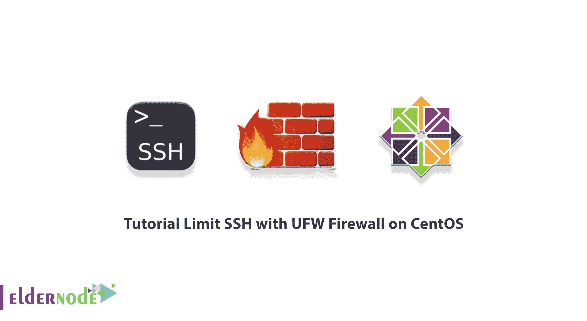

# CentOS - Eldernode 博客上用 UFW 防火墙限制 SSH 的教程

> 原文：<https://blog.eldernode.com/limit-ssh-with-ufw-firewall-on-centos/>



防火墙是一种监控和过滤进出网络流量的工具。它定义了一组允许或阻止特定流量的安全规则。UFW 是管理 iptables 防火墙规则的用户友好视图。顾名思义，它的主要目的是使防火墙管理更容易。在这篇文章中，我们将教你如何在 CentOS 上用 UFW 防火墙限制 SSH。如果你想购买一台 [**CentOS VPS**](https://eldernode.com/centos-vps/) 服务器，你可以访问 [Eldernode](https://eldernode.com/) 中的软件包。

## **如何在 CentOS 上用 UFW 防火墙限制 SSH，8】**

### **如何在 CentOS**T3 上设置 UFW 防火墙

为了全面学习本教程，我们需要在本节中首先教您在 [CentOS](https://blog.eldernode.com/tag/centos/) 上设置 UFW 防火墙。为此，只需遵循以下步骤。

第一步，需要确保您已经激活了**回购 EPEL** 。所以需要用下面的命令**安装 UFW** :

```
sudo yum -y install ufw
```

现在您可以使用以下命令查看 **UFW 安装状态**:

```
sudo ufw status
```

## **CentOS 上用 UFW 防火墙限制 SSH，8】**

在本节中，我们将向您展示如何在 CentOS 上使用 UFW 防火墙来限制 SSH。要做到这一点，请注意本教程的继续。现在要注意的是，基本防火墙拒绝所有输入流量，允许输出流量，这是一个很好的起点。您可以使用以下命令轻松调整默认规则:

```
sudo ufw default deny incoming
```

```
sudo ufw default allow outgoing
```

如果你愿意，你可以在网上开通任何你想要的服务。例如，您可以像以下命令一样打开防火墙:

```
sudo ufw allow ssh
```

或者

```
sudo ufw allow https
```

正如您在以下命令中看到的，对于非标准或不常见的端口，您可以指定端口号而不是服务:

```
sudo ufw allow 2222
```

您还可以通过使用以下命令将它添加到末尾来进一步缩小到协议:

```
sudo ufw allow 2222/tcp
```

您可以使用以下命令为 FTP 添加一系列端口:

```
sudo ufw allow 3000:4000/tcp
```

您可能有一个固定的 IP 地址，并希望允许所有网络流量。在这种情况下，您应该使用以下命令:

```
sudo ufw allow from 123.123.123.123
```

您也可以通过运行以下命令来阻止通过 IP 的流量:

```
sudo ufw deny from 123.123.123.123
```

您可以借助以下命令来调整防火墙:

```
sudo systemctl enable ufw
```

最后，您可以发出以下命令来禁用防火墙:

```
sudo ufw disable
```

## 结论

默认情况下，UFW 防火墙会阻止所有传入和传出连接，并允许所有传出连接。这意味着任何想要访问您的服务器的人都将无法连接，除非您特别打开该端口。在本文中，我们试图教你如何在 CentOS 上用 UFW 防火墙限制 SSH。如果愿意可以参考 Ubuntu 20.04 上的文章[教程用 UFW 限制 SSH。](https://blog.eldernode.com/limit-ssh-with-ufw-on-ubuntu/)