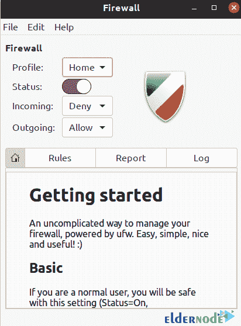
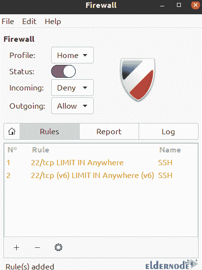
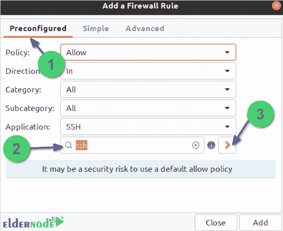

# 教程限制 SSH 与 UFW 在 Ubuntu 20.04 - Eldernode 博客

> 原文：<https://blog.eldernode.com/limit-ssh-with-ufw-on-ubuntu/>


正确的防火墙配置是系统安全最重要的方面之一。默认情况下，Ubuntu 附带一个名为 UFW(简单防火墙)的防火墙配置工具。UFW 是一个用户友好的避难所，用于管理 iptables 防火墙规则，其主要目的是管理或轻松管理 iptables。在这篇文章中，我们将教你如何在 Ubuntu 20.04 上用 UFW 限制 SSH。如果你想购买一台 [**Ubuntu VPS**](https://eldernode.com/ubuntu-vps/) 服务器，你可以访问 [Eldernode](https://eldernode.com/) 中提供的软件包。

## **如何在 Ubuntu 20.04 上用 UFW 限制 SSH**

### **如何语法限制 SSH 与 UFW 的连接**

在这一节中，我们想教你如何使用语法来限制与 UFW 的 SSH (TCP 端口 22)连接。注意，语法非常简单。为此，您可以看到以下命令:

```
## ufw limit ssh various usage ##
```

```
ufw limit ssh
```

```
ufw limit ssh/tcp
```

```
ufw limit ssh comment 'Rate limit for openssh server'
```

```
### if sshd is running on tcp port 2022 add ####
```

```
ufw limit 2022/tcp comment 'SSH port rate limit'
```

## **在 Ubuntu 20.04 上用 UFW 限制 SSH |****Ubuntu 21.04**

在上一节中，我们提到了一些限制 SSH 与 UFW 连接的语法。请注意，这些规则对于防范暴力日志攻击非常有用。

现在在这一节，我们想讨论如何在 Ubuntu 20.04 上用 UFW 限制 SSH。请注意，当使用受限规则时，UFW 通常会允许连接。但是如果一个 IP 地址试图在 30 秒内建立多个连接，它会拒绝该连接。因此，您需要在安装后使用以下命令进行确认:

```
sudo ufw limit ssh/tcp comment 'Rate limit for openssh serer'
```

```
sudo ufw status
```

有趣的是，Iptables 中的真正规则如下:

```
-A ufw-user-input -p tcp -m tcp --dport 22 -m conntrack --ctstate NEW -m recent --set --name DEFAULT --mask 255.255.255.255 --rsource
```

```
-A ufw-user-input -p tcp -m tcp --dport 22 -m conntrack --ctstate NEW -m recent --update --seconds 30 --hitcount 6 --name DEFAULT --mask 255.255.255.255 --rsource -j ufw-user-limit
```

```
-A ufw-user-input -p tcp -m tcp --dport 22 -j ufw-user-limit-accept
```

### **如何用 UFW 等协议限制 SSH**

在这一节中，我们想向您展示如何使用 UFW 和其他协议来限制 ssh。您可以使用以下命令来实现这一点。您也可以使用这些命令来限制其他服务:

```
ufw limit {service}
```

```
## be careful with http/https limits as many users might be behind a large proxy server ##
```

```
ufw limit 25/tcp
```

```
ufw limit http
```

```
ufw
```

```
ufw limit https
```

### **如何使用 GUFW GUI 工具限制 SSH**

在这一节中，我们想使用 GUFW GUI 工具来处理限制 ssh 的问题。为此，您必须按顺序执行以下步骤。

首先，你需要确保 GUFW 安装在 Ubuntu Linux 上。您可以使用以下命令来执行该测试:

```
sudo apt install gufw
```

现在，您可以通过执行以下命令开始:

```
gufw &
```

请注意，运行 GUI 防火墙工具需要身份验证。因此会要求您输入密码。完成此操作并输入密码后，您可以看到如下所示的窗口:



查看上图后，您必须点击**规则**选项卡，然后点击页面底部的 **+** 符号。在下一步中，您需要在**应用程序**过滤器框中键入“ **SSH** ，并点击橙色图标:



在查看下图并确定限制策略后，您可以点击“**添加**，然后点击“**关闭**按钮:



## 结论

在虚拟和[专用服务器](https://eldernode.com/dedicated-server/)中，提高服务器安全性的最有效方法之一是在防火墙的帮助下控制服务器的流量以及入站和出站连接。这是通过设置防火墙并阻止或限制服务端口或流量来实现的。在 Ubuntu 20.04 中，这可以通过 UFW 防火墙来实现，所以在这篇文章中，我们试图教你如何在 Ubuntu 20.04 上用 UFW 来限制 SSH。也可以参考[如何在 Debian 10](https://blog.eldernode.com/set-up-firewall-ufw-debian-10/) 和 [Ubuntu 20.04](https://blog.eldernode.com/setup-firewall-ufw-ubuntu-20/) 上用 UFW 设置防火墙的文章。