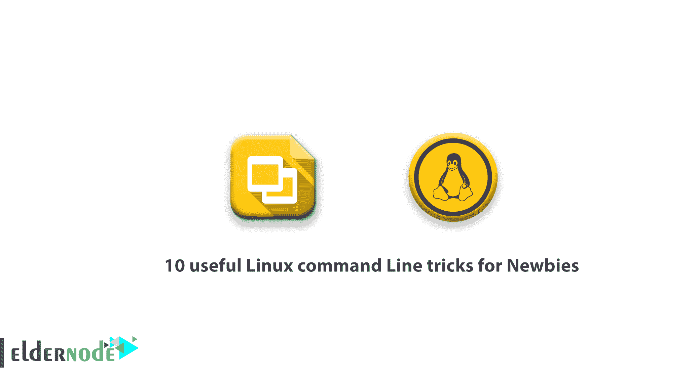

# 新手使用的 10 个有用的 Linux 命令行技巧

> 原文：<https://blog.eldernode.com/linux-command-tricks-newbies/>



教程 **10 个对新手有用的 Linux 命令行技巧**。一个 Linux 系统管理员需要知道一些 Linux 技巧。看看 Eldernode services，买自己的 [Linux VPS](https://eldernode.com/linux-vps/) 。您应该已经意识到 Linux 终端是多么的美观、灵活和易用，老实说，一天不使用都不行。因此，让我们回顾一些有用的技巧和提示，让 Linux 新手更容易过渡到 Linux，或者只是帮助他们学习一些新东西。

## 新手使用的 10 个有用的 Linux 命令行技巧

在本教程中，我们将向您展示一些有用的技巧，告诉您如何像专业人士一样使用 Linux 终端，只需要很少的技巧。你所需要的只是一个 Linux 终端和一些空闲时间来测试这 10 个对新手有用的 Linux 命令行技巧。

### 1-如何找到正确的命令

您知道执行正确的命令对您的系统至关重要。然而，在 Linux 中，有太多不同的命令行，以至于很难记住它们。那么，如何搜索您需要的正确命令呢？答案是**恰到好处**。你只需要运行:

```
apropos <description>
```

在这里，您应该用您正在寻找的命令的实际描述来更改“**描述**”。看看这个例子:

```
apropos "list directory"    dir (1) - list directory contents  ls (1) - list directory contents  ntfsls (8) - list directory contents on an NTFS filesystem  vdir (1) - list directory contents
```

**注意**:在左边，你可以看到命令，在右边是它们的描述。

### 2-如何执行之前的命令

你需要多次反复执行相同的[命令](https://blog.eldernode.com/command-tips-linux/)。虽然您可以重复按下键盘上的**向上**键，但您可以使用历史命令来代替。要列出启动终端后输入的所有命令:

```
history        1  fdisk -l      2  apt-get install gnome-paint      3  hostname tecmint.com      4  hostnamectl tecmint.com      5  man hostnamectl       6  hostnamectl --set-hostname tecmint.com      7  hostnamectl -set-hostname tecmint.com      8  hostnamectl set-hostname tecmint.com      9  mount -t "ntfs" -o     10  fdisk -l     11  mount -t ntfs-3g /dev/sda5 /mnt     12  mount -t rw ntfs-3g /dev/sda5 /mnt     13  mount -t -rw ntfs-3g /dev/sda5 /mnt     14  mount -t ntfs-3g /dev/sda5 /mnt     15  mount man     16  man mount     17  mount -t -o ntfs-3g /dev/sda5 /mnt     18  mount -o ntfs-3g /dev/sda5 /mnt     19  mount -ro ntfs-3g /dev/sda5 /mnt     20  cd /mnt     ...
```

在收到您已经运行的所有命令的列表后，在每一行上都有一个数字，指示您已经输入了该命令的行。您可以使用以下命令调用该命令:

```
! 
```

其中 **#** 应随命令的实际数量而变化。为了更好地理解，我们来验证下面的例子:

```
!501 
```

### 3-如何使用午夜指挥官

在这一步，我们解释如何使用**午夜命令**，如果你不习惯使用 **cd** 、 **cp** 、 **mv** 、 **rm** 等命令。使用可视化外壳很容易，在其中也可以使用鼠标。

通过**F1–F12**键，您可以轻松执行不同的任务。只需查看底部的图例。要选择文件或文件夹，单击“**插入**按钮。

然后，午夜命令被称为“ **mc** ”。要在您的系统上安装 **mc** ，只需运行:

```
sudo apt-get install mc        [On **Debian** based systems]
```

```
yum install mc                 [On **Fedora** based systems]
```

您只需输入以下命令即可打开 **mc** :

```
mc
```

接下来，使用**选项卡**按钮在左**和右**窗口**之间切换。您有一个 **LibreOffice** 文件，我会将它移动到“**软件**文件夹中。**

按下键盘上的 **F6** 按钮，将文件移动到新目录。MC 现在会要求您确认。

**点**:确认后将文件移动到新的目标目录

### 4-如何在特定时间关闭电脑

正如你所猜测的，有时你需要在工作时间结束后关闭电脑。您可以使用以下命令将计算机配置为在特定时间关机:

```
sudo shutdown 21:00
```

如果您需要告诉您的计算机在您提供的特定时间关机，您也可以告诉系统在特定的分钟数后关机:

```
sudo shutdown +15
```

**点**:这样系统将在 **15** 分钟后关闭。

### 5-如何显示已知用户的信息

要使用一个简单的命令列出您的 Linux 系统用户以及关于他们的一些基本信息:

```
lslogins
```

输出 

```
UID USER PWD-LOCK PWD-DENY LAST-LOGIN GECOS  0 root 0 0 Apr29/11:35 root  1 bin 0 1 bin  2 daemon 0 1 daemon  3 adm 0 1 adm  4 lp 0 1 lp  5 sync 0 1 sync  6 shutdown 0 1 Jul19/10:04 shutdown  7 halt 0 1 halt  8 mail 0 1 mail  10 uucp 0 1 uucp  11 operator 0 1 operator  12 games 0 1 games  13 gopher 0 1 gopher  14 ftp 0 1 FTP User  23 squid 0 1  25 named 0 1 Named  27 mysql 0 1 MySQL Server  47 mailnull 0 1  48 apache 0 1 Apache  ...
```

### 6-如何搜索文件

搜索文件有时并不像你想象的那么容易。搜索文件的一个很好的例子是:

```
find /home/user -type f
```

您可以使用以下命令搜索位于 **/home/user** 中的所有文件。 **find** 命令是一个非常强大的命令，你可以传递更多的选项给它，让你的搜索更加详细。

此外，如果您想要搜索大于给定大小的文件，您可以使用:

```
find . -type f -size 10M
```

由于上述命令将从当前目录中搜索所有大于 **10 MB** 的文件，请确保不要从 Linux 系统的根目录运行该命令，因为这可能会导致机器上的高 I/O。

您可以将 **find** 与" **exec** "选项一起使用的最常用的组合之一，它基本上允许您对 find 命令的结果执行一些操作。

例如，假设您想找到一个目录中的所有文件，并更改它们的权限。这可以通过以下方式轻松实现:

```
find /home/user/files/ -type f -exec chmod 644 {} \;
```

通过输入上述命令，它将递归地搜索指定目录中的所有文件，并对找到的文件执行 **chmod** 命令。

### 7-如何用一个命令构建目录树

此外，您可以使用 **mkdir** 命令创建新的目录。所以，如果你想创建一个新的文件夹，你可以这样运行:

```
mkdir new_folder
```

任何时候你需要在那个文件夹中创建 **5 个子文件夹**，连续运行 **mkdir 5** 次并不是一个好的解决方案。相反，你可以像这样使用 **-p** 选项:

```
mkdir -p new_folder/{folder_1,folder_2,folder_3,folder_4,folder_5} 
```

最后，在 new_folder 中应该有 5 个文件夹:

```
ls new_folder/    folder_1 folder_2 folder_3 folder_4 folder_5 
```

### 8-如何将文件复制到多个目录中

文件复制通常使用 **cp** 命令进行。复制文件通常如下所示:

```
cp /path-to-file/my_file.txt /path-to-new-directory/ 
```

然后

```
cp /home/user/my_file.txt /home/user/1  cp /home/user/my_file.txt /home/user/2  cp /home/user/my_file.txt /home/user/3
```

如果这有点荒谬，您可以用一行简单的命令来解决这个问题:

```
echo /home/user/1/ /home/user/2/ /home/user/3/ | xargs -n 1  cp /home/user/my_file.txt
```

### 9-如何删除较大的文件

您可能会遇到文件变得非常大的情况，由于糟糕的管理技能，单个日志文件就超过了 250 GB。在这种情况下，使用 **rm** 实用程序删除文件可能不够，因为需要删除的数据量非常大。这个手术将会是一个“T4”式的大手术，应该避免。相反，你可以选择一个非常简单的解决方案:

```
> /path-to-file/huge_file.log 
```

在这里，您需要将路径和文件名更改为与您的大小写相匹配的名称。上面的命令只是将一个空输出写到文件中。简而言之，它将清空文件，而不会导致系统 I/O 过高。

### 10-如何在多个 Linux 服务器上运行相同的命令

为了在我们的 LinuxSay 论坛上提问，如何使用 SSH 一次对多个 Linux 机器执行一个命令。让机器的 IP 地址看起来像这样:

```
10.0.0.1  10.0.0.2  10.0.0.3  10.0.0.4  10.0.0.5
```

这里有一个解决这个问题的简单方法。如上所示，将服务器的 IP 地址收集到一个名为 **list.txt** 的文件中。然后你可以运行:

```
for in $i(cat list.txt); do ssh [[email protected]](/cdn-cgi/l/email-protection)$i 'bash command'; done 
```

在上面的示例中，您需要将“ **user** ”改为您将要登录的实际用户，将“ **bash command** ”改为您希望执行的实际 bash 命令。当你使用 [SSH](https://eldernode.com/tutorial-connect-to-ssh-on-linux/) 密钥对你的机器进行无密码认证时，这种方法更有效，因为这样你就不需要一次又一次地为你的用户输入密码。

**注意**:根据您的 Linux 系统设置，您可能需要向 SSH 命令传递一些额外的参数。

结论

在本文中，您了解了适用于新手的 10 个有用的 Linux 命令行技巧。上面的例子非常简单，我希望它们能帮助您发现 Linux 的一些优点，以及如何轻松地执行在其他操作系统上需要更多时间的不同操作。此外，您可以阅读更多关于[如何找出哪个进程监听特定端口](https://blog.eldernode.com/find-process-listening-port/)的内容。

In this article, you learned 10 useful Linux command Line tricks for Newbies. The above examples are really simple ones and I hope they have helped you to find some of the beauty of Linux and how you can easily perform different operations that can take much more time on other operating systems. Also, you can read more on [How to Find Out Which Process Listening On A Particular Port](https://blog.eldernode.com/find-process-listening-port/).