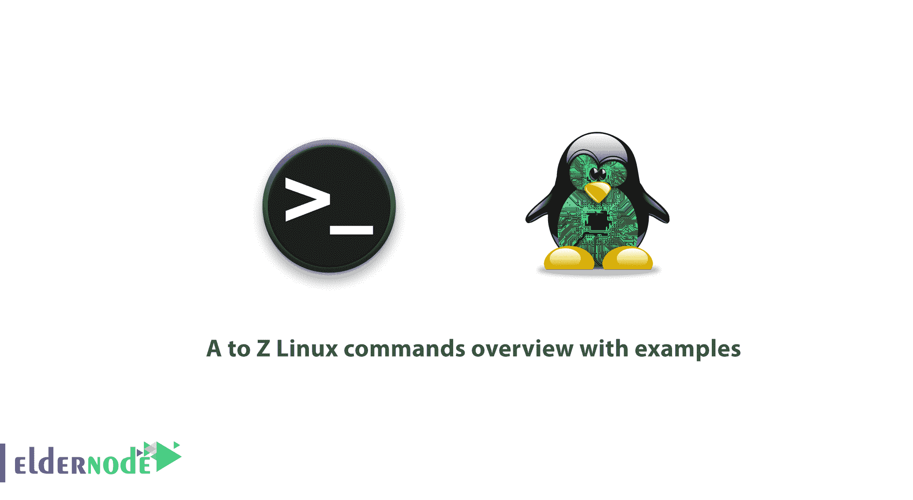

# 带示例的 Linux 命令概述- Eldernode 博客

> 原文：<https://blog.eldernode.com/linux-commands-with-examples/>



【更新】Linux 是一个强大的操作系统。所有 Linux/Unix 命令都在终端中运行。一个 Linux 系统管理员需要知道一些 Linux 技巧。Linux 中有无数的数字命令。你一定会在日常工作中使用其中的一些，或者比其他人更多次地使用它们来完成普通的任务。值得注意的是，某些命令是“基于发行版的”——它们只能在特定的发行版中找到。而另一些是通用的 Unix/Linux 命令，即使不是大多数主流发行版，也可以在所有发行版中找到。Linux 命令是区分大小写的，因此你需要小心你输入的内容。在本文中，您将通过示例了解 **A 到 Z Linux 命令概述。由于您的需要， [Linux VPS](https://eldernode.com/linux-vps/) 包在 [Eldernode](https://eldernode.com/) 上提供。如果你愿意，可以自己买一个。**

## **一至 Z Linux 命令举例**

在本文中，我们将为您介绍最常用的**[Linux](https://blog.eldernode.com/tag/linux/)命令及其示例，以便于学习。Linux 命令也称为 shell、终端、控制台、命令提示符和许多其他命令。 因此，请加入我们，通过示例了解 Linux 命令概述。**

**首先，您可以在手册页上找到每个 Linux 命令的实际描述，您可以这样访问:**

```
`man command-name` 
```

### ****adduser/addgroup Command****

****adduser**和 **addgroup** 命令用于根据 **/etc/adduser.conf** 文件中指定的默认配置分别向系统添加用户和组。**

```
`sudo adduser eldernode`
```

### ****agetty 命令****

**了解一下 **agetty** ，它是一个管理物理或虚拟终端的程序，由 **init** 调用。一旦检测到连接，它就打开一个 tty 端口，询问用户的登录名，并调用 **/bin/login** 命令。 **Agetty** 是 Linux **getty** : 的替代品**

```
`agetty -L 9600 ttyS1 vt100` 
```

### ****别名命令****

**还有别名。这是一个有用的 shell 内置命令，用于在系统上创建 Linux 命令的别名(快捷方式)。这有助于从现有的 Shell/Linux 命令(包括选项)创建新的/自定义命令:**

```
`alias home='cd /home/eldernode/public_html'` 
```

**通过运行上面的命令，您将为/*home/elder node/public _ html 目录*创建一个名为 home 的别名，因此无论何时您在终端提示符下键入 home，它都会将您置于 */home/eldernode/public_html 目录*。**

### ****anacron****

**anacron 是一个 Linux 工具，用于以日、周、月定义的频率定期运行命令。**

**不像它的姐妹**克罗恩**；它假设系统不会连续运行，因此如果计划的作业在系统关闭时到期，它会在机器通电后运行。**

### ****中肯的命令****

**在下文中，你可以看到**相关的**命令用于搜索和显示命令/程序的简短手册页描述，如下所示。**

```
`apropos adduser`
```

### ****贴切命令****

**apt 工具是一个相对较新的高级包管理器，用于 **Debian** / **Ubuntu** 系统:**

```
`sudo apt update` 
```

### ****apt-get 命令****

****apt-get** 是 Debian/ [Ubuntu](https://blog.eldernode.com/tag/ubuntu/) 系统强大免费的前端包管理器。那么，在哪里可以使用呢？要安装新的软件包、删除可用的软件包、升级现有的软件包以及升级整个操作系统。**

```
`sudo apt-get update`
```

### ****资质命令****

****aptitude** 是对 [Debian](https://blog.eldernode.com/tag/debian/) GNU/Linux 包管理系统的一个强大的基于文本的接口。像 **apt-get** 和**apt**；它们可用于在系统上安装、删除或升级软件包。**

```
`sudo aptitude update` 
```

### ****拱形命令****

****arch** 是显示机器架构或硬件名称的简单命令(类似于 **uname -m** ):**

```
`arch`
```

### ****arp 命令****

**ARP(地址解析协议)是一种将网络邻居的 IP 网络地址与 IPv4 网络中的硬件(MAC)地址进行映射的协议。**

**当您需要查找网络上所有活动的主机时，请使用它。**

```
`sudo arp-scan --interface=enp2s0 --localnet` 
```

### ****听候命令****

**at 命令用于调度任务在未来某个时间运行。它是 **cron** 和 **anacron** 的替代品，然而，它在给定的未来时间运行一次任务，而不编辑任何配置文件:**

***例如*，今天 22:10 关闭系统，运行:**

```
`sudo echo "shutdown -h now" | at -m 22:10`
```

### ****atq 命令****

****atq** 命令用于查看 **at 命令**队列中的作业:**

```
`atq`
```

### ****atrm 命令****

****atrm** 命令用于从 at 命令队列中移除/删除作业:**

```
`atrm 2` 
```

### ****awk 命令****

**你可以使用 **Awk** 作为一种强大的编程语言，它是为文本处理而创建的，通常用作数据提取和报告工具。**

```
`awk '//{print}'/etc/hosts`
```

### ****批量命令****

**类似于 at 命令，**批处理**也用于调度任务在未来某个时间运行。**

### ****basename 命令****

****basename** 命令帮助打印文件名称，剥离绝对路径中的目录:**

```
`basename bin/findhosts.sh` 
```

### ****公元前命令****

**和 **bc** 是一个简单而强大的任意精度 CLI 计算器语言，可以这样使用:**

```
`echo 20.05 + 15.00 | bc` 
```

### ****bg 命令****

**您将使用 bg 命令向后台发送一个进程。**

```
`tar -czf home.tar.gz .  bg   jobs`
```

### ****bzip2 命令****

****bzip2** 命令用于压缩或解压缩文件。**

```
`bzip2 -z filename      Compress  bzip2 -d filename.bz2  Decompress`
```

### ****cal 命令****

**要在标准输出上打印日历，使用 **cal** 命令。**

```
`cal`
```

### ****猫命令****

****cat**命令用于查看文件或连接文件的内容，或标准输入上提供的数据，并将其显示在标准输出上。**

```
`cat file.txt`
```

### ****chgrp 命令****

**使用 **chgrp** 命令改变文件的组所有权。提供新的组名作为第一个参数，文件名作为第二个参数，如下所示:**

```
`chgrp eldernode users.txt` 
```

### ****chmod 命令****

****chmod** 命令用来改变/更新文件访问权限，就像这样。**

```
`chmod +x sysinfo.sh`
```

### ****chown 命令****

****chown** 命令更改/更新用户和组对文件/目录的所有权，如下所示。**

```
`chmod -R www-data:www-data /var/www/html` 
```

### ****cksum 命令****

**您可以使用 cksum 命令显示输入文件的 CRC 校验和及字节数。**

```
`cksum README.txt`
```

### ****明确命令****

**如果您希望能够通过命令清除终端屏幕，只需输入**清除**命令。**

```
`clear`
```

### ****cmp 命令****

****cmp** 已经准备好为您执行两个文件的逐字节比较。**

```
`cmp file1 file2`
```

### ****comm 命令****

****comm** 命令用于逐行比较两个已排序的文件，如下所示。**

```
`comm file1 file2`
```

### ****cp 命令****

****cp** 命令用于将文件和目录从一个位置复制到另一个位置。**

```
`cp /home/eldernode/file1 /home/eldernode/Personal/`
```

### ****日期命令****

**要显示/设置系统日期和时间日期，可以使用**日期**命令。**

```
`date` 
```

```
`date --set="8 JUN 2017 13:00:00"`
```

### ****DD****

****dd** 命令用于根据命令行提供的标志复制文件、转换和格式化。它可以去除头文件，提取部分二进制文件，等等。**

**验证在以下示例中创建可引导的 USB 设备。**

```
`dd if=/home/eldernode/kali-linux-1.0.4-i386.iso of=/dev/sdc1 bs=512M; sync` 
```

### ****测向命令****

****df** 命令用于显示文件系统磁盘空间使用情况如下。**

```
`df -h`
```

### ****diff 命令****

****diff**命令用于逐行比较两个文件。它还可以用来找出 [Linux](https://blog.eldernode.com/tag/linux/) 中两个目录的区别，如下所示。**

```
`diff file1 file2` 
```

### ****dir 命令****

****dir** 命令的工作原理类似于 Linux 的 ls 命令，它列出了一个目录的内容。**

```
`dir`
```

### ****dmidecode 命令****

****dmidecode** 命令是一个检索任何 Linux 系统硬件信息的工具。它以人类可读的格式转储计算机的 DMI(又称 SMBIOS)表内容，以便于检索。**

**要查看您的系统硬件信息，您可以键入:**

```
`sudo dmidecode --type system` 
```

### ****杜指挥****

****du 命令**用于显示目录及其子目录中文件的磁盘空间使用情况，如下所示。**

```
`du /home/aaronkilik`
```

### ****呼应命令****

****echo** 命令打印提供给它的一行文本。**

```
`echo “This is Eldernode - Linux How Tos”` 
```

### ****弹出命令****

****弹出命令**用于从系统中弹出可移动介质，如 DVD/CD ROM 或软盘。**

```
`eject /dev/cdrom  eject /mnt/cdrom/  eject /dev/sda`
```

### ****env 命令****

****env 命令**列出了当前所有的环境变量并用来设置它们。**

```
`env`
```

### ****退出命令****

**要退出一个 shell，选择**退出**命令**

```
`exit`
```

### ****expr 命令****

****expr** 命令用于计算如下所示的表达式。**

```
`expr 20 + 30`
```

### ****因子命令****

**要显示一个数字的质因数，使用 factor 命令。**

```
`factor 10`
```

### ****找到命令****

****查找**命令让你在一个目录及其子目录中搜索文件。它按属性搜索文件，如权限、用户、组、文件类型、日期、大小和其他可能的标准。**

```
`find /home/eldernode/ -name eldernode.txt` 
```

### ****自由命令****

**free 命令显示系统内存使用情况(空闲、已用、交换、缓存等)。)在系统中包括交换空间。使用-h 选项以人类友好的格式显示输出。**

```
`free -h`
```

### ****grep 命令****

**使用 **grep** 命令，在一个文件(或多个文件)中搜索指定的模式，并显示在包含该模式的输出行中。**

```
`grep ‘eldernode’ domain-list.txt` 
```

### ****分组命令****

****群组**命令显示一个用户所属的所有群组的名称，如下所示。**

```
`groups  groups eldernode`
```

### ****gzip 命令****

****Gzip** 帮助压缩文件，用扩展名为. gz 的文件替换它，如下所示:**

```
`gzip passwds.txt  cat file1 file2 | gzip > foo.gz`
```

### ****gunzip 命令****

****gunzip** 像这样展开或还原用 **gzip** 命令压缩的文件。**

```
`gunzip foo.gz` 
```

### ****首长命令****

****头**命令用于将指定文件或 stdin 的第一行(默认为 10 行)显示到屏幕:**

```
`ps -eo pid,ppid,cmd,%mem,%cpu --sort=-%mem | head` 
```

### ****历史命令****

****历史**命令用于显示以前使用的命令或获取用户执行的命令的信息。**

```
`history` 
```

### ****主机名命令****

**使用**主机名**命令，您可以在 Linux 中打印或设置系统主机名。**

```
`hostname` 
```

```
`hostname NEW_HOSTNAME`
```

### ****hostnamectl 命令****

****hostnamectl** 命令控制 systemd 下的系统主机名。用于打印或修改系统主机名和任何相关设置:**

```
`hostnamectl` 
```

```
`sudo hostnamectl set-hostname NEW_HOSTNAME`
```

### ****HW clock****

****hwclock** 是管理系统硬件时钟的工具；读取或设置硬件时钟(RTC)。**

```
`sudo hwclock`
```

```
`sudo hwclock --set --date 8/06/2017`
```

### ****hwinfo 命令****

**像这样，hwinfo 用于探测 Linux 系统中的硬件。**

```
`hwinfo`
```

### ****id 命令****

****id** 命令显示当前用户或指定用户名的用户和组信息，如下所示。**

```
`id eldernode`
```

### ****ifconfig 命令****

****ifconfig** 命令用于配置 Linux 系统的网络接口。它用于配置、查看和控制网络接口。**

```
`ifconfig`
```

```
`sudo ifconfig eth0 up`
```

```
`sudo ifconfig eth0 down`
```

```
`sudo ifconfig eth0 172.16.25.125`
```

### ****ionice 命令****

****ionice** 命令用于设置或查看指定进程的进程 I/O 调度类和优先级。**

**如果在没有任何选项的情况下调用，它将查询该进程的当前 I/O 调度类和优先级:**

```
`ionice -c 3 rm /var/logs/syslog`
```

### ****iostat 命令****

****iostat** 用于显示设备和分区的 CPU 和输入/输出统计数据。它为更新系统配置生成有用的报告，以帮助平衡物理磁盘之间的输入/输出负载。**

```
`iostat`
```

### ****ip 命令****

****ip** 命令用于显示或管理路由、设备、策略路由和隧道。它也可以替代众所周知的 **ifconfig** 命令。**

**该命令将把一个 [IP 地址](https://blog.eldernode.com/find-server-public-ip-linux/)分配给一个特定的接口(本例中为 eth1)。**

```
`sudo ip addr add 192.168.56.10 dev eth1` 
```

### ****iptables 命令****

****iptables** 是一款基于终端的防火墙，通过一组可配置的表格规则来管理进出流量。**

**下面的命令用于检查系统上的现有规则(使用它可能需要 root 权限)。**

```
`sudo iptables -L -n -v` 
```

### ****信息战命令****

****iw** 命令用于管理无线设备及其配置。**

```
`iw list` 
```

### ****iwlist 命令****

****iwlist** 命令从无线接口显示详细的无线信息。以下命令使您能够获得关于 **wlp1s0** 接口的详细信息。**

```
`iwlist wlp1s0 scanning` 
```

### ****杀命令****

**kill 命令用于通过向进程发送信号(kill 的默认信号是 TERM)来终止使用其 PID 的进程。**

```
`kill -p 2300  kill -SIGTERM -p 2300`
```

### ****killall 命令****

****killall** 命令用于通过进程的名字来终止一个进程。**

```
`killall firefox`
```

### ****kmod 命令****

****kmod** 命令用于管理 Linux 内核模块。要列出所有当前加载的模块，请键入。**

```
`kmod list` 
```

### ****最后一个命令****

****【最后的 命令显示最后登录的用户列表。****

```
`last` 
```

### ****ln 命令****

****ln** 命令用于使用-s 标志创建文件间的软链接，如下所示。**

```
`ln -s /usr/bin/lscpu cpuinfo` 
```

### ****定位命令****

****定位**命令用来按名称查找文件。locate 工具比它的同类工具工作得更好更快。**

**下面的命令将根据文件的确切名称(不是*name*)来搜索文件:**

```
`locate -b '\domain-list.txt'` 
```

### ****登录命令****

****登录**命令用于创建与系统的新会话。您将被要求提供用户名和密码登录如下。**

```
`sudo login`
```

### ****ls 命令****

****ls** 命令用来列出一个目录的内容。它的工作原理或多或少类似于 **dir** 命令。**

**选项-l 支持像这样的长列表格式。**

```
`ls -l file1`
```

### ****lshw 命令****

****lshw** 命令是获取机器硬件配置详细信息的最小工具，以超级用户权限调用它可以获得全面的信息。**

```
`sudo lshw`
```

### ****lscpu 命令****

****lscpu** 命令显示系统的 cpu 架构信息(如 CPU、线程、内核、插座等的数量)。**

```
`lscpu` 
```

### ****lsof 命令****

****lsof** 命令显示进程打开的文件相关信息。文件可以是任何类型，包括常规文件、目录、块特殊文件、字符特殊文件、执行文本引用、库和流/网络文件。**

**要查看由特定用户进程打开的文件，请键入以下命令。**

```
`lsof -u eldernode`
```

### ****lsusb 命令****

****lsusb** 命令显示系统中 usb 总线的信息以及连接到总线上的设备，如下所示。**

```
`lsusb`
```

### ****男人命令****

****man**命令用于查看类似这样的命令/程序的在线参考手册页。**

```
`man du  man df` 
```

### ****md5sum 命令****

****md5sum** 命令用于计算并打印文件的 MD5 报文摘要。如果在没有参数的情况下运行，debsums 会根据 md5sum 文件检查系统中的每个文件:**

```
`sudo debsums`
```

### ****mkdir 命令****

****mkdir** 命令用于创建一个或多个不存在的目录(可以用-p 选项覆盖)。**

```
`mkdir eldernode-files`
```

**或**

```
`mkdir -p eldernode-files`
```

### ****更命令****

****更多**命令可以让你一次一屏地浏览相对较长的文本文件。**

```
`more file.tx` 
```

### ****mv 命令****

****【mv】**命令用于重命名文件或目录。它还将文件或目录移动到目录结构中的另一个位置。**

```
`mv test.sh sysinfo.sh`
```

### ****纳米命令****

****nano** 是一款流行的小型、免费、友好的 Linux 文本编辑器；非免费 Pine 包中的默认编辑器 **Pico** 的克隆版。**

**要使用 nano 打开文件，请键入:**

```
`nano file.txt` 
```

### ****nc/netcat 命令****

****【NC(或 netcat)】**用于执行任何与 TCP、UDP 或 UNIX 域套接字相关的操作。它可以处理 IPv4 和 IPv6 来打开 TCP 连接、发送 UDP 数据包、监听任意 TCP 和 UDP 端口、执行端口扫描。**

**下面的命令将帮助我们查看主机 192.168.56.5 上的端口 22 是否打开。**

```
`nc -zv 192.168.1.5 22`
```

### ****netstat 命令****

****netstat** 命令显示关于 Linux 网络子系统的有用信息(网络连接、路由表、接口统计、伪装连接和多播成员)。**

**该命令将显示本地系统上所有打开的端口:**

```
`netstat -a | more` 
```

### ****尼斯****

****nice**命令用于显示或改变正在运行的程序的 nice 值。它运行指定的命令与调整好的。当在没有指定任何命令的情况下运行时，它打印当前的 niceness。**

**以下命令启动“tar 命令”进程，将“nice”值设置为 12。**

```
`nice -12 tar -czf backup.tar.bz2 /home/*` 
```

### ****nmap 命令****

**nmap 是一款流行且功能强大的开源网络扫描和安全审计工具。它旨在快速扫描大型网络，但也适用于单个主机。**

**下面的命令将探测指定网络上所有活动主机的开放端口。**

```
`nmap -sV 192.168.56.0/24` 
```

### ****nproc 命令****

****nproc** 命令显示当前进程中存在的处理单元数量。它的输出可能少于系统中在线处理器的数量。**

```
`nproc` 
```

### ****openssl 命令****

****openssl**是一个命令行工具，用于在 shell 中使用 OpenSSL 的加密库的不同加密操作。下面的命令将创建当前目录中所有文件的归档文件，并对归档文件的内容进行加密:**

```
`tar -czf - * | openssl enc -e -aes256 -out backup.tar.gz` 
```

### ****passwd 命令****

****passwd** 命令用于创建/更新用户账户的密码，它还可以改变账户或相关密码的有效期。请注意，普通系统用户只能更改自己帐户的密码，而 root 用户可以修改帐户的密码。**

```
`passwd eldernode` 
```

### ****皮多夫命令****

****pidof** 显示正在运行的程序/命令的进程 ID。**

```
`pidof init  pidof cinnamon` 
```

### ****平命令****

****ping**命令用于确定网络(或互联网)上主机之间的连通性:**

```
`ping google.com` 
```

### ****ps 命令****

****ps** 显示系统上运行的活动进程的有用信息。下面的示例显示了按最高内存和 CPU 使用率排列的正在运行的进程。**

```
`ps -eo pid,ppid,cmd,%mem,%cpu --sort=-%mem | head`
```

### ****pstree 命令****

****p tree**将正在运行的进程显示为一棵树，如果省略 PID，则该树以 PID 或 init 为根。**

```
`pstree` 
```

### ****pwd 命令****

****pwd** 命令显示当前/工作目录的名称如下。**

```
`pwd` 
```

### ****rdiff-备份命令****

****rdiff** -backup 是一个用 Python 编写的强大的本地/远程增量备份脚本。它可以在任何 POSIX 操作系统上运行，例如 Linux、Mac OS x。**

**注意，对于远程备份，您必须在本地和远程机器上安装相同版本的 rdiff-backup。下面是一个本地备份命令的例子:**

```
`sudo rdiff-backup /etc /media/eldernode/Backup/server_etc.backup` 
```

### ****重启命令****

****重启**命令可用于暂停、关闭或重启系统，如下所示。**

```
`reboot` 
```

### ****重命名命令****

****重命名**命令用于一次重命名多个文件。如果你有一个带有**的文件集合。html** 扩展名，并且您想用“**重命名它们。php** 扩展名，可以在下面输入命令。**

```
`rename 's/\.html$/\.php/' *.html` 
```

### ****rm 命令****

****RM**命令用于删除文件或目录，如下所示。**

```
`rm file1  rm -rf my-files` 
```

### ****rmdir 命令****

****rmdir** 命令帮助删除/移除空目录如下。**

```
`rmdir /backup/all` 
```

### ****scp 命令****

**例如， **scp** 命令使您能够在网络上的主机之间安全地复制文件。**

```
`scp ~/names.txt [[email protected]](/cdn-cgi/l/email-protection):/root/names.txt` 
```

### ****关机命令****

****关机**命令安排系统断电的时间。它可以像这样用于停止、关闭或重启机器。**

```
`shutdown --poweroff` 
```

### ****睡眠命令****

****睡眠**命令用于延迟或暂停(特别是命令的执行)一段指定的时间。**

```
`check.sh; sleep 5; sudo apt update` 
```

### ****排序命令****

****排序**命令用于对指定文件或标准输入中的文本行进行排序，如下图**

```
`cat words.txt`
```

### ****拆分命令****

****拆分**顾名思义，是用来将一个大文件拆分成小部分。**

```
`tar -cvjf backup.tar.bz2 /home/eldernode/Documents/*` 
```

### ****ssh 命令****

****ssh** (SSH 客户端)是一个在远程机器上远程访问和运行命令的应用程序。它旨在通过不安全的网络(如互联网)在两个不受信任的主机之间提供安全的加密通信。**

```
`ssh [[email protected]](/cdn-cgi/l/email-protection)` 
```

### ****stat 命令****

****stat**用于显示文件或文件系统的状态，如下所示(-f 用于指定文件系统)。**

```
`stat file1` 
```

### ****苏****

****su** 命令用于在登录会话期间切换到另一个用户 ID 或成为 root。请注意，当在没有用户名的情况下调用 **su** 时，它默认成为 root 用户。**

```
`su   su eldernode` 
```

### ****须藤命令****

****sudo** 命令允许被许可的系统用户以 root 或其他用户的身份运行命令，如安全策略所定义的 sudoers。**

**在这种情况下，运行 **sudo** 的用户的真实(非有效)用户 ID 用于确定查询安全策略的用户名。**

```
`sudo apt update`
```

```
`sudo useradd eldernode`
```

```
`sudo passwd eldernode` 
```

### ****求和命令****

****sum** 命令用于在命令行显示每个指定文件的校验和及块数。**

```
`sum output file.txt` 
```

### ****战术命令****

****tac** 命令将文件串联起来，反向显示。它只是将每个文件打印到标准输出，首先显示最后一行。**

```
`tac file.txt` 
```

### ****尾巴命令****

****尾**命令用于显示每个文件的最后几行(默认为 10 行)以标准输出。**

**如果有多个文件，在每个文件前加上一个给出文件名的标题。如下使用它(使用-n 选项指定更多要显示行)。**

```
`tail long-file`
```

**或**

```
`tail -n 15 long-file` 
```

### ****说话命令****

****通话命令**用于与另一个系统/网络用户通话。要与同一台机器上的用户通话，请使用他们的登录名，但是要与另一台机器上的用户通话，请使用“[【电子邮件保护】](/cdn-cgi/l/email-protection)”。**

```
`talk person [ttyname]  OR  talk‘[[email protected]](/cdn-cgi/l/email-protection)’ [ttyname]` 
```

### ****焦油命令****

****tar**命令是 Linux 中最强大的文件归档工具。**

```
`tar -czf home.tar.gz .` 
```

### ****三通命令****

****tee** 命令用于从标准输入中读取并打印到标准输出和文件中，如下所示。**

```
`echo "Testing how tee command works" | tee file1` 
```

### ****树命令****

****tree**命令是一个微小的跨平台命令行程序，用于递归地以树状格式列出或显示目录的内容。**

```
`tree` 
```

### ****时间命令****

****时间**命令运行程序并汇总系统资源使用情况。**

```
`time wc /etc/hosts` 
```

### ****最高命令****

****最上面的**程序显示 Linux 系统上所有进程的内存和 CPU 使用情况，并提供运行系统的动态实时视图。**

```
`top` 
```

### ****触摸命令****

****触摸**命令改变文件时间戳，它也可以用来创建如下文件。**

```
`touch file.txt` 
```

### ****tr 命令****

****tr** 命令是一个有用的实用程序，用于翻译(更改)或删除标准输入中的字符，并将结果写入标准输出或发送到文件，如下所示。**

```
`cat domain-list.txt | tr [:lower:] [:upper:]` 
```

### ****乌梅命令****

****uname** 命令显示操作系统、网络节点主机名、内核名、版本、发行版等系统信息。**

**使用-a 选项显示所有系统信息:**

```
`uname` 
```

### ****uniq 命令****

****uniq 命令**显示或省略输入(或标准输入)中的重复行。要指示一行出现的次数，请使用-c 选项。**

```
`cat domain-list.txt` 
```

### ****正常运行时间命令****

****uptime** 命令显示系统已经运行了多长时间，登录用户的数量，以及系统平均负载如下。**

```
`uptime` 
```

### ****用户命令****

****users** 命令显示当前登录到当前主机的用户的用户名，如下所示。**

```
`users` 
```

### ****vim/vi 命令****

****vim** (Vi 改进)类 Unix 操作系统上流行的文本编辑器。它可以用来编辑各种纯文本和程序文件。**

```
`vim file` 
```

### ****w 命令****

****w** 命令显示系统正常运行时间、平均负载和机器上当前用户的信息，以及他们正在做的事情(他们的进程)。**

```
`w` 
```

### ****墙命令****

****墙**命令用于向系统上的所有用户发送/显示消息，如下所示。**

```
`wall “This is Eldernode – Linux How Tos”` 
```

### ****观看命令****

****观看**命令反复运行一个程序，同时全屏显示其输出。它还可以用来监视文件/目录的变化。下面的例子显示了如何观察目录的内容变化。**

```
`watch -d ls -l` 
```

### ****wc 命令****

****wc** 命令用于显示每个指定文件的换行、字数和字节数，以及多个文件的总数。**

```
`wc filename` 
```

### ****wget 命令****

****wget** 命令是一个简单的实用程序，用于以非交互方式(可以在后台工作)从网络下载文件。**

```
`wget -c http://ftp.gnu.org/gnu/wget/wget-1.5.3.tar.gz` 
```

### ****什么是命令****

****whatis** 命令搜索并显示所提供命令名称的简短或单行手册页描述，如下所示。**

```
`whatis wget` 
```

### ****哪个命令****

****哪个**命令显示将在当前环境中执行的文件(或可能的链接)的绝对路径(路径名)。**

```
`which who` 
```

### ****谁指挥****

****who** 命令显示当前登录的用户信息如下。**

```
`who` 
```

### ****命令****

**命令帮助我们定位命令的二进制、源文件和手动文件。**

```
`whereis cat` 
```

### ****xargs 命令****

****xargs** 命令是一个有用的工具，用于从标准输入中读取条目，由空格(用双引号、单引号或反斜杠保护)或换行符分隔，并执行输入的命令。**

**下面的例子显示了在 Linux 中使用 xargs 将一个文件复制到多个目录。**

```
`echo /home/user/test/ /home/user/tmp | xargs -n 1 cp -v /home/user/bin/sys_info.sh` 
```

### ****是命令****

****yes** 命令用于重复显示一个字符串，直到使用如下[Ctrl + C]终止或终止。**

```
`yes "This is Eldernode - Linux HowTos"` 
```

### ****youtube-dl 命令****

**youtube-dl 是一个轻量级命令行程序，可以下载视频，也可以从 YouTube.com 和其他一些网站提取 MP3 歌曲。**

**下面的命令将在提供的链接中列出视频的可用格式。**

```
`youtube-dl --list-formats https://www.youtube.com/watch?v=iR` 
```

### ****zcmp/zdiff 命令****

****zcmp** 和 **zdiff** 用于比较压缩文件的最小实用程序如下例所示。**

```
`zcmp domain-list.txt.zip basic_passwords.txt.zip`
```

```
`zdiff domain-list.txt.zip basic_passwords.txt.zip` 
```

### ****zip 命令****

**zip 是一个简单易用的工具，用于打包和压缩(存档)文件。**

```
`tar cf - . | zip | dd of=/dev/nrst0 obs=16k`
```

```
`zip inarchive.zip foo.c bar.c --out outarchive.zip`
```

```
`tar cf - .| zip backup -` 
```

### ****ZZ****

****zz** 命令是 fasd 命令行工具的别名，在 Linux 中提供对文件和目录的快速访问。它用于通过从第一个字段中选择电话号码，快速、交互式地进入先前访问的目录，如下所示。**

```
`zz` 
```

## **结论**

**在本文中，您已经回顾了 Linux 命令的 A 到 Z。Linux 命令行是计算机的文本界面。正如我们之前提到的，Linux 中有无数的数字命令。名单可能比我们能提供的要长。如果您有兴趣阅读更多关于 Linux 命令的内容，可以看看我们关于 [Linux 服务器监控命令](https://blog.eldernode.com/linux-server-monitoring-commands/) **和**的文章。如果您是入门用户，可以在[为新手准备的 10 个有用的 Linux 命令行技巧](https://blog.eldernode.com/linux-command-tricks-newbies/)中找到合适的文章。**