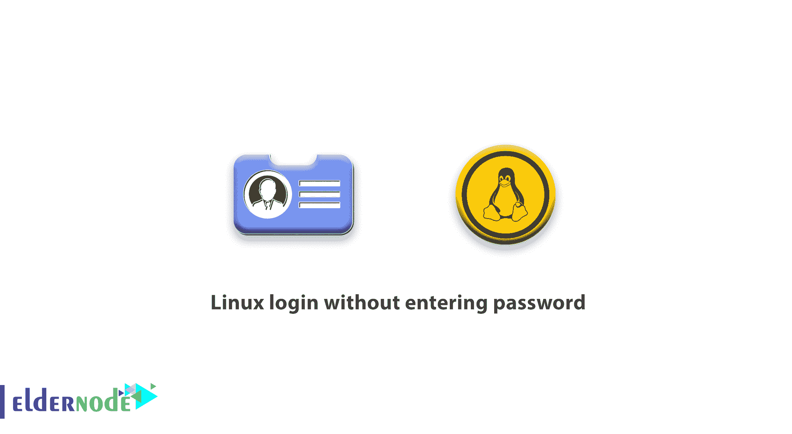

# 如何不用输入密码登录 Linux-elder node 博客

> 原文：<https://blog.eldernode.com/linux-login-without-entering-password/>



在这篇文章中，我们试图一步一步地教你如何在不输入密码的情况下登录 Linux。此外，你可以访问 [Eldernode](https://eldernode.com/) 站点提供的软件包来购买 [Linux VPS](https://eldernode.com/linux-vps/) 服务器。

### **教程 Linux 登录无需输入密码**

为此，首先运行“sudo visudo”命令来打开“sudoers”文件，现在将下面一行添加到文件的末尾:

```
username ALL=(ALL) NOPASSWD:ALL
```

通过将这一行添加到 sudoers 文件中，用户可以执行需要以 root 用户访问级别执行的命令，而无需输入自己的密码，例如 chmod 或 ifconfig 等命令。当然，你必须输入你想要的用户名，而不是用户名。现在保存文件并退出。现在您需要删除您的用户帐户密码，因为您希望您的用户无需登录即可登录:

```
sudo passwd -d "whoami"
```

如果这不起作用，请运行以下命令，但您应该写用户名而不是 whoami:

```
# sudo passwd -d username
```

输入用户名而不是用户名。我在各种 [Linux](https://blog.eldernode.com/tag/linux/) 发行版上测试了这种方法，并找到了答案。这种方法在使用 [LightDM](https://wiki.archlinux.org/index.php/LightDM) 的 Linux 上肯定有效。

## 结论

在本文中，您将学习如何在不输入密码的情况下登录 Linux 系统。完成上述步骤后，您将能够登录到您的 Linux 服务器，而无需输入密码。