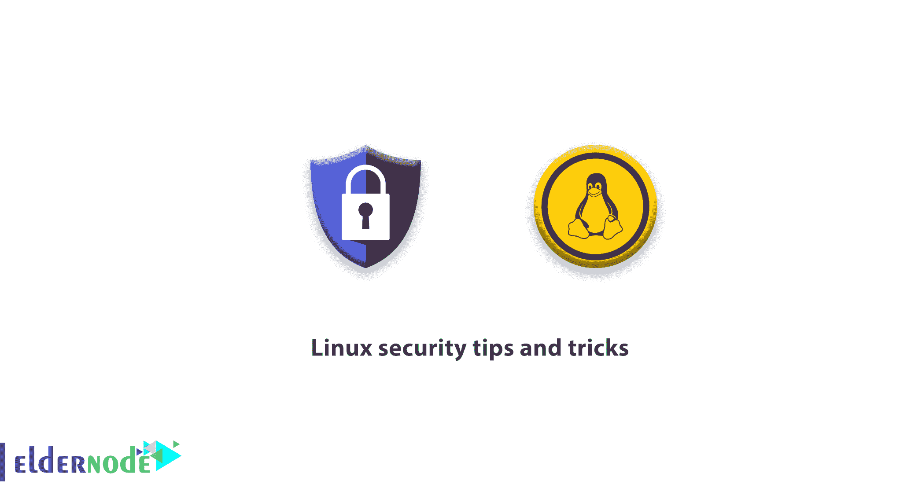

# linux 安全提示和技巧——让 Linux 更安全

> 原文：<https://blog.eldernode.com/linux-security-tips-and-tricks/>



大多数用户认为 Linux 足够安全，默认情况下，在本文中，我们将向您学习更多关于 [Linux](https://eldernode.com/linux-vps/) 安全提示和技巧。

## Linux 安全提示和技巧

作为对系统管理员来说最重要的挑战之一是**黑客**和**黑客**，我们很高兴解释 8 个有用的提示和技巧来帮助你保护你的 Linux 系统。和我们一起回顾安全密钥。

### 如何让 Linux 更安全

**1。保持系统更新**

简单又重要！通过运行以下命令，尝试保持系统更新，观察所有新发布的补丁、安全补丁和内核。

**厘斯**

```
# yum updates  # yum check-update
```

**Ubuntu 和 Debian**

```
sudo apt-get update
```

**2。使用******复杂且不可预测的密码****

**首先，你应该检查是否有空的[密码](https://eldernode.com/tag/create-a-strong-password/)。空密码是安全风险之一，因为它使帐户很容易被黑客攻击。因此，确保没有人有任何授权访问任何帐户。要检查任何密码为空的帐户，请使用以下命令。**

```
`# cat /etc/shadow | awk -F: '($2==""){print $1}` 
```

******第二种**方式是使用并选择一个强而复杂的密码。由于黑客试图通过攻击 Brutus Force 来破解你的密码，这一步非常重要。****

******这里有一些帮助你选择复杂密码**的小技巧。****

****字符数**不应少于 8 个。使用大写字母和小写字母的组合，并在字母之间放置数字。使用非数字和字母字符。如果需要更改密码，可以使用下面的命令。******

```
**`passwd username`** 
```

****如果您想更改 root 用户密码，请执行以下命令。****

```
**`passwd root`** 
```

******3。禁用 root 用户**登录****

****禁用 root 用户[登录意味着您不能使用 root 用户登录 Linux 终端。按照以下步骤禁用 root 用户登录。](https://eldernode.com/create-user-on-debian-with-root-access/)****

****用文件编辑器打开**etc/ssh/sshd _ config//**。****

```
**`nano /etc/ssh/sshd_config`**
```

******在下面的命令中找到**的“是”并将其改为“否”****

```
**`# Prevent root logins:`**
```

```
**`PermitRootLogin no`**
```

****在应用更改并保存后，重启 **SSH 服务**文件。****

```
**`service ssh restart`**
```

****现在如果你需要一个 **root** 用户，用其他用户登录后用 **su 命令**在用户间切换。****

******4。限制用户登录******

****您的服务器上可能有许多用户名，但只有少数需要登录。例如，您的 Linux 上有 10 个用户，但是只有 Jona 和 Ruth 用户可以远程连接到服务器。要限制 Linux 用户，用编辑器打开 **sshd_config** 文件。****

```
**`nano /etc/ssh/sshd_config`** 
```

****当您打开文件时，找到短语“AllowUsers”并根据下面的命令输入用户。****

```
**`AllowUsers Jona Ruth`**
```

****最后，重启 **SSH 服务**。****

```
**`Service ssh restart`** 
```

******5。**禁用协议 1****

****SSH 服务使用两种协议，协议 1 和协议 2，协议 1 由于年代久远而不太安全。所以在你们的交流中最好使用协议 2。要禁用协议 1，用编辑器重新打开 **sshd_config** 文件。****

```
**`nano /etc/ssh/sshd_config`**
```

****找到以下短语，将其更改为**协议 2** 。****

```
**`# Protocol 2,1    Protocol 2`**
```

****在第二行中，将协议更改为 2，并重新启动 SSH 服务。****

```
**`service ssh restart`** 
```

******6。SSH 使用非标准端口******

****默认 **SSH 服务**端口设置为 **22** ，但黑客优先扫描。在某些情况下，管理员已经将 SSH 端口改为 **2222** 以便更容易记忆，但是你应该知道，如果黑客没有得到结果，他们肯定能够扫描端口 22。他们的第二个选择是端口 2222。因此，我们建议您使用编号较大的端口，以便您的输入端口不容易被识别，同时最好不要选择其他服务预留的端口。最好的选择在 1 万到 6.5 万之间，大部分都是免费的。****

****`**7。用防火墙过滤 SSH 连接**`****

****`如果您总是远程连接到您的服务器并使用特定的 IP，使用下面的命令来隔离您到 [SSH](https://eldernode.com/tag/difference-ssh-vs-telnet/) 服务的连接。`****

```
**``iptables –A INPUT –p tcp –s 98.56.233.9 –dport 22 –j –ACCEPT``**
```

****`注意:通过输入上述命令，您只能从具有 98.56.233.9 IP 地址的系统连接到服务器。**但是**如果你想让服务器从各个点都可以访问。使用以下命令。`****

```
**``iptables -A INPUT -p tcp --dport 22 -m state --state NEW -m recent --set --name ssh --rsource  iptables -A INPUT -p tcp --dport 22 -m state --state NEW -m recent ! --rcheck --seconds 60 --hitcount 4 --name ssh --rsource -j ACCEPT``** 
```

****`在第一个命令中，您打开所有 IP 对端口 22 的访问。第二个命令提供了智能设置，如果在不到 60 秒的时间内同时发送了几个请求，它会自动阻止申请人的 IP 防火墙。要正确运行第二个命令，必须添加默认的删除策略。`****

****`注意:如果您更改了 SSH 服务端口，请在命令中输入您想要的端口。`****

****`**8。使用**安全钥匙识别`****

****`如果使用安全密钥，您将面临两个主要好处。1-您无需输入密码即可访问您的终端。
2-您可以完全禁止使用密码进入，然后无需密码即可登录系统终端。这个功能可以保护你免受 Brutus Force 等可能的攻击。`****

****`亲爱的用户，我们希望你喜欢这个 Linux 安全提示和技巧教程，你可以在评论区提出关于这个培训的问题，或者解决 [Eldernode 培训](https://eldernode.com/blog/)领域的其他问题，参考[提问页面](https://eldernode.com/ask)部分并提出你的问题。`****