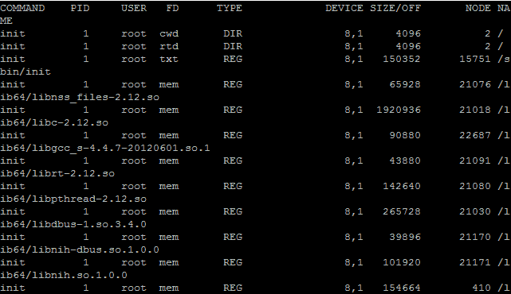
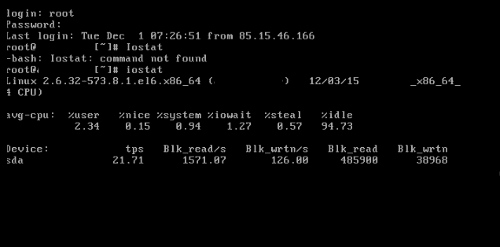

# Linux 服务器监控命令- | ElderNode 博客

> 原文：<https://blog.eldernode.com/linux-server-monitoring-commands/>

Linux 服务器监控命令，本文研究了 20 个 Linux 应用程序命令和命令行来监控 Linux 服务的性能。

### **[Linux VPS](https://eldernode.com/linux-vps/) 服务器监控命令**

对于大多数使用 Linux 命令的系统管理员或网络管理员来说，调试和排除 Linux 系统的故障是非常困难的。

作为一名 Linux 系统管理员，由于命令行环境的原因，维护一台 Linux 服务器是非常困难的。因此，这里有一些对基于 Linux 的系统有用的命令。这些命令适用于各种 Linux 发行版，对于排除故障和监控 Linux 服务器非常有用。

### **Top command——监控 Linux 进程**

top 命令对于监控 **Linux/UNIX** 系统的性能非常有用。许多服务器管理员使用这个命令。事实上，Linux 中的 top 命令显示了所有实时进程以及活动或正在运行的进程的常规列表。这份名单定期更新。

使用 **Top 命令**，可以看到 CPU 使用率、内存使用率、交换内存、缓存大小、处理器缓冲区大小、PID、用户、命令等等。此命令还允许您查看内存或 CPU 使用率最高的进程。

例如，在下图中你可以看到**顶部命令**的输出。

### **vmstat——消耗的虚拟内存量**

为了显示虚拟内存统计数据的数量，使用了内核线程、磁盘、系统进程、中断、CPU 活动、(I/O 块)和 I/O 块。

默认情况下， **vmstat** 在 Linux 系统上不存在，您需要安装一个名为 sysstat 的包来启用它。以下是最常见的 vmstat 命令:

### **lsof–显示打开文件的列表**

基于 Linux/Unix 的系统中的另一个实用程序是 lsof 命令。lsof 语句用于显示所有文件和打开进程的列表。打开的文件包括所有磁盘文件、网络套接字、进程、设备和管道。该命令最重要的用途是当**装载/卸载**时，无法卸载驱动器。并且出现类似“**文件已打开或正在使用**”的错误。因此，您可以使用此命令来确定当前打开了哪些文件。

### **TCP dump–网络数据包分析**

Tcpdump 是最常用的 [Linux](https://www.linux.org/) 命令之一。该命令可用作**网络数据包分析器**或**数据包嗅探器**程序。也可以将特定的包存储在文件中以供将来分析。tcpdump 命令适用于大多数不同的 Linux 发行版。

### **netstat–网络使用情况**

netstat 是一个应用程序指令，用于监控网络数据包的传入和传出值。此命令有助于监控网络性能和解决服务器管理员可能遇到的问题。

### **htop–监控 Linux 进程**

htop 命令是一个非常强大的实时命令，用于即时监控 Linux 进程。该命令类似于 Top 命令。然而，其他功能，如流程的垂直或水平视图、快捷方式，为管理流程提供了用户友好的界面。

**htop 命令**是第三方工具，在 Linux 系统上不是默认的。要安装 htop 命令，您必须使用 **YUM 管理包**。

### **io top–监控 I/O 磁盘**

这非常类似于 Top 命令和 htop 程序。然而， **iotop 命令**使用计算函数来监控和显示 I/O 磁盘和瞬时进程。

该命令最常用于准确查找占用大量磁盘空间的读/写进程。

### **iostat–输入/输出用法**

ioStat 是一个简单的命令，用于收集和显示 I/O 存储设备。此命令通常用于检查存储设备的性能。应用此命令可以解决本地磁盘、I/O 设备和远程磁盘(如 **NFS** )的问题。

### **IP traf–局域网 IP 网络即时监控**

iptraf 命令是一个基于控制台的开源命令，用于实时监控局域网 IP ( **实时 IP 局域网监控**)。它监视和显示各种信息，如网络的 IP 流量，包括 TCP 标志、ICMP、TCP/UDP 弱点、TCP 数据包和字节数。

它还提供关于 TCP、UDP、IP、ICMP、非 IP 消耗、IP 校验和错误、接口活动等有用且准确的信息。

### **psacct 或 acct——监控用户活动**

这个命令提供了一个非常有用的工具，可以监视在后台运行的用户的所有活动，以及一目了然地检查所有活动。它还指定了哪些用户正在使用哪些资源。

这些命令对服务器管理员非常有用。这个命令允许您检查用户的活动，例如他们当前在服务器上执行什么操作，他们执行什么命令，他们每个人消耗多少，他们在系统上活动多长时间。

Linux 服务器监控命令；

### **monit——监控 Linux 服务和进程**

monit 是一个开源命令，是一个进程监控工具。它自动监控管理系统进程、程序、文件、文件夹、访问权限、系统文件和校验和。

**monit 命令**监控 Apache、MySQL、Mail、FTP、ProFTP、Nginx、SSH 等所有服务。

系统状态的结果在命令行和图形界面中都可以看到。

### **nethogs——监控每个进程的网络带宽**

nethogs 命令也是一个小型的开源命令，比如 top 命令。该命令用于显示系统中每个进程的网络活动。它还提供任何应用程序使用的实时网络流量带宽。

### **iftop——网络带宽监控**

iftop 命令是开源的，基于终端的。此命令用于显示系统网卡上主机或目标主机消耗的带宽列表。请注意，iftop 命令用于检查网络带宽。top 命令用于检查 CPU 的使用情况。

**iftop 命令**来自 **top 命令家族**，它监控特定接口并显示两台主机之间消耗的带宽。

Linux 服务器监控命令；

### **monitorix——系统和网络监控**

Monitorix 是一个非常轻量级的工具，适用于 Linux 和 UNIX 服务器，旨在监控网络和系统资源。该命令包含一个特定的 Http web 服务器，该服务器定期收集网络和系统信息，并将其显示为图形或图表。

**Monitorix 命令**监控系统平均负载、系统内存分配、驱动程序健康、系统服务、网络端口、电子邮件使用(Sendmail、Postfix、Dovecot 等。)和 MySQL 数据库的使用。事实上，该命令旨在总体上监控系统性能。它还能够检测瓶颈和任何一般的异常活动。

### **ARP watch–监控以太网活动**

arpwatch 命令是用于监控 Linux 网络上以太网流量的地址(MAC 和 IP 地址变化)的工具之一。该工具定期监控以太网流量。它还会生成一份报告，报告网络上一段时间内发生变化的所有 IP 和 MAC 地址。每当这些地址发生变化时，它可以向网络管理员发送通知电子邮件。这个命令对于**检测网络上的 ARP 欺骗**非常有用。

### **苏里卡塔——网络安全监控**

Suricata 命令是为了保护网络安全，识别入侵者，防止对 Linux、Windows 和 FreeBSD 系统的监控。这个命令是由 **OISF** (开放信息安全基金会)设计的。

### **vnstat PHP–网络带宽监控**

Vnstat PHP 是一个基于 web 的应用程序，通常称为 Vnstat。该命令以图形方式监控和显示网络流量使用情况。 **vnstat PHP 命令**显示每小时消耗的入站和出站流量，可以是每日、每月或整体消耗报告。

### **Nagios——网络/服务器监控**

使用 Nagios 系统，网络管理员将能够在一个页面上管理 Linux、Windows、交换机、路由器和打印机。如果怀疑网络或服务器有任何问题，此命令会通过电子邮件向网络管理员发送警报。

### **NMO–Linux 性能监控**

nmon 命令代表 Nigel 的性能监视器。该命令用于监控 Linux 资源，如 CPU、内存、磁盘使用、网络、顶级进程、NFS、内核等。它还具有在线模式和捕获模式，以 CSV 格式存储输出。

### **集合——多用途监控工具**

collectl 工具是一个非常强大和全面的工具，可以从 Linux 服务源收集完整的信息，例如 CPU 使用、内存、网络、inodes、进程、NFS、TCP、套接字等等。

[Linux 服务器](https://eldernode.com/tag/linux-server/)监控命令；

祝您好运

**不要错过一些相关文章:**

[如何在 Linux 中找到并杀死正在运行的进程](https://eldernode.com/find-kill-running-processes-linux/)

[Linux A 到 Z 命令概述及示例](https://eldernode.com/linux-commands-with-examples/)

[如何在 Linux 中运行有时间限制的命令](https://eldernode.com/run-command-with-time-limit-linux/)

[How to run a command with time limit in Linux](https://eldernode.com/run-command-with-time-limit-linux/)