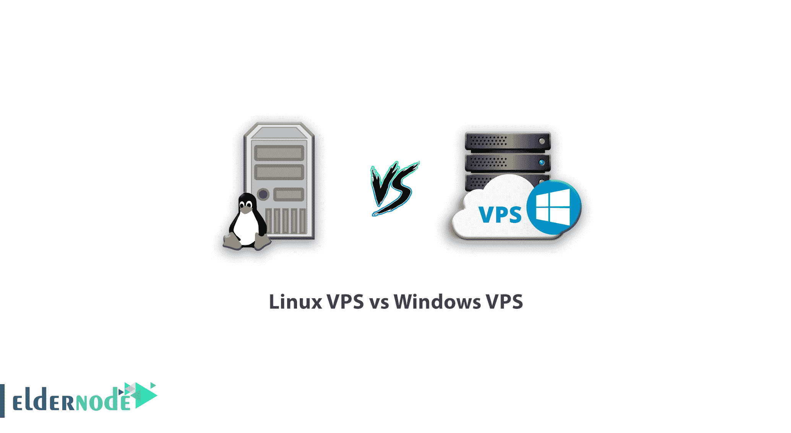

# Linux VPS 与 Windows VPS - Eldernode

> 原文：<https://blog.eldernode.com/linux-vps-vs-windows-vps/>

为了开始你的在线业务，在注册了你想要的域名后，你需要空间来存放你的虚拟主机。如果你需要优质快速的服务，vps 服务器将是你最好的选择之一。这个阶段的要点是，你必须选择最适合你的网站和操作系统的 vps 服务器类型，即 Linux 和 [Windows vps](https://eldernode.com/windows-vps/) 服务器。在这篇文章中，我们将检查 [Linux vps](https://eldernode.com/linux-vps/) 和 Windows vps 服务器之间的差异，这样你就可以选择最适合你的虚拟主机服务。

[Eldernode](https://eldernode.com/) 还通过提供 Linux VPS 和 Windows VPS，以有保证的速度和质量在其服务器上托管您的网站或应用程序。现在就订购虚拟服务器，提高您企业的可信度。

## 什么是 VPS 服务器？

虚拟专用服务器(VPS)是一个虚拟机，它是物理服务器的一部分，有自己的操作系统和独立的环境。VPS 使用专用的物理服务器资源，完全独立于同一物理服务器上的其他虚拟机。

这种类型的服务器由互联网托管服务提供商出售，对于那些希望从资源有限的共享托管升级到访问级别更高的服务器的人来说，这是一个很好的选择。因为在这种情况下，他们可以使用更多的资源，并对自己的网站拥有控制权。

***注意:*** 在你的 VPS 上你可以使用 Linux 操作系统或者 Windows 操作系统，利用各自的特点。

VPS 服务器可以被认为是共享服务器和专用服务器的子集。不同类型的 vps 服务器的突出特征之一是可以在 Windows 或 Linux 操作系统上创建网站，这允许用户根据他们使用的操作系统选择 vps 服务器服务之一。

### 虚拟服务器功能

***1。可扩展性***

可扩展性是指通过利用额外的服务器资源来快速管理和增加服务器工作容量的能力。可扩展的商业系统是优选的，因为由 vps 服务器的主机提供商监控的 web 流量会突然停止。

如果你的企业正在追求一个巨大的增长方法，它需要管理其不断增长的工作能力。

***2。专用资源***

VPS 服务器允许用户提供专用资源并选择磁盘空间、数据传输、存储空间、处理速度和 RAM 的数量。

***3。根权限***

vps 服务器最显著的特征之一是访问根服务器，这允许用户运行操作系统、安装应用程序和各种服务。

***4。定制***

每个 vps 服务器都有自己的操作系统，允许用户安装各种服务器应用程序，如 PHP、MySQL 和 APACHE。

在选择 vps 服务器的过程中，用户面临两种操作系统: **Windows** 和 **Linux** 。选择合适的操作系统是 **[购买 vps](https://eldernode.com/vps/)** 服务器时最重要的选择，因为它为您提供了用于运行应用程序的平台和环境。

在最终选择 vps 服务器之前，请阅读本文的其余部分，了解 Linux 和 Windows vps 服务器之间的更多区别:

### VPS 服务器的类型

***1。Linux VPS 服务器***

通过购买 Linux vps 服务器，您将能够使用 Linux 操作系统来管理您的网站。

***2。Windows VPS 服务器***

如果你使用的是 Windows 操作系统，并且你想用它来管理你的站点，Windows vps 服务器将是最好的选择。

## Linux VPS vs Windows VPS

以下是 Linux VPS 和 Windows VPS 根据一系列参数的区别:

### 1。功能

***–Linux***

当系统负载增加时，Linux 不会重复请求重新启动，它被设计为由 SSH 使用，vps 服务器通过命令行管理。

***–Windows***

Windows 必须在每个小补丁和驱动程序或软件更新后重新启动，由于它使用图形用户界面或 GUI，因此可能需要更多资源，这不是最佳选择。

### 2。安全性

***–Linux***

Linux 服务器被认为更安全，因为只有服务器管理员可以访问服务器并编辑代码。但是，这取决于服务器的安装和配置。

***–Windows***

Windows 服务器也是安全的，但是需要正确的设置和安装。

### 3。兼容性

***–Linux***

Linux vps 服务器兼容 PHP / Perl、ROR、Java、Python、SSH、CGI、FrontPage Extensions 等开源软件。

***–Windows***

Windows vps 服务器适用于特定于 Windows 的应用程序，如 ASP Classic、ASP.net、MySQL、C#、VB 开发、MS Access。

### 4。服务器访问

FTP 访问在 Windows 和 Linux 上都是可能的，但是 SSH 和 Telnet 访问只在 Linux 上可用。Linux 和 Windows vps 服务器之间的这种差异使得开发人员更愿意使用这种类型的服务器。

### 5。控制面板

***–Linux***

CPanel 和 WHM 通常用于 Linux。

***–Windows***

一般在 Windows VPS 服务器中使用 Plesk 控制面板，具有更加人性化的界面。

### 6。支持

***–Linux***

Linux VPS 有一个提供平台的公共论坛，允许用户就他们的问题和难题提出常见问题。当然，这降低了支持者的信任度。所以最好向你的托管公司寻求支持。

**Eldernode** 还通过提供各种 vps 服务器及其服务的 24 小时支持，在最短的时间内为您提供最优质的解决方案。

***–Windows***

提供 Windows VPS 服务器托管服务的公司也将负责支持此类 VPS。事实上，你的虚拟主机公司的服务之一就是提供 Windows VPS 支持服务。

### 7 .。易于使用

***–Linux***

由于其 cPanel 控制面板，Linux 非常容易使用，这是一个相对方便的托管管理工具，并有助于管理 FTP 和 SSH。

***–Windows***

Windows 有一个图形用户界面，这也使服务器管理更容易。

### 8。成本

***–Linux***

因为 Linux 是一个开源平台，它的构建成本也更低。

***–Windows***

由于 Windows 是微软的专有软件，因此用户需要支付许可费，这也包含在 vps 服务器的成本中。

## 结论

vps 服务器操作系统的选择取决于服务器的管理方式、成本和每个组织的工作流程。每个操作系统都有其优点和缺点，选择正确的选项取决于您利用每个优点的方法。如果您的应用程序运行在 Ruby、Python 和 Perl 上，Linux VPS 是一个更好的选择。但是如果你的开发者运行的是 ASP.net 或者 PHP，选择 Windows VPS。VPS 适合需要服务器独立和控制的用户。Windows 和 Linux 操作系统都是强大的平台，选择哪一个取决于人们的需求、软件环境和预算。

通过研究 Linux 和 Windows vps 服务器之间的功能和差异，您现在可以通过购买 Linux 或 Windows vps 服务器来受益于 Eldernode 服务。