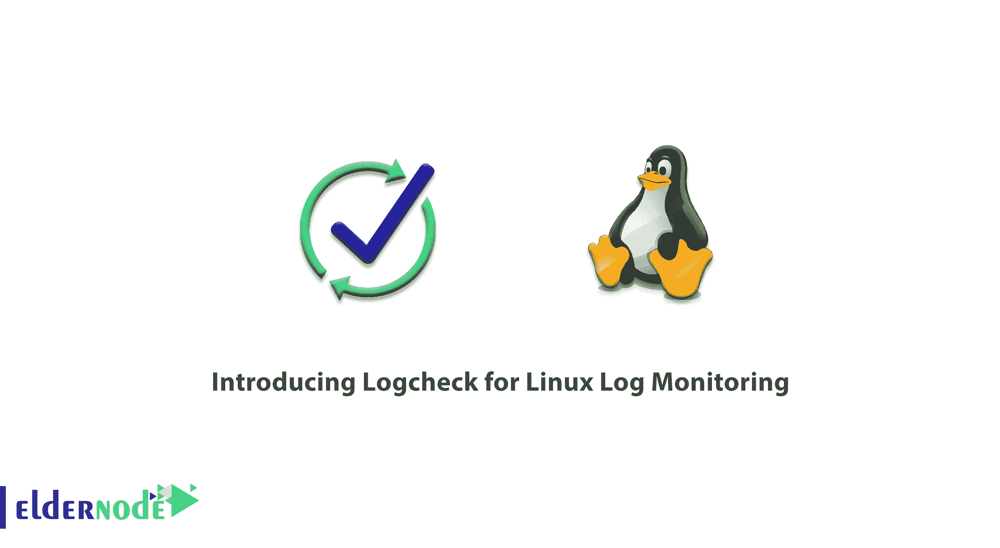
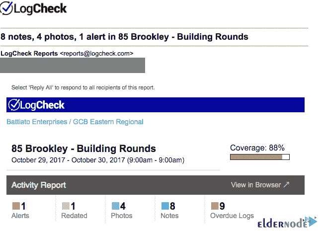
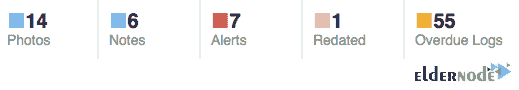
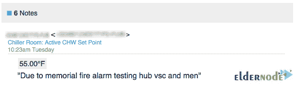
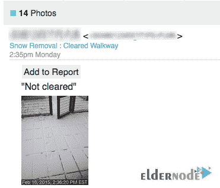
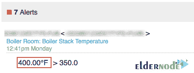
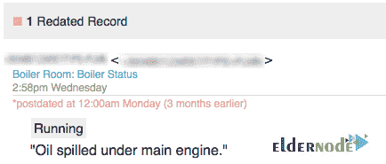

# 介绍用于 Linux 日志监控的 Log check-elder node 博客

> 原文：<https://blog.eldernode.com/logcheck-for-linux-log-monitoring/>



在下面的 Linux 系统日志活动监控工具介绍中，本文将介绍用于 Linux 日志监控的 LogCheck。您需要软件来记录文件，并检查它们是否违反了安全规定和异常活动。为了达到这个目标，LogCheck 被设计为一个自动化工具，它还会记住它从日志文件中读取的最后一个位置。LogCheck 每小时运行并检查日志文件，并在发现问题时向管理员发送电子邮件。它是由 Debian LogCheck 团队开发的。因为它包含在 Debian/Ubuntu Linux 发行版的稳定库中，所以您可以很容易地安装它。 [Eldernode](https://eldernode.com/) 的可用软件包是根据各种需要设计的，购买您自己的 [Linux VPS](https://eldernode.com/linux-vps/) 并享受它。

## **什么是 Logcheck，它是如何工作的？**

作为管理员，您需要一个简单的实用程序来帮助您查看由您控制的主机上生成的日志文件。LogCheck 是一个广泛使用的工具，用于分析系统日志，并在过滤“正常”条目时发送日志文件摘要。LogCheck 从***/etc/log check/log check . log files***中指定的文件中读取每个日志条目。在本例中，日志文件 ***/var/log/syslog*** 和***/var/log/auth . log***。为了跟踪读取的消息，它使用了一个名为“logtail”的 Perl 实用程序。它可以标记它在日志中的位置。这样，事件就不会在连续的日志检查运行中报告两次。



LogCheck 扫描您的系统日志文件，并通过电子邮件发送可疑问题。由于它是通过 [cron](https://blog.eldernode.com/list-cron-jobs-on-ubuntu-20-04/) 运行的，它可能藏在几个不同的地方:

1 英寸标准根 crontab 条目。

2 英寸 */etc/crontab*

3-作为 */etc/cron.d* 下的一个条目

4-在一个“运行部件”子目录下，如 */etc/cron.daily*

日志检查支持 3 级过滤，如偏执，服务器和工作站。

**偏执**:这个级别支持运行尽可能少服务的高安全性机器。它有详细的信息，你应该考虑它是否容易处理。

**服务器**:默认级别是包含许多不同守护进程规则的服务器。

**工作站**:工作站级包含上述规则，偏执规则包含在服务器级。它适用于受保护的机器，可以过滤大部分信息。

报告的消息分为三层，即系统事件、安全事件和攻击警报，并具有以下功能:

1-具有预定义的报告模板

2-使用正则表达式的简单日志过滤机制

3-即时电子邮件通知

4-具有基于云的调度处理系统

5-即时安全问题警报

### **日志检查邮件报告**

下面，我们将快速回顾一下更易于阅读的**新** **日志检查电子邮件报告**。

**指标部分**让您对日志中值得注意的日常活动一目了然。



**笔记部分**可以列出现场记录的所有笔记。您将能够使用笔记部分与您的团队进行交流。



使用**照片部分**有助于您的团队确保正在执行关键检查。因此，您可以查看在现场拍摄的所有照片。



**报警区**将列出所有数值超出范围的记录，让您轻松识别/预防潜在问题。



**更新的记录**部分帮助您识别时间戳被修改的记录。



### **LogCheck 优势**

–基于云的调度管理系统。

–开发人员也可以使用他们的手机访问该工具。

–提供有关安全问题的即时信息。

–使用正则表达式可以轻松过滤日志。

–通过电子邮件发送即时通知。

–具有重要的预制报告模板，可制作即时报告。

–log check 易于设置，可在许多系统上运行。

–使员工能够节省时间并降低风险。

### **LogCheck 缺点**

日志检查不灵活。它将所有日志文件合并成一个文件，这意味着如果一个字符串在一个日志文件中是问题，而在另一个日志文件中不是问题，那么处理起来会很困难。它在某些配置中速度较慢，并且限制了通过电子邮件向系统管理员发送报告。

### **【日志检查选项(LogCheck for Linux Log Monitoring)**

让我们看看一些日志检查选项

**-c CFG** :否决默认配置文件。

**-d** :调试模式。

**-h** :显示使用信息。

**-H** :在 logCheck 邮件的主题中使用这个主机名字符串。

**-l LOG** :通过 logCheck 运行日志文件。

**-L CFG** :否决默认日志文件列表。

**-m** :邮件报告给收件人。

**-o** : STDOUT 模式，不发送邮件。

**-p** :将报告级别设置为“偏执”。

**-r 目录**:否决默认规则目录。

**-R:在邮件主题行添加“重启”:**。

**-s** :将报告级别设置为“服务器”。

**-S 目录**:否决默认状态目录。

**-t** :测试模式不更新偏移量。

**-T** :不要拆下 TMPDIR。

**-u** :启用 Syslog-summary。

**-v** :打印当前版本。

**-w** :设置报告级别为“工作站”。

### **【Log check 用法(Linux 日志介绍)**

让我们看一些如何使用 logCheck 命令的例子。如你所知，logCheck 默认定期发送电子邮件。因此，您可以使用 *-m* 选项来强制它立即发送一个。请看下面的命令:

```
logcheck -m
```

***注* :**
1。您可以使用 **-h** 选项，后跟一个主机名，以便在电子邮件的主题中使用该主机名。

2.您可以使用 **-o** 选项将报告发送到 stdout，而不是电子邮件。

### **Linux 使用 LogCheck 进行日志监控**

大多数 [Linux](https://blog.eldernode.com/tag/linux/) 发行版的系统管理员经常检查日志文件生产环境，以确保系统健康、应用程序的运行状态、潜在的内存问题、高优先级事件等等。因此，各种问题可能会影响用户及其应用程序，因此整个系统的性能将会下降。它说明了需要使用工具来查看和分析日志文件，以[监控](https://blog.eldernode.com/linux-server-monitoring-commands/)日志文件。LogCheck 作为 cronjob 每小时运行一次，并在每次启动后运行。然而，用户可以通过命令行和从项目网站下载来安装 LogCheck。

## 结论

本文介绍了用于 Linux 日志监控的 LogCheck。LogCheck 使用简单，可定制性极强。毫无疑问，LogCheck 是最好的 Linux 日志文件管理工具的前 10 名。系统管理员发现这个工具是主要工具，并喜欢它的功能。在 [Eldernode Community](https://community.eldernode.com/) 上与你的朋友讨论，如果你使用过 LogCheck，提及它的利与弊。