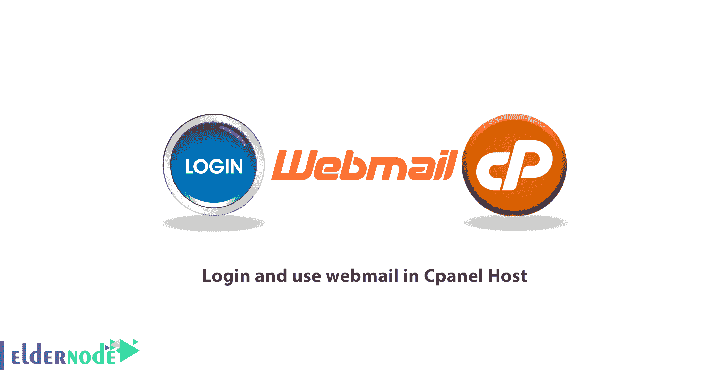
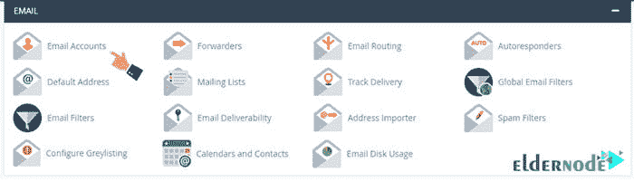
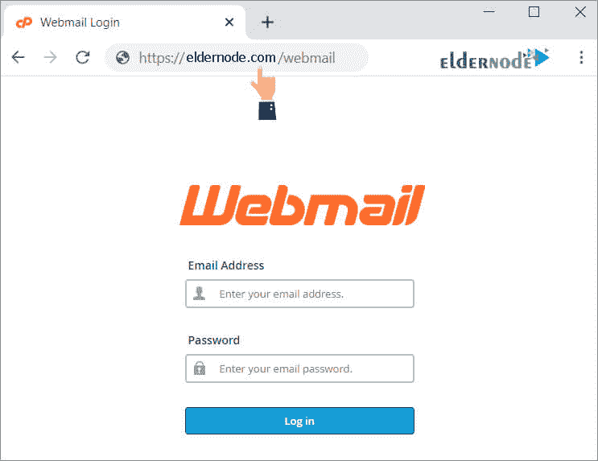
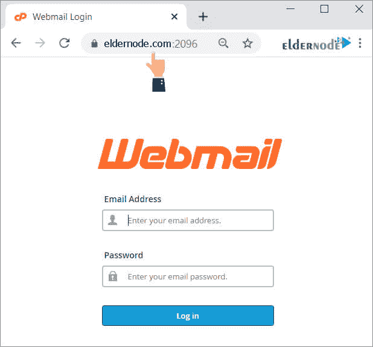

# 教程登录并使用 Cpanel 主机中的 webmail 有三种方法

> 原文：<https://blog.eldernode.com/login-and-use-webmail-in-cpanel-host/>

在本文中，我们将教你**教程登录和使用 Cpanel 主机**中的 webmail。买了一台 **[Linux 主机](https://eldernode.com/linux-hosting/)** 之后，你应该熟悉你的控制面板的不同部分。网络邮件是您的服务中提供的最好的功能，您可以通过任何互联网连接访问您的所有电子邮件。

用 [Cpanel](https://www.cpanel.net/) 访问 **Webmail** 有几种方法。在本教程中，我们将解释连接到主机的所有方法，以及如何进入 **Cpanel webmail** 。最后，完成本教程后，您将了解主机电子邮件的所有登录端口、默认 Cpanel webmail 服务，以及如何管理主机电子邮件。

## 教程登录并使用 Cpanel 主机中的 webmail

电子邮件是主机最重要的部分之一。创建电子邮件后，有几种方法可以输入，您应该根据您的权限选择其中一种方法。**例如**，直接访问 Cpanel 的用户可以登录他们的 Cpanel 主机，进入**邮箱**部分管理他们的邮件。其他人，如使用公司电子邮件的公司员工，没有 Cpanel 访问权限，因此他们必须输入默认的 webmail 服务地址或使用电子邮件端口。

我们将在本文中讨论的教育主题如下:

**–—连接主机邮箱**

**–通过 Cpanel 连接到主机邮箱(仅限管理员)** 

**–—如何通过直接链接访问网络邮件**

**–—使用主机邮件管理程序的地址**

## **教程连接主机邮箱**

有两种方法可以使用您的托管电子邮件服务。你可以从你的主机的**电子邮件**部分开始，也可以通过相关链接或 IP 访问你的**邮件服务器**部分。我们将在下面解释这两者。如果你愿意，可以阅读文章 **[教程将 Cpanel 邮箱账号连接到 Gmail](https://eldernode.com/tutorial-connect-cpanel-email-account-to-gmail/)** 。

### 如何通过 Cpanel 连接到主机邮箱

在大多数人使用的这种方法中，您应该可以访问 Cpanel。为此，请按照下列步骤操作:

**1。先登陆**你的 Cpanel。

**2。** 在**邮箱**部分，点击邮箱账号。

**3。** 在打开的页面中，你会看到在这些主机上创建的邮件列表。

**4。** 找到你想要的邮件然后**点击**。

现在，在你的电子邮件服务中，你可以发送电子邮件和查看收到的电子邮件。

第二种方法是为那些没有访问 Cpanel 主机权限的人准备的。**例如**，一个小组可能为其员工创建公司电子邮件，但不希望所有员工都能访问 Cpanel 在这种情况下，最好的解决方案是给每个人提供一个**地址**和一个**密码**。电子邮件所有者将能够通过链接访问他们的邮件服务。在下面，我们将描述这种方法。

### 如何通过 Cpanel 中的直接链接访问网络邮件

如前所述，**通过链接和端口直接访问**电子邮件对于那些无法访问主机的人来说更合理。要直接访问网络邮件，请在网络浏览器中输入以下信息:

如果您的域名如下:

***Https://www.example.com/webmail***

****

**你应该输入你的网站域名，而不是 example.com。您也可以通过 Cpanel 中默认的 webmail 端口直接访问**的 Webmail 端口号** 2095 或 2096:**

*****【Http://www . example . com】******:2095*****

****

**然后输入您的电子邮件地址或密码，点击**登录**按钮。**

### **如何在 Cpanel 中使用主机邮件管理程序的地址**

**您可以通过直接链接选择 **3 个默认网络邮件程序**中的一个进入网络邮件。这可以通过在地址栏中使用以下 URL 或在您的网站上创建如下链接来实现:**

****1。地址为**www.example.com:2096/horde/index.php**的部落邮件**。**

****2。地址为**www.example.com:2096/3rdparty/squirrelmail/index.php**的****squirrel mail****webmail**。**

****3。进入**www.example.com:2096/3rdparty/roundcube/index.php**链接T3**round cube webmail**。****

**当你进入上述地址时，会出现**登录页面**，输入你的**用户名**和**密码**。注意，这个用户名和密码与 Cpanel 主机无关，而与 Cpanel 中创建的电子邮件帐户有关。用户名与电子邮件地址完全相同。**

****

****注意:** 用户名和密码区分大小写，应该和你在控制面板看到的一模一样。**

## **结论**

**连接主机邮箱有几种方式，包括**通过 Cpanel** 访问 webmail，直接链接，通过 webmail 应用登录。在本教程中，我们解释了连接到主机的所有方法，以及如何登录到 webmail。**最后**，我们向大家介绍了所有的主机邮箱登录端口，默认的 Cpanel webmail 服务，以及如何管理主机邮箱。**

**我们希望你喜欢这个教程。**

**祝你好运。**