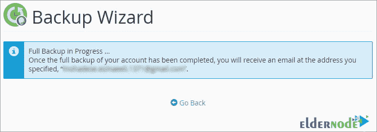

# 教程逐步对主机 Cpanel 进行完整备份

> 原文：<https://blog.eldernode.com/make-a-full-backup-of-host-cpanel/>

在这篇文章中，我们将教你如何对主机 Cpanel 进行完全备份。购买了 **Linux 主机**并推出网站后，是时候进行设计了。由于在此过程中可能会出现不可预知的问题，因此最好定期对主机进行完整备份，以便在紧急情况下恢复备份。

**在这篇文章**中，我们将教你如何对所有 Cpanel 托管信息进行完整备份。看完这篇文章，你将能够对所有 Cpanel 托管信息和网站进行完整备份。

## 教程对主机 Cpanel 进行完整备份

本教程涵盖的主题包括:

**1。****Cpanel 备份教程**

**2。如何从主机下载备份文件**

请继续关注本文的其余部分。

### 如何对 Cpanel 进行完整备份

首先，**登录**到 Cpanel。

从**文件**部分，点击**备份向导**选项。

您将看到一个类似于下图的页面。

在这一页上，Cpanel 向我们展示了两个部分。**第一部分**从左侧开始用于备份，**下一选项**用于恢复准备好的备份。

从左侧的**备份**部分，点击蓝色备份按钮。

#### Cpanel 中不同部分的部分备份

在下一页上，您将收到通知，您正在准备的备份副本包含 4 个常规部分:

**1。 主目录:**通过该选项可以备份**主机文件管理器**中的所有文件和目录。

**2。 Mysql 数据库:**使用此选项，您可以有选择地备份任何主机数据库，并访问数据库的输出文件。

**3。 邮件转发配置:**通过此选项，您可以备份主机内邮件推荐类型的设置，或者您在 [Cpanel](https://www.cpanel.net/) 内为传入邮件设置的过滤器。

**4。** **邮件过滤器配置:**您可以在主机邮件上备份设置的过滤器。

**重要提示:** 从**选择部分备份**部分，您可以下载您单独准备的各种 Cpanel 备份。**例如**，点击 Mysql 数据库选项，将下载备份的数据库。

既然我们要备份主机的所有内容，那么我们必须在**完整备份**部分点击蓝色的**完整备份**按钮。

#### Cpanel 中生成完整备份段的描述

现在，您需要根据以下说明应用设置:

**–**从**生成完整备份**部分，确保备份目的地设置为主目录。

**–**注意，在**电子邮件地址**字段中，必须有一个有效的电子邮件地址。当然，默认情况下，主主机管理员的电子邮件地址包含在该字段中。此电子邮件地址的用途是，当备份过程完成时，主机会向该地址发送一封电子邮件，告知您的备份已准备就绪。

**–**如果您选择了**不发送邮件通知备份完成**选项，Cpanel 将不会发送任何邮件通知您备份过程结束。

**最后是**，要开始备份过程，点击蓝色的**生成备份**按钮即可看到这条蓝色消息。该消息意味着备份过程已经开始。此外，在完成备份过程并呈现完整备份后，将向主机管理器的默认地址发送一封电子邮件进行通知。

一旦完整备份存在，这个备份将被放在 **Cpanel 文件管理器**的主路径中。

点击 **Cpanel** 图标进入控制面板主屏幕。现在从**文件**部分，点击**文件管理器**工具，这是管理主机内部文件的主要部分。

如果主机默认将你重定向到 **public_html** ，你需要点击主目录 **home** ，从左侧菜单中查看完整的备份文件。

正如您在下图中看到的，这是我们网站信息的完整备份，我们主机备份的容量约为 832MB。

### 如何从 Cpanel 下载备份文件

通过**右键点击这个文件上的**并按下**下载**按钮，你将能够下载这个完整的备份到你的电脑上。

## 结论

在本文中，您将学习如何对所有 Cpanel 主机信息进行完整备份。从现在开始，你将能够对你的 Cpanel 主机和网站上的所有信息进行完整备份，并保留这些信息以备不时之需。您还可以创建一个直接下载链接来完整备份您的所有站点主机信息。

我们希望你喜欢这个教程。

祝你好运。