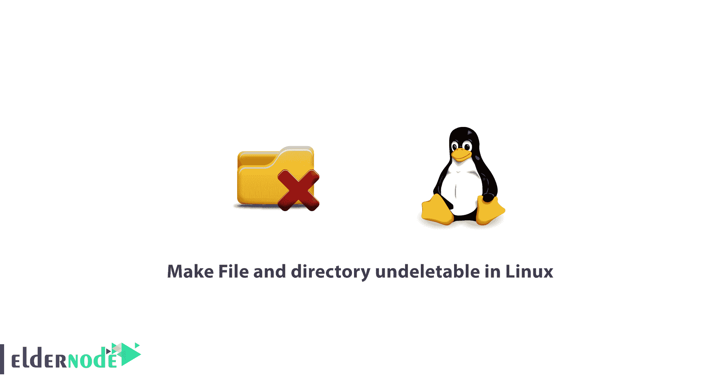

# 如何使文件和目录在 Linux 中不可删除，即使是通过 Root

> 原文：<https://blog.eldernode.com/make-file-directory-undeletable-linux/>



一个 Linux 系统管理员需要知道一些 Linux 技巧。在本文中，您将学习如何使文件和目录不可删除。

如您所知， **root** 是默认情况下可以修改系统上所有目录和文件的帐户或用户名，在包括 Linux 在内的类 Unix 操作系统上。

在本教程中，你将会看到如何让 Linux 中的 [根用户](https://www.ssh.com/iam/user/root/) 无法删除目录或文件。

## 如何使文件和目录不可删除 Linux

在 Linux 提示中，学习**使文件和目录不可删除**对你来说非常有用，因为你可以将这个提示应用于所有重要的配置文件，这样就不会有人意外或故意删除它。

要使文件不可修改，可以使用下面的命令使 **/backups/passwd** 文件不可修改(或不可删除)。之后，您将无法创建指向该文件的链接，也无法将任何数据写入该文件。

另外，请注意，要设置或删除该属性，您需要超级用户权限。所以使用 **sudo** 命令。

```
sudo chattr +i /backups/passwd  OR  sudo chattr +i -V /backups/passwd
```

同样，使用 **lsattr 命令**，查看文件的属性

```
$ lsattr /backups/passwd 
```

现在让我们以普通用户和 root 用户的身份尝试删除不可变文件。

```
rm /backups/passwd  sudo rm /backups/passwd 
```

[购买 Linux 虚拟私有服务器](https://eldernode.com/linux-vps/)

### `如何在 Linux 中递归地使目录不可删除`

`这里我们有 **-R 标志** ，来递归地改变目录及其内容的属性。`

```
`$ sudo chattr +i -RV /backups/`
```

`然后，使用 **-i** 符号删除上述属性，使文件再次可变。`

```
`sudo chattr -i /backups/ passwd`
```

`干得好！现在您知道了如何使文件和目录不被检测到，即使是在 Linux 中被 root 用户检测到。`

`亲爱的用户，我们希望你喜欢这个教程，你可以在评论区提出关于这个培训的问题，或者解决 [Eldernode](https://eldernode.com/) 培训领域的其他问题，请参考 [提问页面](https://eldernode.com/ask) 部分并在其中提出你的问题。`