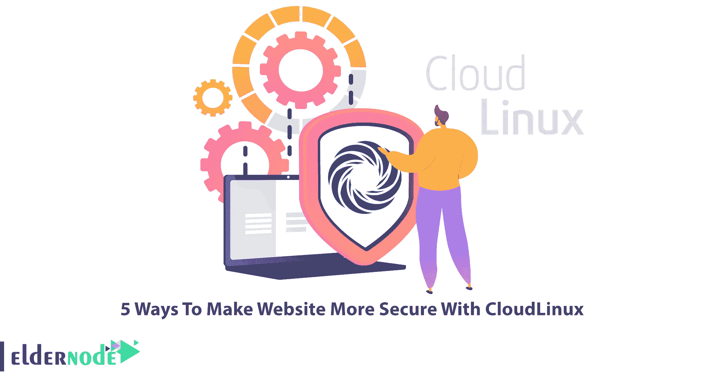

# 用 CloudLinux 让网站更安全的 5 种方法

> 原文：<https://blog.eldernode.com/make-website-more-secure-with-cloudlinux/>

导致你的 WordPress 网站容易被黑的因素有很多。WordPress 被黑客攻击后，清除黑客、木马和恶意程序的残余将非常困难。所以最好的就是防止黑客入侵。本文将介绍使用 CloudLinux 使网站更加安全的 5 种方法。如果你打算购买自己的 [Linux VPS](https://eldernode.com/linux-vps/) 服务器，你可以查看 [Eldernode](https://eldernode.com/) 网站上提供的软件包。

## **如何用 CloudLinux 让网站更安全**

[CloudLinux](https://blog.eldernode.com/install-cloudlinux-on-cpanel/) 是一款基于 Linux 的操作系统，可以保护您的服务器免受攻击。它通过虚拟化用户的文件系统和防止敏感信息泄露来做到这一点。它是对 Linux 发行版的一组核心更改，实现了一些功能，使系统管理员能够对服务器的资源使用进行细粒度的控制。事实上，该操作系统有助于管理员确保与网站相关的问题不会降低向其他网站提供的服务质量。

### **1-用 CageFS** 防止用户看到对方

CageFS 是一个虚拟化的文件系统，它将每个帐户及其执行的脚本限制在自己的范围内。该文件系统防止用户查看彼此和敏感信息。它允许用户虚拟化他们自己的文件系统，并防止大量的攻击。事实上，根据与 CloudLinux 相关的 LVE 设置中设置的包，帐户将被放在笼子里。这将对每个帐户造成限制。此外，使用 CageFS，用户只能访问安全文件，并且只能有限地查看自己的处理文件系统。

### **2-用加固的 PHP** 保护不受支持的 PHP 版本

HardenedPHP 使得在账户中使用不同版本的 PHP 成为可能。这使得服务器对于托管帐户来说更加兼容和高效，并且所有帐户都可以以最好的方式轻松运行他们想要的 PHP 脚本。它修补所有 PHP 版本，甚至那些不受 PHP.net 社区支持的版本，防止已知的漏洞，保护您的客户端和服务器的安全。

### **3-用 securelink**防止所有已知的符号链接攻击

保护网站安全的方法之一是使用安全链接来防止所有已知的符号链接攻击。SecureLinks 是 CloudLinux 中的一项内核级技术，可以增强服务器的安全级别。它可以防止所有已知的符号链接攻击，还可以防止恶意用户创建符号链接文件。然而，这种技术可以防止恶意用户创建指向他们不拥有的文件的符号链接和硬链接，并防止攻击。

### **4-用 LVE** 防止攻击者访问易受攻击的文件

轻量级虚拟化环境或 LVE 可防止攻击者访问易受攻击的文件或窃取服务器上用户的信息。尽管它允许为服务器上的每台主机分配特定的资源。这导致如果一个主机的资源消耗增加，其他主机将不会经历速度下降，并且所有的服务器资源都不会涉及这个问题。

### **5-用 MySQL Governor** 识别并控制滥用者

通过不断的用户查询来保持 MySQL 的稳定是一项非常困难的任务。Cloud Linux 中的 MySQL Governor 特性有助于服务器管理员识别和控制滥用者。此外，MySQL Governor 工具实时跟踪每个网站用户的 CPU 和磁盘 I/O 消耗，并控制和应用 MySQL 查询，考虑与每个 LVE 相同的限制。

## 结论

CloudLinux 是一个面向共享主机提供商的操作系统。它可以提高你的服务器的安全性。在本文中，我们解释了使用 CloudLinux 使网站更加安全的 5 种方法。我希望这篇教程对你有用，并且能帮助你用 CloudLinux 保护你的网站。如果您有任何问题或建议，可以在评论区联系我们。