# 在 Unity 上制作多人游戏专用服务器的教程

> 原文：<https://blog.eldernode.com/making-dedicated-server-to-multiplayer-game/>

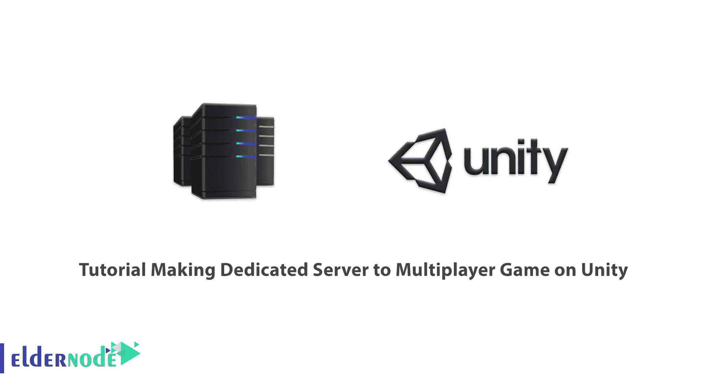

在网站启动之初，你可以使用托管甚至共享服务器，但过一段时间，随着网站的知名度和吸引高访客，共享服务器将无法满足您的网站的需求，你应该考虑使用专用服务器。专用服务器是为特定任务而嵌入的计算机。在这篇文章中，我们将教你关于在 Unity 上制作多人游戏专用服务器的教程。如果你想购买一台 [**专用服务器**](https://eldernode.com/dedicated-server/) ，你可以查看 [Eldernode](https://eldernode.com/) 网站上提供的套装。

## **在 Unity 上制作多人游戏专用服务器**

### **什么是专用服务器？**

[专用服务器](https://blog.eldernode.com/tag/dedicated-server/)是一种专门提供给客户的网络托管服务。它在数据中心 24 小时不间断运行，并连接到万维网。此外，它是一个专门用于托管网站、数据和应用程序的计算机硬件。当用户使用专用服务器时，所有资源(如内存、RAM 和 CPU)都完全属于他们自己，他们不会与其他用户共享这些资源。由于服务器应该可以使用很长时间，并且硬件稳定性非常重要，因此使用特殊技术来延长服务器组件的寿命。

### **专用服务器使用案例**

1 –>用于电子邮件服务器、数据库服务器、流程服务器等。

2 ->用于工程、医学等各种技术学科。

3 –>用于存储信息

4 –>托管网站

5 –>计算机网络的控制、管理和评估

### **什么是团结？**

Unity 是一个跨平台的 2D/3D 游戏引擎，也是一个面向开发人员的强大 IDE，主要用于为计算机、控制台、移动设备等开发视频游戏和模拟器。它可以提供许多使游戏运行的最重要的内部功能。这个游戏引擎为游戏构建、平台开发和活跃的社区提供了强大的可视化界面。

苹果开发者大会于 2005 年 6 月首次推出 Unity 作为独特的 Mac OS X 游戏引擎，由 Unity 技术团队开发。此后，它逐渐发展到支持各种桌面、移动、控制台和虚拟现实操作系统。

### **要求**

在这一节，我们将解释如何在 Unity 上为多人游戏制作专用服务器。您应该设置一个简单的构建脚本，它有四种不同的方法:

```
BuildAll()  {  BuildWindowsServer();  BuildLinuxServer();  BuildWindowsClient();  }
```

您不需要每次去构建设置并选择一堆选项来构建您的项目，您可以使用脚本化的方法来为您做所有的事情。

以下脚本仅执行该构建脚本中的 build-all 方法。

```
echo "Starting build..."  "c:\Program Files\Unity\Hub\Editor\2022.5.23f1\Editor\Unity.exe" -quit -batchmode -projectPath "C:\Users\Neil\Dev\shrinewars" -executeMethod BuildScript.BuildAll  echo "Finished build!"
```

所有这一切的最终结果将是三个不同的版本，一个用于 **Windows 服务器**，一个用于 **Linux 服务器**，一个用于 **Windows 客户端**。为此，您应该部署一个 Linux 服务器。你需要在 Unity 上买一个多人专用的服务器。在下一节，我们将教你如何购买一个多人专用服务器。

## **如何在 Unity 上购买多人游戏专用服务器**

首先，你应该去 [Eldernode](https://eldernode.com/) 网站，点击**专用服务器**。

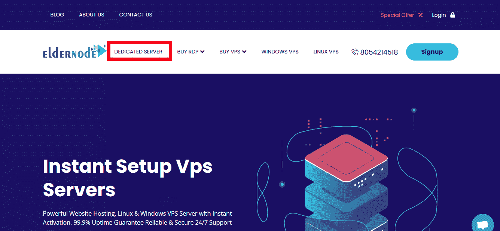

现在从可用的专用服务器位置中选择您的**专用服务器位置**。我们会选择英国。

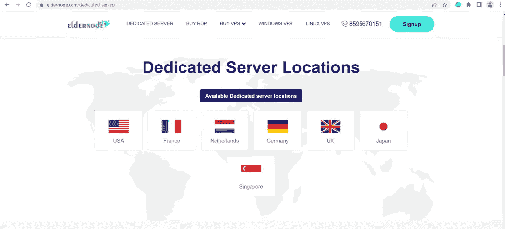

然后你需要选择你的**专用服务器计划**并点击**订单**。

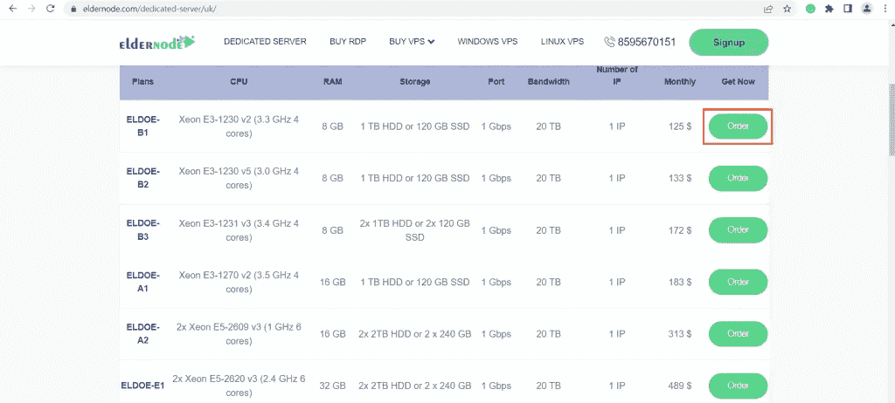

在这一步，您应该配置您想要的选项并继续**检查**。填写相关信息后点击**继续**。

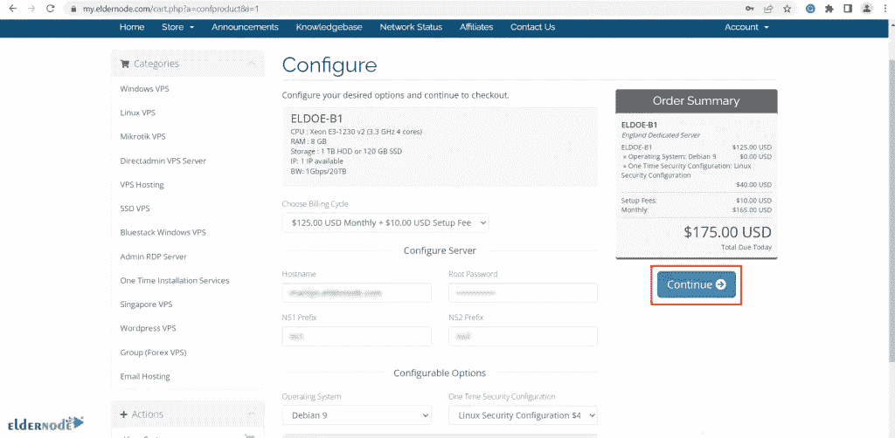

最后一步，点击**结账**并付款。

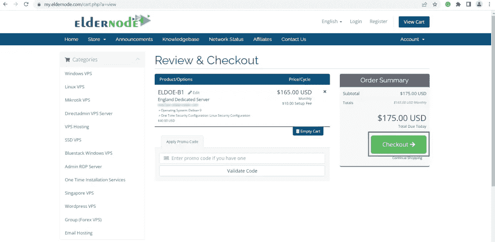

一旦您付款，我们将在最短的时间内为您提供所需的服务。

## **在 Unity 上制作多人游戏专用服务器**

在此部分，导航至 **Unity 项目**。如果你设置了编辑器脚本，你会在顶部看到**构建**选项。

现在点击**构建**部分中的**构建服务器(Linux)** 。然后它会开始自动构建一切。构建完成后，如果你回到 **vs 代码**，你可以看到构建文件夹。

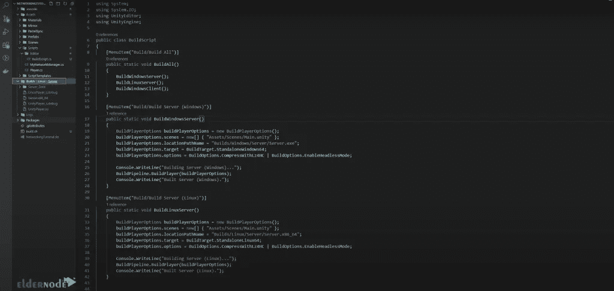

您应该在文件资源管理器中打开该文件夹。为此，双击**构建**文件夹并选择**在文件浏览器中显示**:

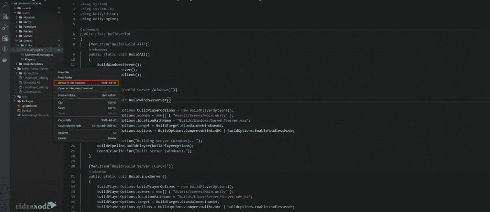

上传的话可以用 **7-zip** 压缩成 zip 文件。选择 **7-Zip** 然后点击**添加到“server . Zip”**:

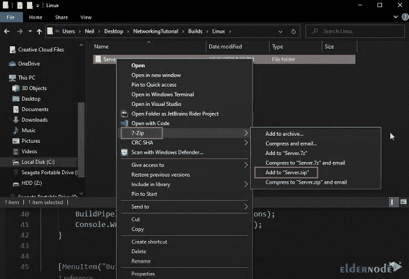

如果你点击它，Eldernode 会给你一个**公共 IP** 和一个**用户名**。您可以使用它们通过 **SSH 客户端**进行连接。要做到这一点，请在您的终端中复制 IP。

然后运行以下命令连接到该服务器:

```
ssh -i ~/Downloads/sshkeypair.pem [[email protected]](/cdn-cgi/l/email-protection)
```

将询问您是否要继续连接，按**是**。

在这一部分，您应该上传您的构建 zip 文件。为此，请输入以下命令:

```
scp -i ~Downloads/sshkeypair.pem Builds/Linux/Server.zip [[email protected]](/cdn-cgi/l/email-protection):.
```

***注意:*** 记得更换你的 IP 地址。

冒号和圆点表示您希望在 Linux 服务器上放置这个 zip 文件的位置。在这里，它被放置在根的右边。

如果您想返回到您的终端，请使用以下命令:

```
ls   server.zip
```

您可以使用以下命令**解压缩上传的文件**:

```
unzip Server.zip
```

要检查那里有什么，只需键入以下命令:

```
ls   Server.zip
```

要进入**服务器文件夹**，只需运行以下命令:

```
cd Server/
```

现在您应该看到**服务器。x86_64** 是您将作为服务器运行的。

在此步骤中，返回管理控制台，配置实例防火墙，仅允许来自一个或两个端口 777 的流量。为此，转到**网络**部分，点击**添加角色**。

请注意，如果您使用使用 TCP 的心灵感应传输，您应该只添加一个角色，并指定要打开的协议和端口，如下所示。就是这样！您已经设置了防火墙。

现在回到 Linux 服务器终端。然后，您应该通过输入以下命令来运行服务器:

```
./Server.x86_64
```

你应该使它可执行。为此，请键入以下内容:

```
chmod +x ./Server.x86_64
```

请记住，再次尝试运行上面的命令。

在输出中，您可以看到 Unity 正在初始化一切，并且服务器启动的心灵感应传输也已初始化，它正在侦听端口 7777。

现在导航到 Unity 并点击 play。要以客户端身份加入服务器，您必须将 IP 粘贴到 **localhost** 部分，然后点击**客户端**。

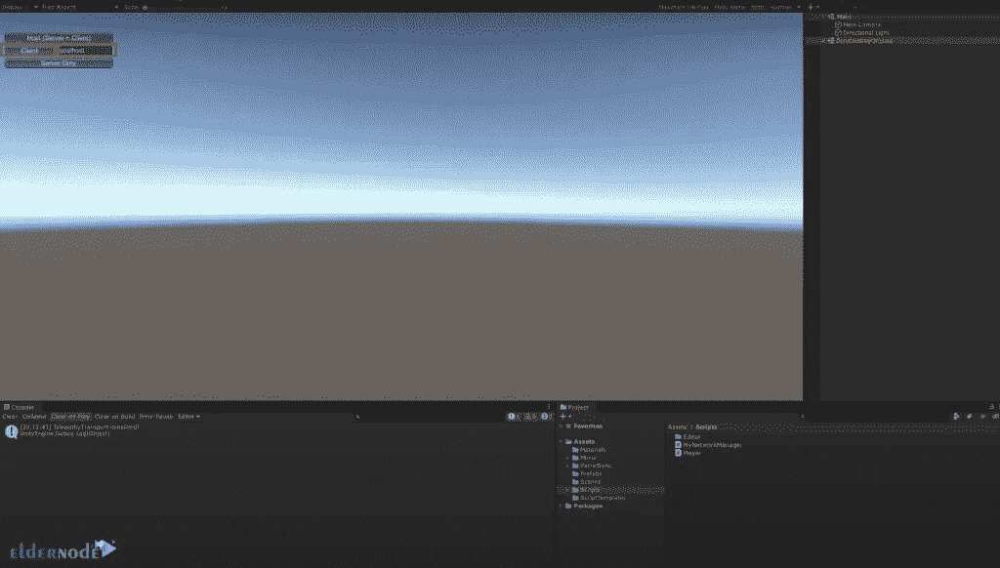

您可以看到您已连接到服务器，如果客户端准备好了，您可以四处移动。然后，点击**客户端就绪**。

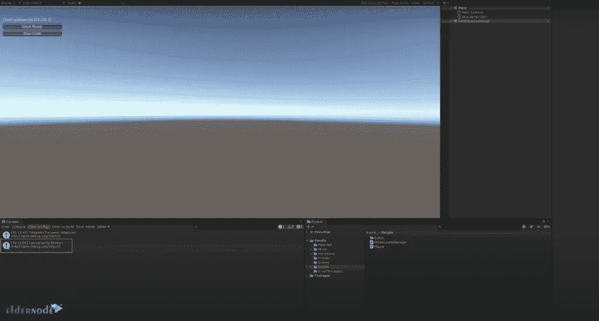

接下来，我们将对多个客户端进行尝试。为此，使用 **ParrelSync** 并点击**克隆管理器**。克隆管理器窗口打开后，点击**在新编辑器中打开**。

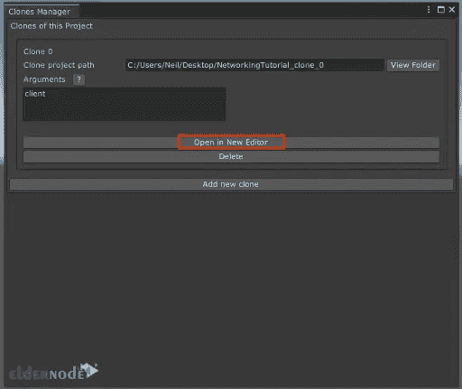

新编辑器打开后，点击两者上的**播放**，粘贴 **IP** 。然后点击**客户端**和**客户端**。现在，您有两个客户端连接到云上的一个服务器。

如果只在本地主机上运行，会有明显的延迟。

您可以通过许多调整来做到这一点，例如使用 UDP 而不是 TCP，以及不使用默认的网络转换。

## 结论

Unity 是开始学习游戏的最佳选择，因为它以图形界面的形式提供了许多有用的功能。同时是游戏开发的专业游戏引擎。我们解释了为你的游戏设置一个专用服务器所需的所有步骤。在这篇文章中，我们学习了如何在 Unity 上制作多人游戏的专用服务器。如有疑问，可在评论中联系我们。