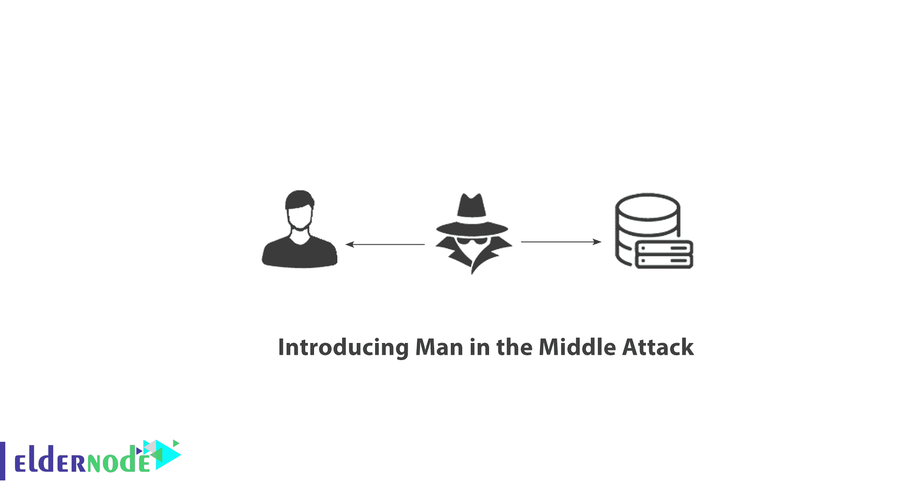
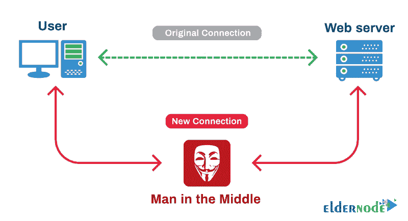

# 介绍中间人攻击- Advance ElderNode 博客

> 原文：<https://blog.eldernode.com/man-in-the-middle-attack/>

介绍中路进攻的人。互联网上的黑客攻击正在以各种方式进行。其中，像[暴力](https://eldernode.com/ftp-configuration-to-prevent-brute-force-attacks-on-windows-server-2012/)和中间人这样的攻击是最流行的，当然也是最危险的攻击。

在本教程中，我们将向您介绍中间人攻击。和我们在一起。

**[ElderNode VPS 托管包](https://eldernode.com/vps-hosting/)**

### 介绍中间人攻击

中路进攻的人，在国际上被称为 MIM 、 [MitM](https://en.wikipedia.org/wiki/Man-in-the-middle_attack) 和 MITMA 。这是最危险的黑客攻击类型之一。

这种类型的攻击可以在网络中的**层 2** 和**层 3** 进行。在这种类型的攻击中，黑客将自己置于网络中两个节点的连接之间，存储所有信息，并通过在网络中的两个系统或服务器之间传递信息来显示给黑客。

这些攻击是对网络上发生的一切的强大窃听。

这种攻击非常危险，因为它不像其他攻击那样涉及用户和管理员，也不像病毒、勒索软件、后门等。，它不可识别，很容易捕获信息。

下图显示了中间的男子攻击。

### 第二层中间人攻击

第二层的 MitM 攻击是这样的，攻击者通过**伪造**网络上的 MAC 地址，使系统相信网关已经被传输。

系统认为他们把所有的数据包都发送给了黑客。同样，黑客通过复制所有输入的信息将数据包发送到目的地。

这一过程发生得如此之快，以至于用户都没有意识到，就好像他们正在自己的网络上不间断地工作。

**注:** 这种类型的攻击，又称 ARP 中毒，可以用[戴](https://www.cisco.com/c/en/us/td/docs/switches/lan/catalyst6500/ios/12-2SXF/native/configuration/guide/swcg/dynarp.pdf)等技术在智能交换机上**挫败**。

### 第三层中间人攻击

第三层的 MitM 攻击 要常见得多，当然也更危险。在第二层攻击中，黑客必须能够访问网络的**物理层**。或者在网络上捕获一个系统，用各种软件发动攻击。在第三层中，这种攻击也可以远程完成。

第 3 层中的中间人攻击可以在 [web 服务器](https://eldernode.com/vps-hosting/)和用户之间。它也可以在一个[虚拟服务器](https://eldernode.com/vps/)和一个用户之间。一般来说，它能够用各种方法控制这种攻击。

在第三层中的这种攻击类似于在第二层中的攻击，除了在第三层中，攻击者用一个**路由器**代替自己，并在两个系统之间移动和复制第三层数据包。

在这种类型的攻击中，一个**黑客**可以轻易获得并复制的密码，输入的命令，银行和系统账户，以及你输入到你系统中的一切。

为此，建议使用安全的加密协议来尽可能防止这种类型的攻击。

比如，如果你有一个简单的**网站**，当你登录你的**管理区**时，输入你的用户名和密码。你输入的方式(意思是明文)对黑客是可见的。如果你的网站上有一个安全证书，你所有的信息都会被加密。所以黑客会看到无意义的和加密的字符。

这样，它就不能轻易使用你的密码和其他信息。

**亦作，见:**

[如何安装和激活 SSL 证书](https://eldernode.com/how-to-install-and-activate-the-ssl-certificate/)

[教程在 IIS Web 服务器上安装 SSL 证书](https://eldernode.com/install-ssl-on-iis-web-server/)

使用安全认证是非常普遍的，你将能够使用这个系统为你的大部分服务。

**尊敬的用户**，我们希望您能喜欢这个[教程](https://eldernode.com/category/tutorial/)，您可以在评论区提出关于本次培训的问题，或者解决[老年人节点培训](https://eldernode.com/blog/)领域的其他问题，请参考[提问页面](https://eldernode.com/ask)部分，并尽快提出您的问题。腾出时间给其他用户和专家来回答你的问题。

好运。