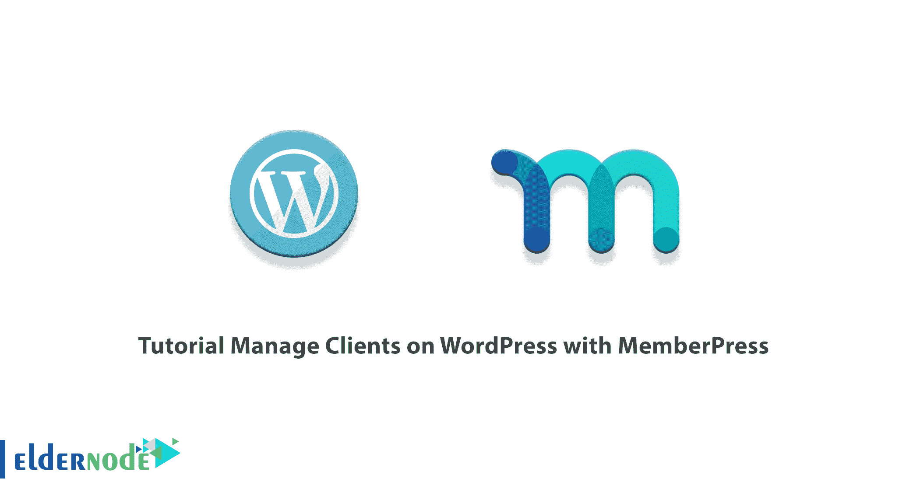
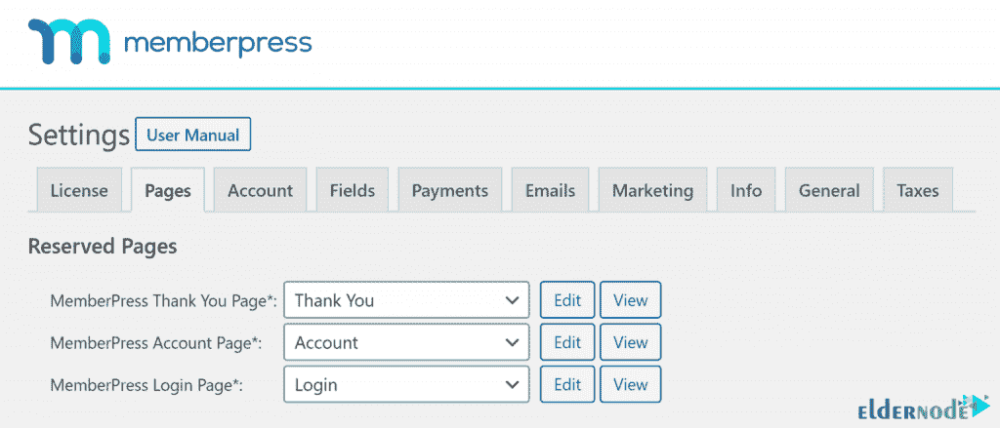
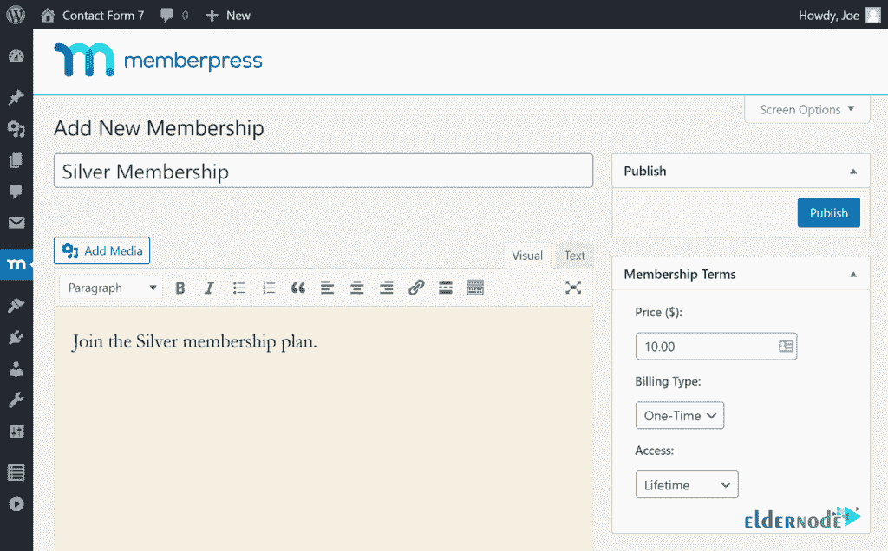
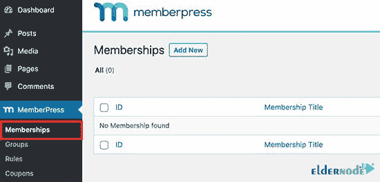
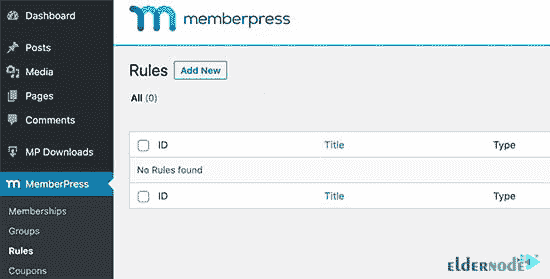
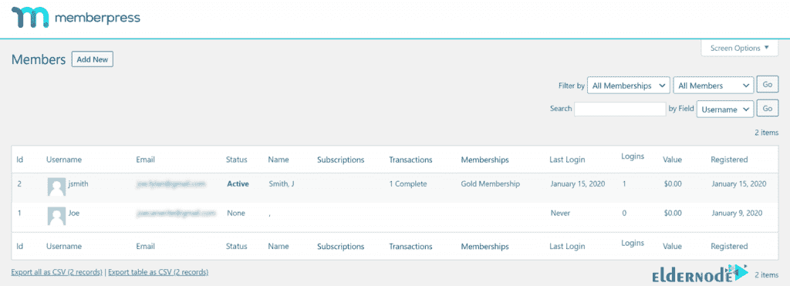
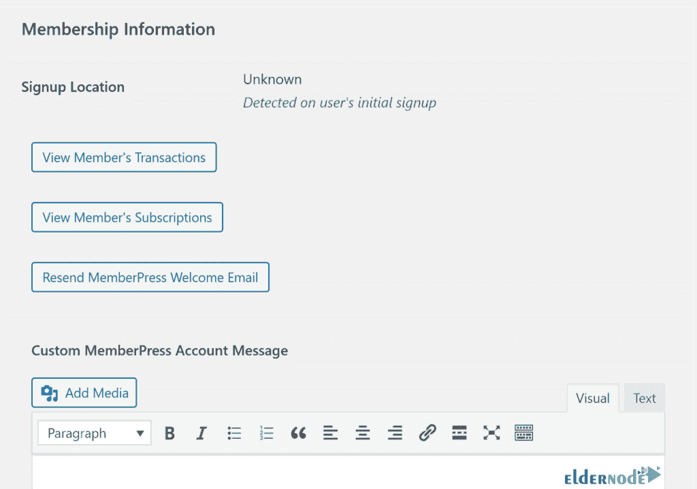
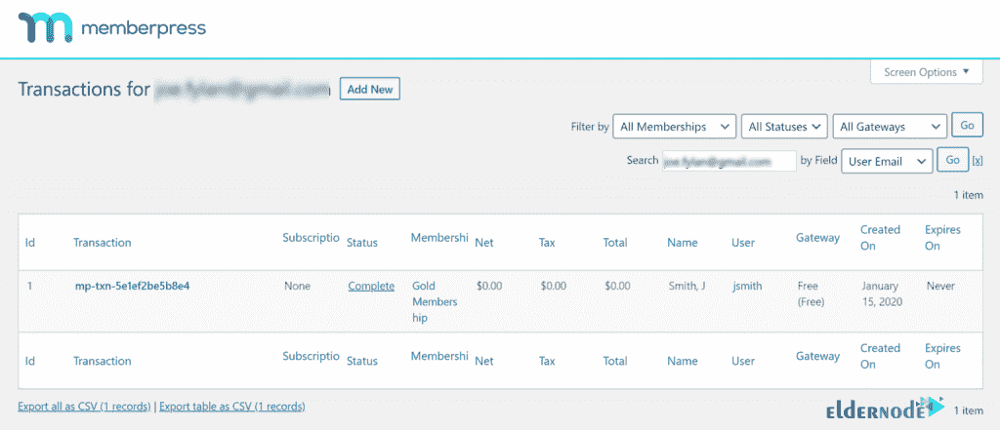
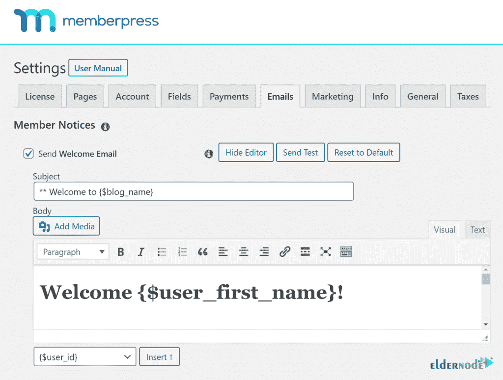
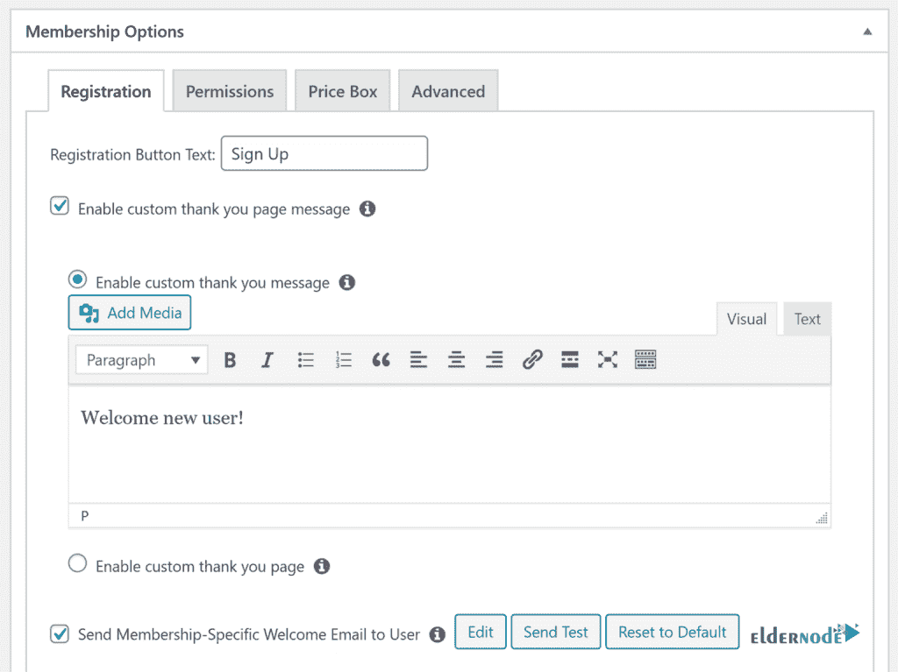

# 教程使用 MemberPress 管理 WordPress 上的客户端

> 原文：<https://blog.eldernode.com/manage-clients-wordpress-memberpress/>

MemberPress 是一个 WordPress 应用程序插件的名字，它允许你在你的网站上创建一个强大的用户界面，以及管理你的用户的会员资格和登录。这个插件还允许你管理对各种页面、类别、标签和文件的访问，并限制你的用户对它们的访问。在这篇文章中，我们试着教你关于用 MemberPress 管理 WordPress 客户端的**教程。如果你想买一台 [VPS](https://eldernode.com/vps/) 服务器，你可以访问 [Eldernode](https://eldernode.com/) 中的软件包。**

## **如何用 MemberPress 管理 WordPress 上的客户端**

[WordPress](https://blog.eldernode.com/tag/wordpress/) 中最好的用户文件管理插件之一是 MemberPress。在这个插件的功能中，我们可以提到订阅和锁定网站上的一些内容。但是这些并不是 MemberPress 的唯一特性。通过安装这个插件，你可以下载高级并标记想要的文件。甚至可以对文件进行分类。

通过 MemberPress 锁定文件只允许有适当条件的用户访问文件。借助此功能，您可以根据标签或类别保护您的文件，并防止它们向公众显示。如果每天发布大量的帖子或者博客，这些人使用和搜索这些文件会有点困难。因为他们喜欢的帖子会消失在大量的内容中。为了避免这个问题，您可以通过标记来组织它们，以便用户可以通过他们喜欢的标记来访问相关的帖子。该插件还支持一些电子邮件营销服务，如 ConvertKit、Constant Contact 和 AWeber。

### **向会员介绍按下**

MemberPress 插件允许您在您的网站上创建不同的会员资格，并为每个会员设置价格。在网站上创建各种会员资格后，您可以根据会员费指定用户对网站内容和部分的访问级别。

这个插件允许你使用这个插件的通知部分来通知你的用户他们的帐户到期，并要求他们支付会员费。

在下一节中，我们将介绍这个插件的一些特性。请加入我们。

### **MemberPress 特性**

MemberPress plugin 有一个强大的报告系统，允许您在网站上获得事件和成员的通知，并确定需要改进的地方。以下是这个插件的一些特性:

1.无需编程知识即可轻松管理和安装

2.能够管理用户对网站不同部分的访问

3.在网站上创建折扣券

4.有一个提醒系统(帐户到期或任何其他情况)

5.它有一个非常安全的系统

6.兼容所有 WordPress 主题

7.具有不同的系统配置设置

8.无限创造

9.可以选择每个会员期的价格

10.具有访问内容的过期系统

11.拥有强大的报告系统

在下一节，我们将教你如何一步一步地用 MemberPress 管理 WordPress 上的客户端。

## **如何在 WordPress 上安装 MemberPress 插件**

现在你已经完全熟悉了 MemberPress，我们现在来看看如何安装这个插件。购买 MemberPress 插件后，可以登录 [MemberPress](https://www.memberpress.com/) 下载插件的 zip 文件。请注意，我们将按照这些说明使用 FTP 手动安装插件。因此，请按顺序执行以下步骤:

第一步是提取您已经下载的 **memberpress.zip** 文件。

然后，您需要使用您最喜欢的 FTP 客户端(如 **FileZilla** )连接到您的 web 服务器。

现在你需要将解压后的 **/Memberpress/** 目录从你的电脑复制到远程服务器上的 **/wp-content/plugins/** 文件夹中。

成功传输文件后，你现在可以登录到你的 **WordPress 仪表盘**。

最后，进入插件页面，点击 MemberPress 插件下的“**激活**”。

***注意:*** 如果以上步骤都做对了，现在仪表盘里应该有一个新的菜单项叫做“ **MemberPress** ”。

需要注意的是，激活后，必须到**member press****Settings**页面输入许可密钥。在下一步中，您需要转到“**付款**选项卡，并选择一种付款方式来接受会员订阅付款。还应注意，如果您愿意，您可以创建免费订阅，或者手动添加您的成员。

### **如何在 MemberPress** 中启用新用户注册

一个新用户在你的 WordPress 会员网站上注册并不需要很长时间。在本节中，我们打算执行创建新会员网站的基础的基本步骤。这意味着生成一些重要的内容，比如感谢页面、账户和登录。

下一步是创建会员资格，并允许访问者在会员网站上注册为用户。重点是，在创建至少一个会员资格后，你的访问者将有办法通过在线表格和会员资格进行注册。

*

您现在可以创建会员计划了。通过这样做，您将能够添加您的客户到它。

进入**会员点击** > > **会员**页面，如图所示，点击**添加新会员按钮**。

下一步，您可以为您的会员计划命名。您还可以指定定价选项。有趣的是，根据客户合同的管理方式，您可以选择终身计划、到期或固定到期。

重要的是，您必须创建访问规则。通过这样做，你可以控制你的网站的一部分，你希望得到保护，只对成员开放。

为此，您可以进入 **MemberPress** > > **规则**页面，点击上面的**添加新按钮**。

接下来，您需要选择想要限制为“**受保护内容**”的内容。您可以选择与标签、类别、单篇文章或任何 URL 匹配的文章。接下来，您需要选择谁将访问受保护的内容。添加访问规则后，点击**保存规则**按钮保存您的设置。

## **用 MemberPress 管理 WordPress 上的客户端**

在这一节，我们将讨论如何用 MemberPress 管理 WordPress 上的客户端。如果你已经正确地遵循了这些步骤，你现在可以在你的 WordPress 仪表盘中查看和管理新成员了。您还可以从会员页面看到所有在您的网站上注册的现有用户。

通过此页面，您可以获得识别和管理新用户注册的有用信息。您可以查看每个用户的注册日期，并从最新到最早对成员进行排序。另外，如果您想编辑客户的详细信息，您可以点击会员用户名下方的**编辑**链接。因此，您可以查看他们的用户资料，并在必要时编辑他们的详细信息。

如下图所示，用户成员信息显示在默认用户详细信息页面的底部。因此，您可以在您的会员网站上找到他们订阅信息的链接以及交易详情。

注意，使用 Memberpress 插件有很多好处。有趣的是，除了从管理者的角度管理新成员，你还可以管理加入你的社区的用户体验。默认情况下，MemberPress 会在新成员在你的网站上注册后立即向他们发送**欢迎邮件**。您可以根据自己的喜好进行定制。事实上，您可以自动设置您发送的电子邮件，以便用用户的个人详细信息(如姓名、会员计划和付款状态)来欢迎新用户。

另一种可能是在 MemberPress 的帮助下为新用户创建欢迎内容。例如，您可以启用一个特殊的感谢页面，新用户在注册后将被重定向到该页面。

## 结论

MemberPress 插件非常强大，允许您轻松扩展您的网站。它也可以很好地与其他插件配合使用。在本文中，我们试图让您全面了解 MemberPress 及其特性。我们还教你如何用 MemberPress 管理 WordPress 上的客户端。