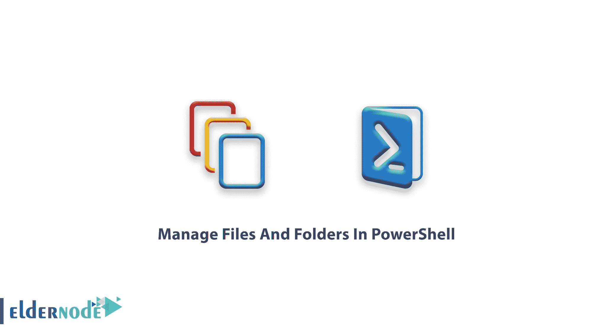
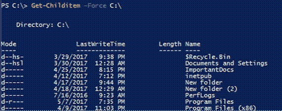
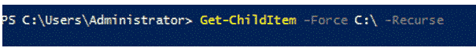
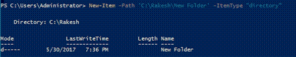
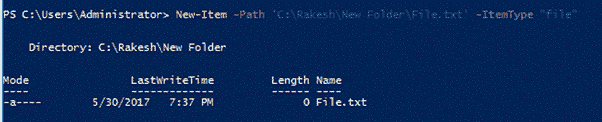
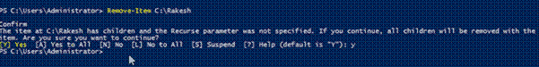

# 如何在 PowerShell - Eldernode 中管理文件和文件夹

> 原文：<https://blog.eldernode.com/manage-files-and-folders-in-powershell/>



在这篇来自 [PowerShell 教程系列](https://eldernode.com/tag/powershell-commands/)的文章中，我们将教你**如何在 PowerShell** 中管理文件和文件夹。通过使用 Windows [PowerShell](https://docs.microsoft.com/en-us/powershell/scripting/overview#:~:text=PowerShell%20is%20a%20cross%2Dplatform,NET%20objects.) ，你可以管理电脑上的文件和文件夹。对于经常使用文件系统执行任务的 Windows 系统管理员来说，这非常有用。这些任务包括创建、复制、重命名、删除文件和文件夹。

您也可以从 eldernode 购买并使用 [Windows VPS 服务器](https://eldernode.com/windows-vps/)。

### 1。列出一个文件夹中的所有文件

您可以使用 Get-ChildItem 命令列出文件夹中的所有项目。考虑下面的例子:

```
 PS C:\ > Get-ChildItem -Force C:\ 
```



### 2。列出所有项目，包括隐藏文件和服务

使用以下命令，所有文件都放在一个文件夹中:

```
 PS C:\> Get-ChildItem -Force C:\ -Recurse 
```



### 3。创建文件夹

您可以使用以下命令在 PowerShell 中创建新文件夹。要创建一个文件夹，将 -ItemType 指定为**目录**。

注意，在下面的命令中，我将文件夹位置指定为 C: \Rakesh\New Folder。

```
 PS C:\> New-Item -Path ‘C:\Rakesh\New Folder’ -ItemType “directory” 
```



### 4。创建一个空文本文件

使用以下命令创建一个空文本文件:

```
 PS C:\> New-Item -Path ‘C:\Rakesh\New Folder    \file.txt’ -ItemType “file” 
```

您必须将 -ItemType 指定为**文件**来创建一个空文件。如果要创建一个文件夹，那么 -ItemType 应该是 **目录** 。



### 5。复制文件和文件夹

要将文件从一个位置复制到另一个位置，您必须按照下面的说明指定源和目标。

```
 PS C:\> Copy-Item -Path C:\Rakesh -Destination C:\Vemulawada 
```


### 6。重命名文件或文件夹

要重命名文件或文件夹，请使用以下命令:

```
 PS C:\> Remove-Item C:\file3 File4.txt 
```

在本例中，文件 3 的名称更改为文件 4。


### 7。删除文件或文件夹

使用以下命令，您可以指定要删除的项目的路径，以便删除它。

```
 PS C:\> Remove-Item C:\Rakesh 
```



**尊敬的用户**，我们希望您能喜欢这个[教程](https://eldernode.com/category/tutorial/)，您可以在评论区提出关于本次培训的问题，或者解决[老年人节点培训](https://eldernode.com/blog/)领域的其他问题，请参考[提问页面](https://eldernode.com/ask)部分，并尽快提出您的问题。腾出时间给其他用户和专家来回答你的问题。

好运。