# 使用 Mikrotik 中的 RoMON 管理网络的最佳解决方案

> 原文：<https://blog.eldernode.com/manage-network-using-romon-in-mikrotik/>

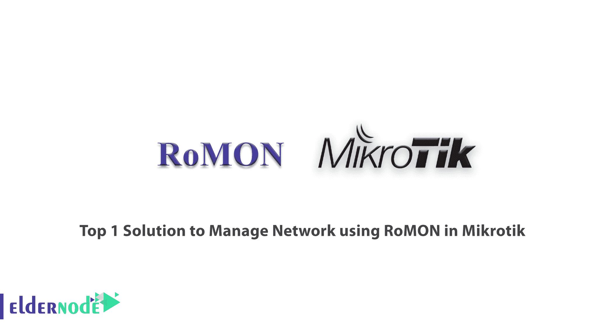

Mikrotik 是拉脱维亚一家制造计算机网络和无线电信设备的公司的名称。这家公司最重要的产品是 Mikrotik RouterOS 操作系统。在本文中，我们将介绍在 [Mikrotik VPS](https://eldernode.com/mikrotik-vps-server/) 服务器中使用 RoMON 的顶级网络管理解决方案之一。

## **什么是 Mikrotik？**

Mikrotik 是一家拉脱维亚公司，成立于 1996 年，旨在开发路由器和无线 ISP 系统。Mikrotik 是这家公司的重要产品。Mikrotik 操作系统是一种使用 Linux 内核构建的路由器，除了能够安装在个人电脑上，它还以软硬件包的形式到达消费者手中。创建该操作系统的目的是与安装在 PC 上的著名 Cisco IOS 操作系统竞争，并提供独特的功能，如路由、防火墙、VPN、监控、Qos、热点、负载平衡和其他有用的服务，为管理员管理网络提供有价值的帮助。

### **米克罗提克特征**

*   开机高速
*   无需登录任何服务即可自动操作
*   稳定性
*   安装速度快
*   图形操作系统带来的高配置速度
*   能够导入和导出其设置
*   比类似的硬件型号更经济

## 介绍罗蒙

RoMON 代表路由器管理覆盖网络，是一种网络功能，允许您通过不同类型的网络管理您的 Mikrotik 设备。它可以在 6.28 版本的 Mikrotik 路由器中使用。RoMON 基于第 2 层或 mac 层创建独立的对等连接。借助此协议，您可以查看和管理整个网络中使用的 Mikrotik 设备。该协议为网络管理员提供了一种工具，可以根据网络上的 Mac 地址进行搜索或发现。

## **如何在 Mikrotik** 中使用 RoMON 管理网络

RoMON 是一项网络功能，允许您在不同类型的网络上管理您的 [Mikrotik server](https://eldernode.com/mikrotik-vps-server/) 设备。如果您有一个桥接网络或旋转网络，您将能够从一个界面管理您的设备。在本教程中，我们将向您展示如何配置 RoMON。客户端路由器是您要管理的 Mikrotik 路由器。

首先，你应该去 **Winbox** 点击连接来连接你的路由器。它可以在任何运行轮值表的 Mikrotik 设备上运行。

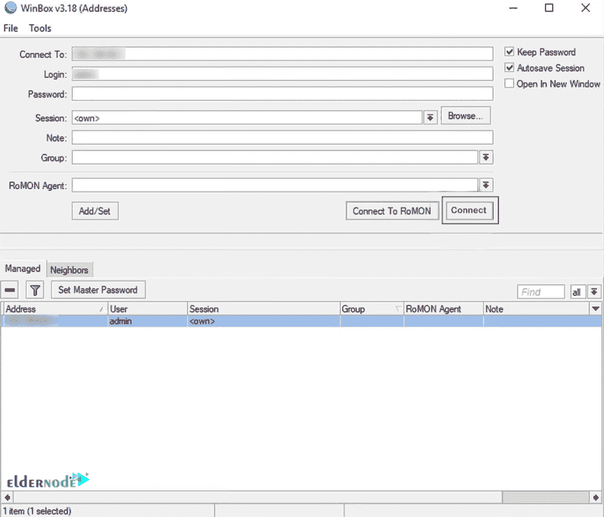

现在进入**工具**，选择**罗蒙**，点击**启用**。您也可以在机密上创建 ID。这是额外的安全措施，可以启用。

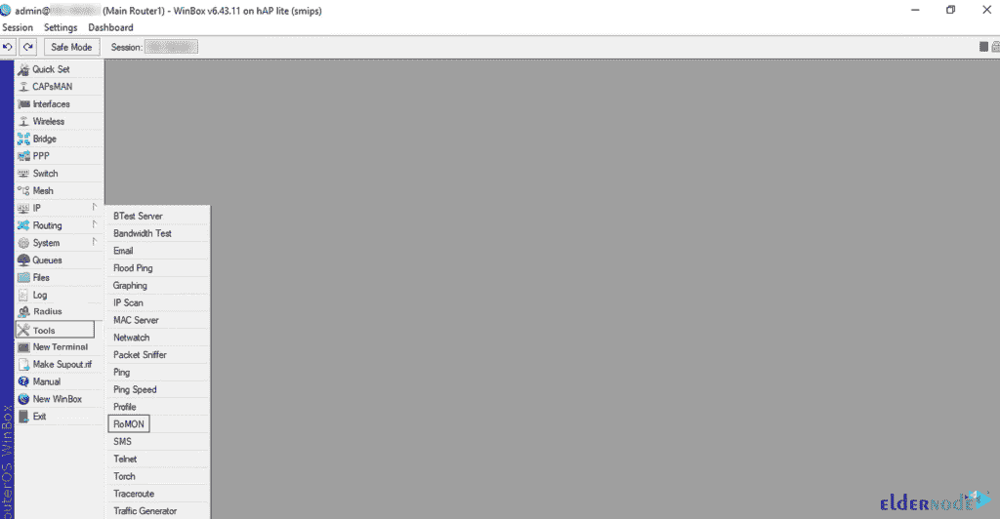

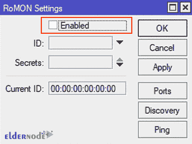

在**秘密**选项中，您可以防止有人窃取您路由器之间的通信。这是额外的安全性，可以启用。

在**端口**选项中，你可以选择 RoMON 工作的端口。RoMON 端口默认设置为**所有**接口。

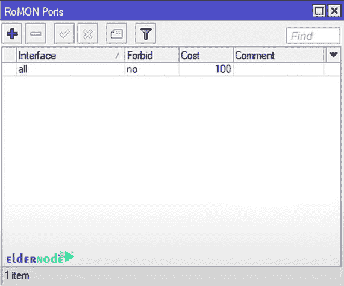

您还有一个**发现**选项，您可以发现网络上的其他 RoMON 设备。

在 **Ping** 选项中，您可以使用 ID Ping 一个 RoMON 设备。如果您知道设备的 ID，您可以 ping 它以查看它是否存在。

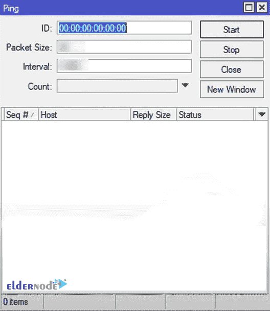

最后，点击**应用**。然后自动分配 id，通常是 MAC 地址。如果需要，您可以指定您的 ID。

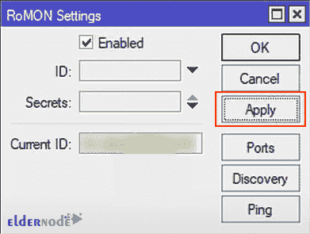

接下来，您可以通过点击**确定来使用默认选项。然后，关闭风箱。然后重新打开它，点击**连接到罗蒙**。**

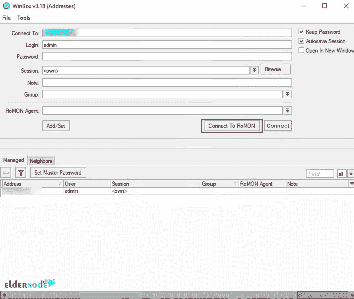

现在您将连接到 RoMON，您可以看到您的 RoMON 邻居。您已经在这两台路由器上启用了 RoMON，它们能够显示开销。成本基于道路的距离，并且是自动计算的。如果一台路由器连接到另一台路由器，它会计算选项，告诉您并给出成本。它将为您提供有关 Mikrotik 设备的所有必要信息，例如设备的类型、版本和身份。

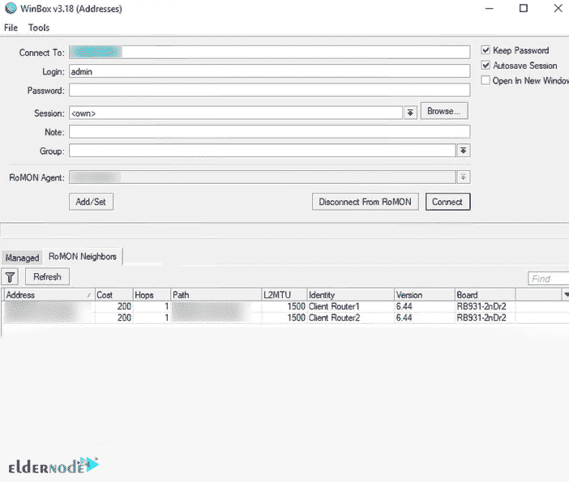

如果您单击客户端，您将连接到该客户端并获得一个 MAC 地址。然后你应该点击**连接**连接到客户端路由器。

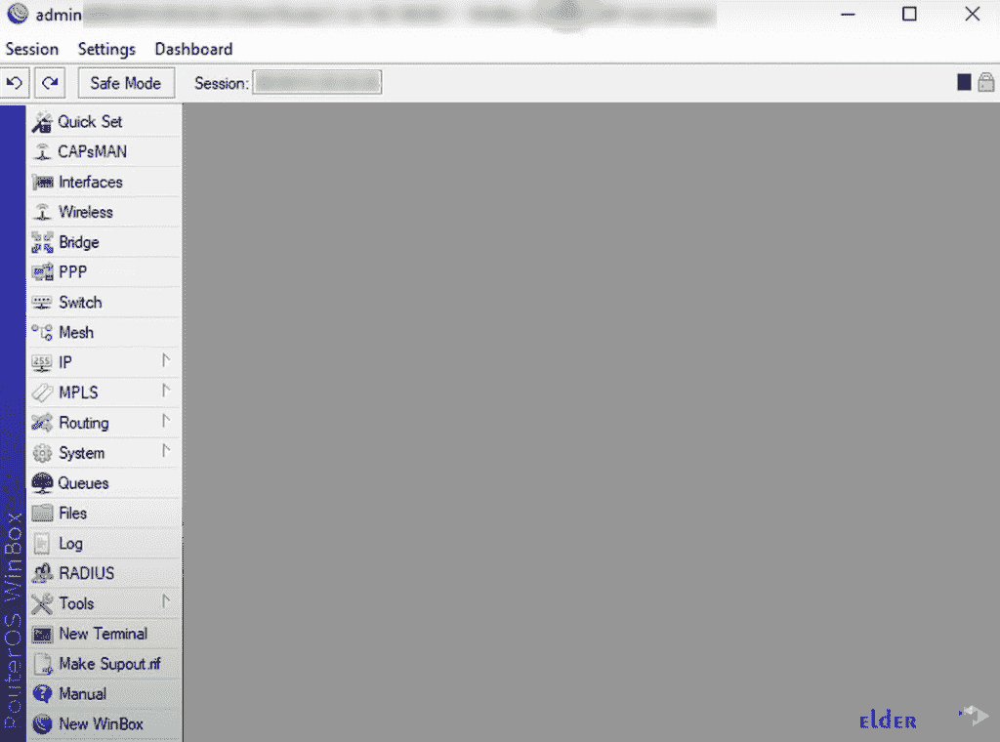

如果设置了密码，则需要将其放入客户端连接的密码中。

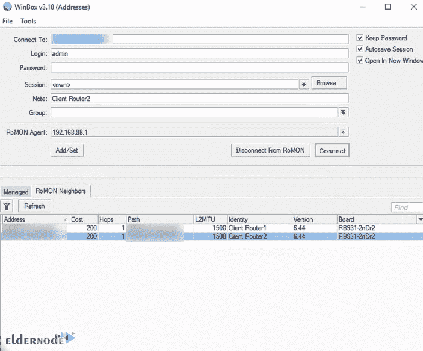

此外，如果您想更改密码，您可以继续从客户端删除密码。带着密码返回并连接，现在你不用密码就可以连接了。

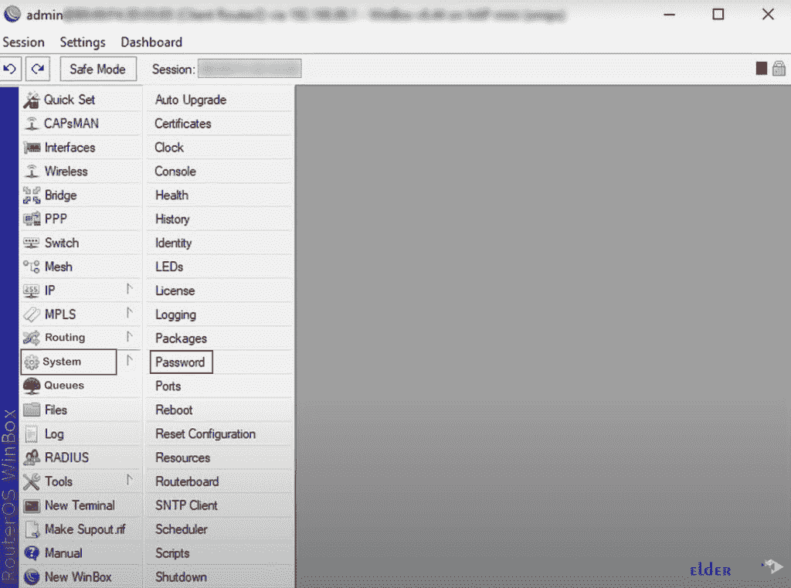

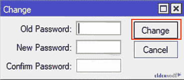

RomMON 允许你管理你所有的微芯片设备。你可以断开一切从 Winbox，你不必知道 IP 地址。它将只显示参与 RoMON 网络的设备。

## 结论

在本文中，我们向您介绍了在 Mikrotik 中使用 RoMON 进行网络管理的顶级解决方案之一。RoMON 的工作原理是建立一个独立的 MAC 层对等发现和数据转发网络。如果您启用了 RoMON，任何收到的 RoMON 数据包将不会显示。我希望这篇教程对你有用。