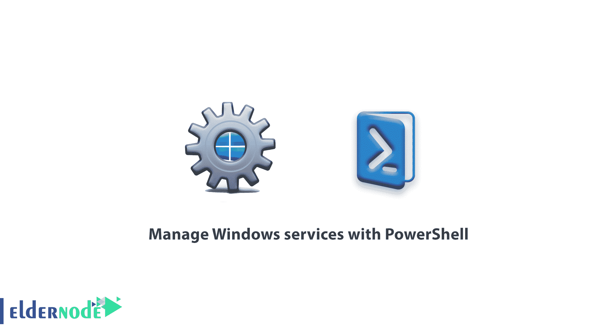

# 使用 PowerShell - Eldernode 管理 Windows 服务

> 原文：<https://blog.eldernode.com/manage-windows-services-with-powershell/>



使用 PowerShell 管理 Windows 服务。在本文中，我们希望通过管理 Windows 服务向您介绍 PowerShell，以便您可以轻松快速地控制和管理 Windows 服务。您也可以从 eldernode 购买并使用 [Windows VPS 服务器](https://eldernode.com/windows-vps/)。

众所周知，任何操作系统最重要的部分之一就是运行它的服务。一般来说，可以说启动的操作系统的每个部分都有一个可以管理和控制的特殊服务。

在本文中，我们将使用 PowerShell 管理 Windows 服务，这样，如果您需要在 Windows Nano Server 或 Windows Server Core 中使用 PowerShell，就不会有任何问题。

## 使用 PowerShell 管理 Windows 服务

*首先打开一个有**管理员权限的 PowerShell 终端。**

*在 PowerShell 中使用服务的第一步是获取服务列表或在其中进行搜索，为此可以使用以下命令。

```
Get-Service 
```

[Get-Service](https://docs.microsoft.com/en-us/powershell/module/microsoft.powershell.management/get-service?view=powershell-6) 命令显示所有服务的列表，输出如下。

```
PS C:\WINDOWS\system32> Get-Service    Status Name DisplayName  ------ ---- -----------  Running AdobeARMservice Adobe Acrobat Update Service  Stopped AJRouter AllJoyn Router Service  Stopped ALG Application Layer Gateway Service  Running AppHostSvc Application Host Helper Service  Stopped AppIDSvc Application Identity  Running Appinfo Application Information  Running AppMgmt Application Management  Stopped AppReadiness App Readiness  Stopped AppVClient Microsoft App-V Client  Stopped AppXSvc AppX Deployment Service (AppXSVC) 
```

默认情况下，您会看到三个主要部分状态、名称和显示。

现在，如果您计划搜索并列出一个特定的服务，您可以使用过滤每个参数。

**例如:**

显示名称以字母开头的所有服务:

```
Get-Service -Name wi* 
```

显示所有显示名称以字母 **win** 开头的服务:

```
Get-Service -DisplayName win* 
```

**注意:** 如果您通过网络访问另一台计算机，您可以从下面的命令中看到该系统的服务列表，如下所示。

```
Get-Service -ComputerName Server1 
```

服务中最重要的一点是依赖服务，它可能用于服务的故障排除、运行等等。

以下命令可用于获取依赖服务的特殊服务列表:

```
Get-Service -Name WinDefend -DependentServices 
```

RequiredServices 参数可用于获取服务所需的服务列表。

```
Get-Service -Name WinDefend - RequiredServices 
```

**解释服务的管理说明**

## 用 PowerShell 停止服务

以下命令可用于通过 PowerShell 停止服务。

```
Stop-Service -Name Windefend 
```

## 用 PowerShell 启动服务

与 PowerShell Stop Service 命令的结构类似，使用了 Start-Service 命令。

```
Start-Service -Name Windefend 
```

## 用 PowerShell 重启服务

服务最常用的命令之一是重新启动结构。

```
Restart-Service -Name Windefend 
```

## 暂停 PowerShell 服务

另一个您可能不太熟悉的命令是服务暂停，它将暂时停止服务。

```
Suspend-Service -Name Windefend 
```

同样，您可以使用 PowerShell 管理 Windows 服务。

关于这些命令及其工作方式的更多信息，使用 Get-Help 命令了解这些命令的更多信息。

**尊敬的用户**，我们希望您能喜欢这个[教程](https://eldernode.com/category/tutorial/)，您可以在评论区提出关于本次培训的问题，或者解决[老年人节点培训](https://eldernode.com/blog/)领域的其他问题，请参考[提问页面](https://eldernode.com/ask)部分，并尽快提出您的问题。腾出时间给其他用户和专家来回答你的问题。

好运。